<!-- #AG_PROJECT_NAMESPACE_ROOT# -->
<!-- #AG_PROJECT_CAPTION_BEGIN# -->
# DemoFramework 6.5.1 GLES2

To [main document](../../README.md)
<!-- #AG_PROJECT_CAPTION_END# -->
## Table of contents
<!-- #AG_TOC_BEGIN# -->
* [Demo applications](#demo-applications)
  * [GLES2](#gles2)
    * [Bloom](#bloom)
    * [Blur](#blur)
    * [DeBayer](#debayer)
    * [DirectMultiSamplingVideoYUV](#directmultisamplingvideoyuv)
    * [EightLayerBlend](#eightlayerblend)
    * [FractalShader](#fractalshader)
    * [LineBuilder101](#linebuilder101)
    * [ModelLoaderBasics](#modelloaderbasics)
    * [ModelViewer](#modelviewer)
    * [OpenCV101](#opencv101)
    * [S01_SimpleTriangle](#s01_simpletriangle)
    * [S02_ColoredTriangle](#s02_coloredtriangle)
    * [S03_Transform](#s03_transform)
    * [S04_Projection](#s04_projection)
    * [S05_PrecompiledShader](#s05_precompiledshader)
    * [S06_Texturing](#s06_texturing)
    * [S07_EnvMapping](#s07_envmapping)
    * [S08_EnvMappingRefraction](#s08_envmappingrefraction)
    * [S09_VIV_direct_texture](#s09_viv_direct_texture)
    * [SdfFonts](#sdffonts)
    * [Stats](#stats)
    * [T3DStressTest](#t3dstresstest)
    * [TextureCompression](#texturecompression)
    * [VIVDirectTextureMultiSampling](#vivdirecttexturemultisampling)
  * [GLES2.System](#gles2system)
    * [BasicRenderModelLoader](#basicrendermodelloader)
    * [DevBasicRender](#devbasicrender)
    * [DevBasicRenderCustomShader](#devbasicrendercustomshader)
    * [DevNativeTexture2D](#devnativetexture2d)
    * [DFGraphicsBasic2D](#dfgraphicsbasic2d)
    * [DFNativeBatch2D](#dfnativebatch2d)
    * [InputEvents](#inputevents)
    * [OnDemandRendering](#ondemandrendering)
  * [GLES2.UI](#gles2ui)
    * [BasicDataBinding](#basicdatabinding)
    * [Benchmark](#benchmark)
    * [Charts](#charts)
    * [Declarative](#declarative)
    * [DpiScale](#dpiscale)
    * [PixelPerfect](#pixelperfect)
    * [RenderTest](#rendertest)
    * [SimpleUI100](#simpleui100)
    * [SimpleUI101](#simpleui101)
    * [SmoothScroll](#smoothscroll)
    * [ThemeBasicUI](#themebasicui)
<!-- #AG_TOC_END# -->

# Demo applications

<!-- #AG_DEMOAPPS_BEGIN# -->

## GLES2

### [Bloom](Bloom)

A example of how to create a bloom effect. The idea is not to create the most accurate bloom,
but something that is fairly fast to render.

Instead of increasing the kernal size to get a good blur we do a fairly fast approximation by
downscaling the original image to multiple smaller render-targets and then blurring these
using a relative small kernel and then finally rescaling the result to the original size.

### [Blur](Blur)

<a href="Blur/Thumbnail.jpg">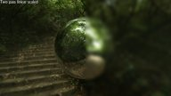</a>

Showcases multiple ways to implement a gaussian blur.
- One pass blur
- Two pass blur
  The 2D Gaussian filter kernel is separable. This allows us two produce the same output as a one pass algorithm by first applying a X-blur and then a Y-blur.
- Two pass linear blur
  Uses the two pass technique and further reduces the bandwidth requirement by taking advantage of the GPU's linear texture filtering
  which allows us to reduce the needed kernel length to roughly half its length while producing the same output as the full kernel length.
- Two pass linear scaled blur
  Uses the two pass linear technique and further reduces the bandwidth requirement by downscaling the 'source image' to 1/4 its size (1/2w x 1/2h) before applying the blur and
  and then upscaling the blurred image to provide the final image. This works well for large kernel sizes and relatively high sigma's but the downscaling produces visible artifacts with low sigma's

### [DeBayer](DeBayer)

This sample shows how to use OpenGL ES shaders to Debayer an input video.
Please check the Shader.frag file within the Content folder to actually see how the data is converted.
The video data is obtained using gstreamer and using the DirectVIVMap extension mapped to a GPU buffer to be used as a texture for the fragment shader to DeBayer.

### [DirectMultiSamplingVideoYUV](DirectMultiSamplingVideoYUV)

This sample shows how to use Gstreamer and OpenGL ES to display a YUV video on a texture by doing the YUV to RGB conversion on a shader and also use the DirectVIV extensions to avoid copying data from the Video Buffer to the GL Texture.

### [EightLayerBlend](EightLayerBlend)

<a href="EightLayerBlend/Thumbnail.jpg">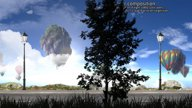</a>

Creates a simple parallax scrolling effect by blending eight 32 bit per pixel 1080p layers
on top of each other. This is not the most optimal way to do it as it uses eight passes.
But it does provide a good example of the worst case bandwidth use for the operation.

The demo was created to compare GLES to the G2D eight blend blit functionality.

### [FractalShader](FractalShader)

Can render both the julia and mandelbrot set using a fragment shader.
This demo was used to demonstrates GPU shader performance by using up roughly 515 instructions
to render each fragment while generating the julia set.

It uses no textures, has no overdraw and has a minimal bandwidth requirement.

Use the commandline arguments to select the scene and quality.

### [LineBuilder101](LineBuilder101)

<a href="LineBuilder101/Thumbnail.jpg">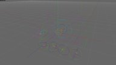</a>

A simple example of dynamic line rendering using the LineBuilder helper class.
The line builder has 'Add' methods for most FslBase.Math classes like BoundingBox, BoundingSphere, BoundingFrustrum, Ray, etc.

### [ModelLoaderBasics](ModelLoaderBasics)

Demonstrates how to use the FslSceneImporter and Assimp to load a scene and render it using OpenGLES2.

The model is rendered using a simple per pixel directional light shader.

For a more complex example take a look at the ModelViewer example.

### [ModelViewer](ModelViewer)

<a href="ModelViewer/Thumbnail.jpg">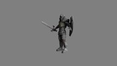</a>

Expands the ModelLoaderBasics example with:

- A arcball camera
- Multiple different scenes (Knight, Dragon, Car, etc)
- More advanced shaders for directional per pixel specular light with support for gloss and normal maps.

### [OpenCV101](OpenCV101)

Demonstrates how to use OpenCV from inside a OpenGL ES 2 project.

This is a very basic example that mainly shows how to setup the correct dependency in the Fsl.gen file and
then it does some very basic OpenCV operations. It could be used as a good starting point for a more complex example.

### [S01_SimpleTriangle](S01_SimpleTriangle)

Shows how to render a single colored Triangle using OpenGL ES, this sample serves as a good introduction to
the OpenGL ES 2 Pipeline and the abstraction classes that the DemoFramework provides.

It's basically the typical 'Hello World' program for graphics.

### [S02_ColoredTriangle](S02_ColoredTriangle)

<a href="S02_ColoredTriangle/Thumbnail.jpg">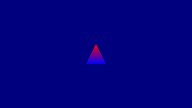</a>

Shows how to render a vertex colored Triangle using OpenGL ES, this demonstrates how to add more than vertex
positions to the vertex attributes.

This is basically the same as the S01 example it just adds vertex colors to the shader.

### [S03_Transform](S03_Transform)

Renders a animated vertex colored triangle.

This shows how to modify the model matrix to rotate a triangle and
how to utilize demoTime.DeltaTime to do frame rate independent animation.

### [S04_Projection](S04_Projection)

<a href="S04_Projection/Thumbnail.jpg">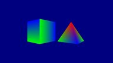</a>

This example shows how to:

- Build a perspective projection matrix
- Render two simple 3d models using frame rate independent animation.

### [S05_PrecompiledShader](S05_PrecompiledShader)

Demonstrates how to use a pre-compiled shader using the offline compiler tool 'vCompiler' from Verisilicon.

This currently only works on the Yocto platform.

### [S06_Texturing](S06_Texturing)

This example shows how to use the Texture class to use a texture in a cube.

It also shows you how to use the ContentManager service to load a 'png' file from the Content directory
into a bitmap utility class which is then used to used to create a OpenGL ES texture.

### [S07_EnvMapping](S07_EnvMapping)

<a href="S07_EnvMapping/Thumbnail.jpg">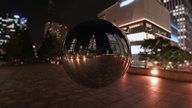</a>

This sample shows how to use a cubemap texture to simulate a reflective material.

It also shows you how to use the ContentManager service to load a 'dds' file from the Content directory
into a Texture utility class which is then used to used to create a OpenGL ES cubemap texture.

### [S08_EnvMappingRefraction](S08_EnvMappingRefraction)

<a href="S08_EnvMappingRefraction/Thumbnail.jpg">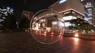</a>

This sample is a variation from the previous sample, again, a cubemap texture is used,
but this time instead of simulating a reflective material a refractive material is simulated.

It also shows you how to use the ContentManager service to load a 'dds' file from the Content directory
into a Texture utility class which is then used to used to create a OpenGL ES cubemap texture.

### [S09_VIV_direct_texture](S09_VIV_direct_texture)

This sample shows how to use the Verisilicon extensions to create a texture without having the need to copy the image data to GL.

### [SdfFonts](SdfFonts)

<a href="SdfFonts/Thumbnail.jpg">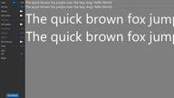</a>

Simple example of bitmap fonts vs SDF bitmap fonts.
This example shows the worst case differences as we only use one resolution for the bitmap font meaning we often upscale the image which gives the worst ouput.
A proper bitmap font solution should have multiple font textures at various DPI's and select the one closest to the actual font rendering size and preferbly also prefer to downscale the image instead of upscaling it.

It also showcases two simple SDF effects:

- Outline
- Shadow

### [Stats](Stats)

<a href="Stats/Thumbnail.jpg">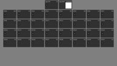</a>

Showcase the new stats services.

### [T3DStressTest](T3DStressTest)

<a href="T3DStressTest/Thumbnail.jpg">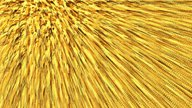</a>

Executes a highly configurable stress test for the OpenGL ES API.

It will procedurally generate a mesh and fur texture that is then rendered to cover the entire screen.

This will often showcase the worst case power consumption of the GPU.

### [TextureCompression](TextureCompression)

<a href="TextureCompression/Thumbnail.jpg">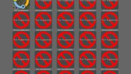</a>

Load and render the supported compressed textures.
It also outputs information about the compression support.

### [VIVDirectTextureMultiSampling](VIVDirectTextureMultiSampling)

This example shows how to use the DirectVIV extension to use an existing buffer as a texture source without having to copy the data to GL.

## GLES2.System

### [BasicRenderModelLoader](System/BasicRenderModelLoader)

Quick example that showcase how to mix rendering using the basic rendering API and the FslSimpleUI.

### [DevBasicRender](System/DevBasicRender)

<a href="System/DevBasicRender/Thumbnail.jpg">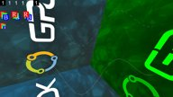</a>

Development project for the IBasicRenderSystem.

### [DevBasicRenderCustomShader](System/DevBasicRenderCustomShader)

<a href="System/DevBasicRenderCustomShader/Thumbnail.jpg">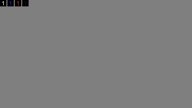</a>

Development project for custom shaders for the IBasicRenderSystem.

### [DevNativeTexture2D](System/DevNativeTexture2D)

<a href="System/DevNativeTexture2D/Thumbnail.jpg">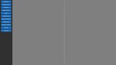</a>

Development project for the Vulkan NativeTexture2D and DynamicNativeTexture2D implementation.
Makes it easy to provoke certain NativeTexture2D/DynamicNativeTexture2D scenarios.

### [DFGraphicsBasic2D](System/DFGraphicsBasic2D)

<a href="System/DFGraphicsBasic2D/Thumbnail.jpg">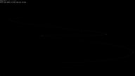</a>

Shows how to use the Demo Frameworks 'basic' 2d rendering capabilities that work across all backends.
The basic2D interface allows you to render ASCII strings using a system provided font and draw colored points in batches.

The functionality in Basic2D is used internally in the framework to render the profiling overlays like the frame rate counter and graphs.

### [DFNativeBatch2D](System/DFNativeBatch2D)

Shows how to use the Demo Frameworks NativeBatch implementatin to render various graphics elements.
The native batch functionality works across various 3D backends and also allows you to use the API native textures for rendering.

The native batch is very useful for quickly getting something on the screen which can be useful for prototyping and debugging.
It is however not a optimized way of rendering things.

### [InputEvents](System/InputEvents)

Demonstrates how to receive various input events and logs information about them onscreen and to to the log.

This can also be used to do some basic real time tests of the input system when porting the framework to a new platform.

### [OnDemandRendering](System/OnDemandRendering)

<a href="System/OnDemandRendering/Thumbnail.jpg">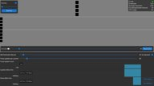</a>

Development project for on demand rendering and demonstrates how to implement it.
It also has some basic 'janky timing' detection animations.

This application has been designed for a **1920x1080dp** screen and will provide a sub-optimal experience for resolutions lower than that.

## GLES2.UI

### [BasicDataBinding](UI/BasicDataBinding)

Simple example of UI data binding

### [Benchmark](UI/Benchmark)

<a href="UI/Benchmark/Thumbnail.jpg">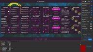</a>

UI benchmark that can be used to benchmark various ways of rendering a UI. This allows you to see what works best on the given hardware.

This application has been designed for a **1920x1080dp** screen and will provide a sub-optimal experience for resolutions lower than that.

### [Charts](UI/Charts)

<a href="UI/Charts/Thumbnail.jpg">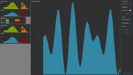</a>

Simple example of UI chart rendering.

### [Declarative](UI/Declarative)

Experimental declarative UI that use the new data-binding capability to create UI from a XML file.

### [DpiScale](UI/DpiScale)

<a href="UI/DpiScale/Thumbnail.jpg">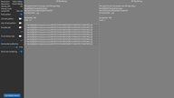</a>

This sample showcases a UI that is DPI aware vs one rendered using the standard pixel based method.

It also showcases various ways to render scaled strings and the errors that are easy to introduce.

### [PixelPerfect](UI/PixelPerfect)

This sample showcases some of the common scaling traps that can occur when trying to achieve pixel perfect rendering.

### [RenderTest](UI/RenderTest)

<a href="UI/RenderTest/Thumbnail.jpg">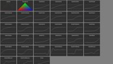</a>

This sample test the various internal UI rendering primitives.

### [SimpleUI100](UI/SimpleUI100)

A very basic example of how to utilize the DemoFramework's UI library.
The sample displays four buttons and reacts to clicks.

The UI framework that makes it easy to get a basic UI up and running. The main UI code is API independent. It is not a show case of how to render a UI fast but only intended to allow you to quickly get a UI ready that is good enough for a demo.

### [SimpleUI101](UI/SimpleUI101)

A more complex example of how to utilize the DemoFramework's UI library.
It displays various UI controls and ways to utilize them.

The UI framework that makes it easy to get a basic UI up and running. The main UI code is API independent. It is not a show case of how to render a UI fast but only intended to allow you to quickly get a UI ready that is good enough for a demo.

### [SmoothScroll](UI/SmoothScroll)

<a href="UI/SmoothScroll/Thumbnail.jpg">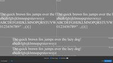</a>

This sample showcases the difference between sub pixel accuracy vs pixel accuracy when scrolling.

### [ThemeBasicUI](UI/ThemeBasicUI)

<a href="UI/ThemeBasicUI/Thumbnail.jpg">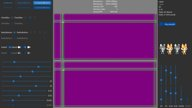</a>

Showcase all controls that is part of the Basic UI theme.

<!-- #AG_DEMOAPPS_END# -->
