<!-- #AG_PROJECT_NAMESPACE_ROOT# -->
<!-- #AG_PROJECT_CAPTION_BEGIN# -->
# DemoFramework 6.5.0 GLES3

To [main document](../../README.md)
<!-- #AG_PROJECT_CAPTION_END# -->
## Table of contents
<!-- #AG_TOC_BEGIN# -->
* [Demo applications](#demo-applications)
  * [GLES3](#gles3)
    * [AntiAliasing](#antialiasing)
    * [AssimpDoubleTexture](#assimpdoubletexture)
    * [Bloom](#bloom)
    * [CameraDemo](#camerademo)
    * [ColorspaceInfo](#colorspaceinfo)
    * [D1_1_VBOs](#d1_1_vbos)
    * [D1_2_VAOs](#d1_2_vaos)
    * [DFNativeBatchCamera](#dfnativebatchcamera)
    * [DirectMultiSamplingVideoYUV](#directmultisamplingvideoyuv)
    * [E1_1_VBOs](#e1_1_vbos)
    * [E1_2_VAOs](#e1_2_vaos)
    * [E2_1_CopyBuffer](#e2_1_copybuffer)
    * [E3_0_InstancingSimple](#e3_0_instancingsimple)
    * [E4_0_PRestart](#e4_0_prestart)
    * [E6_0_MultipleRenderTargets](#e6_0_multiplerendertargets)
    * [E7_0_ParticleSystem](#e7_0_particlesystem)
    * [EquirectangularToCubemap](#equirectangulartocubemap)
    * [FractalShader](#fractalshader)
    * [FurShellRendering](#furshellrendering)
    * [GammaCorrection](#gammacorrection)
    * [HDR01_BasicToneMapping](#hdr01_basictonemapping)
    * [HDR02_FBBasicToneMapping](#hdr02_fbbasictonemapping)
    * [HDR03_SkyboxToneMapping](#hdr03_skyboxtonemapping)
    * [HDR04_HDRFramebuffer](#hdr04_hdrframebuffer)
    * [LineBuilder101](#linebuilder101)
    * [ModelInstancing](#modelinstancing)
    * [ModelLoaderBasics](#modelloaderbasics)
    * [ModelViewer](#modelviewer)
    * [MultipleViewportsFractalShader](#multipleviewportsfractalshader)
    * [ObjectSelection](#objectselection)
    * [OpenCL101](#opencl101)
    * [OpenCLGaussianFilter](#openclgaussianfilter)
    * [OpenCV101](#opencv101)
    * [OpenCVMatToNativeBatch](#opencvmattonativebatch)
    * [OpenCVMatToUI](#opencvmattoui)
    * [OpenVX101](#openvx101)
    * [ParticleSystem](#particlesystem)
    * [RenderToTexture](#rendertotexture)
    * [S01_SimpleTriangle](#s01_simpletriangle)
    * [S02_ColoredTriangle](#s02_coloredtriangle)
    * [S03_Transform](#s03_transform)
    * [S04_Projection](#s04_projection)
    * [S05_PrecompiledShader](#s05_precompiledshader)
    * [S06_Texturing](#s06_texturing)
    * [S07_EnvMapping](#s07_envmapping)
    * [S08_EnvMappingRefraction](#s08_envmappingrefraction)
    * [S09_VIV_direct_texture](#s09_viv_direct_texture)
    * [Scissor101](#scissor101)
    * [SdfFonts](#sdffonts)
    * [Skybox](#skybox)
    * [SpatialHashGrid2D](#spatialhashgrid2d)
    * [SpringBackground](#springbackground)
    * [SRGBFramebuffer](#srgbframebuffer)
    * [Stats](#stats)
    * [T3DStressTest](#t3dstresstest)
    * [Tessellation101](#tessellation101)
    * [TessellationSample](#tessellationsample)
    * [TextureCompression](#texturecompression)
    * [VerletIntegration101](#verletintegration101)
  * [GLES3.System](#gles3system)
    * [BasicRenderModelLoader](#basicrendermodelloader)
    * [DevBasicRender](#devbasicrender)
    * [DevBasicRenderCustomShader](#devbasicrendercustomshader)
    * [DevNativeTexture2D](#devnativetexture2d)
    * [DFGraphicsBasic2D](#dfgraphicsbasic2d)
    * [DFNativeBatch2D](#dfnativebatch2d)
    * [Gestures](#gestures)
    * [OnDemandRendering](#ondemandrendering)
  * [GLES3.UI](#gles3ui)
    * [BasicDataBinding](#basicdatabinding)
    * [Benchmark](#benchmark)
    * [Charts](#charts)
    * [Declarative](#declarative)
    * [DpiScale](#dpiscale)
    * [Gestures](#gestures)
    * [PixelPerfect](#pixelperfect)
    * [RenderTest](#rendertest)
    * [SimpleUI100](#simpleui100)
    * [SimpleUI101](#simpleui101)
    * [SmoothScroll](#smoothscroll)
    * [ThemeBasicUI](#themebasicui)
<!-- #AG_TOC_END# -->

# Demo applications

<!-- #AG_DEMOAPPS_BEGIN# -->

## GLES3

### [AntiAliasing](AntiAliasing)

<a href="AntiAliasing/Thumbnail.jpg">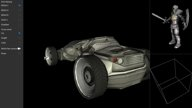</a>

Example of various forms of anti aliasing.
Demonstrates enabling fast MSAA resolve using GL_EXT_multisampled_render_to_texture.

### [AssimpDoubleTexture](AssimpDoubleTexture)

<a href="AssimpDoubleTexture/Thumbnail.jpg">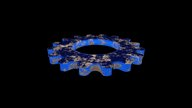</a>

A simple example of multi texturing.

### [Bloom](Bloom)

<a href="Bloom/Thumbnail.jpg">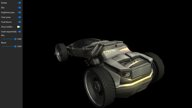</a>

A example of how to create a bloom effect. The idea is not to create the most accurate bloom,
but something that is fairly fast to render.

Instead of increasing the kernal size to get a good blur we do a fairly fast approximation by
downscaling the original image to multiple smaller render-targets and then blurring these
using a relative small kernel and then finally rescaling the result to the original size.

### [CameraDemo](CameraDemo)

<a href="CameraDemo/Thumbnail.jpg">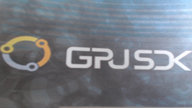</a>

Showcases how to use the helios camera API.
It captures a image from the camera and renders it using OpenGL ES 3.

### [ColorspaceInfo](ColorspaceInfo)

Checks for the presence of known EGL color space extensions and outputs information about them to the console.

### [D1_1_VBOs](D1_1_VBOs)

This sample introduces you to the use of Vertex Buffer Objects.
Look for the OSTEP tags in the code, they will list in an ordered way the steps needed to set a VBO,
The CHALLENGE tags will list additional steps you can follow to create an additional VBO.

This sample is basically a exact copy of E1_1_VBOs but it uses the DemoFramework utility classes to
make the code simpler.

### [D1_2_VAOs](D1_2_VAOs)

This sample introduces you to the use of Vertex Array Objects.
They will allow you to record your Vertex States only once and then restore them by calling the glBindVertexArray function.
As with the E* samples, look for the OSTEP tags to see how they are created and used.

This sample is basically a exact copy of E1_2_VAOs but it uses the DemoFramework utility classes to
make the code simpler.

### [DFNativeBatchCamera](DFNativeBatchCamera)

Showcases how to use the helios camera API.
It captures a image from the camera and renders it using the nativebatch.

### [DirectMultiSamplingVideoYUV](DirectMultiSamplingVideoYUV)

This sample shows how to use Gstreamer and OpenGL ES to display a YUV video on a texture by doing the YUV to RGB conversion on a shader and also use the DirectVIV extensions to avoid copying data from the Video Buffer to the GL Texture.

### [E1_1_VBOs](E1_1_VBOs)

<a href="E1_1_VBOs/Thumbnail.jpg">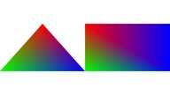</a>

This sample introduces you to the use of Vertex Buffer Objects.
Look for the OSTEP tags in the code, they will list in an ordered way the steps needed to set a VBO,
The CHALLENGE tags will list additional steps you can follow to create an additional VBO.

To see a simpler version of this code that utilize utility classes from the DemoFramework take a look at D1_1_VBOs example.

### [E1_2_VAOs](E1_2_VAOs)

This sample introduces you to the use of Vertex Array Objects.
They will allow you to record your Vertex States only once and then restore them by calling the glBindVertexArray function.
As with the E* samples, look for the OSTEP tags to see how they are created and used.

To see a simpler version of this code that utilize utility classes from the DemoFramework take a look at the D1_2_VAOs example.

### [E2_1_CopyBuffer](E2_1_CopyBuffer)

<a href="E2_1_CopyBuffer/Thumbnail.jpg">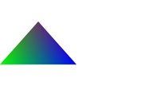</a>

This sample teaches you how to use the glCopyBufferSubData to copy data between 2 Vertex Buffer Objects.
In this sample we copy a Buffer for Positions and a Buffer for Indices.

.

### [E3_0_InstancingSimple](E3_0_InstancingSimple)

<a href="E3_0_InstancingSimple/Thumbnail.jpg">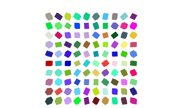</a>

This sample introduces the concept of instancing, this concept is useful to render several meshes that share geometry.
In this sample all cubes will share the same vertex positions, however the colors and MVP Matrices will be independent.

.

### [E4_0_PRestart](E4_0_PRestart)

<a href="E4_0_PRestart/Thumbnail.jpg">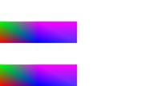</a>

This sample shows you a new feature of OpenGL ES 3.0 called primitive restart.
This allows you to segment the geometry without the need of adding a degenerate triangle to the triangle index list.

.

.

### [E6_0_MultipleRenderTargets](E6_0_MultipleRenderTargets)

This sample introduces multiple render targets (MRT). This feature allows you to define multiple outputs from your fragment shader.
Please check the fragment shader under the Content folder, you will notice how 4 outputs are being defined.

.

### [E7_0_ParticleSystem](E7_0_ParticleSystem)

<a href="E7_0_ParticleSystem/Thumbnail.jpg">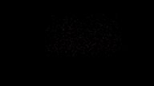</a>

This sample creates a particle system using GL_POINTS.
It defines an initial point where the particles will be tightly packed and then, during the explosion lifetime each point will be animated from a starting position to an end position.

.

### [EquirectangularToCubemap](EquirectangularToCubemap)

<a href="EquirectangularToCubemap/Thumbnail.jpg">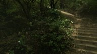</a>

Convert a [equirectangular map](https://en.wikipedia.org/wiki/Equirectangular_projection) to a cubemap using OpenGL ES3.

### [FractalShader](FractalShader)

<a href="FractalShader/Thumbnail.jpg">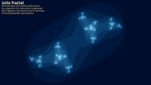</a>

Can render both the julia and mandelbrot set.
Was used to demonstrates GPU shader performance by using up to 515 instructions each fragment while generating the julia set.

No texture and no overdraw, minimal bandwidth requirements.

### [FurShellRendering](FurShellRendering)

<a href="FurShellRendering/Thumbnail.jpg">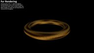</a>

Illustrates how to render fur over several primitives.

The fur is rendered on a layered approach using a seamless texture as a base and then creating a density bitmap.

.

### [GammaCorrection](GammaCorrection)

<a href="GammaCorrection/Thumbnail.jpg">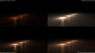</a>

A simple example of how to do gamma correction it shows the difference that SRGB textures and gamma correction makes to the output by comparing
it to the uncorrected rendering methods.

### [HDR01_BasicToneMapping](HDR01_BasicToneMapping)

<a href="HDR01_BasicToneMapping/Thumbnail.jpg">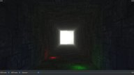</a>

As normal framebuffer values are clamped between 0.0 and 1.0 it means that any light value above 1.0 gets clamped.
Because of this its not really possible to differentiate really bright lights from normal lights.
To take advantage of the light information that normally gets discarded we use a tone mapping algorithm to try and
preserve it. This demo applies the tonemapping right away in the lighting shader so no temporary floating point framebuffer is needed.

### [HDR02_FBBasicToneMapping](HDR02_FBBasicToneMapping)

<a href="HDR02_FBBasicToneMapping/Thumbnail.jpg">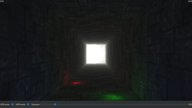</a>

As normal framebuffer values are clamped between 0.0 and 1.0 it means that any light value above 1.0 gets clamped.
Because of this its not really possible to differentiate really bright lights from normal lights.
To take advantage of the light information that normally gets discarded we use a tone mapping algorithm to try and
preserve it. This demo applies the tonemapping as a postprocessing step on the fully lit scene,
so a temporary floating point framebuffer is needed.

This sample outputs to a LDR screen.

### [HDR03_SkyboxToneMapping](HDR03_SkyboxToneMapping)

<a href="HDR03_SkyboxToneMapping/Thumbnail.jpg">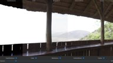</a>

Render a HDR skybox and apply various tonemapping algorithms to it.

This sample outputs to a LDR screen.

### [HDR04_HDRFramebuffer](HDR04_HDRFramebuffer)

<a href="HDR04_HDRFramebuffer/Thumbnail.jpg">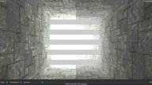</a>

Demonstrates how to enable HDRFramebuffer mode if available.
The render a test scene using a pattern that makes it easy to detect if the display actually enabled HDR mode.

This sample outputs to a HDR screen if supported.

### [LineBuilder101](LineBuilder101)

A simple example of dynamic line rendering using the LineBuilder helper class.
The line builder has 'Add' methods for most FslBase.Math classes like BoundingBox, BoundingSphere, BoundingFrustrum, Ray, etc.

### [ModelInstancing](ModelInstancing)

<a href="ModelInstancing/Thumbnail.jpg">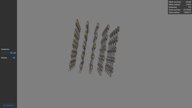</a>

Shows the use of instancing for rendering many copies of the same mesh.

### [ModelLoaderBasics](ModelLoaderBasics)

<a href="ModelLoaderBasics/Thumbnail.jpg">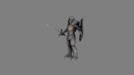</a>

Demonstrates how to use the FslSceneImporter and Assimp to load a scene and render it using OpenGLES2.

The model is rendered using a simple per pixel directional light shader.

For a more complex example take a look at the ModelViewer example.

### [ModelViewer](ModelViewer)

Expands the ModelLoaderBasics example with:

- A arcball camera
- Multiple different scenes (Knight, Dragon, Car, etc)
- More advanced shaders for directional per pixel specular light with support for gloss and normal maps.

### [MultipleViewportsFractalShader](MultipleViewportsFractalShader)

<a href="MultipleViewportsFractalShader/Thumbnail.jpg">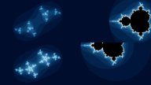</a>

Demonstrates how to utilize multiple viewports.
It reuses the fractal shaders from the FractalShader demo to render the julia and mandelbrot sets.

No texture and no overdraw, minimal bandwidth requirements.

### [ObjectSelection](ObjectSelection)

<a href="ObjectSelection/Thumbnail.jpg">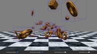</a>

Shows how to select (pick) 3d objects using the mouse via Axis Aligned Bounding Boxes (AABB).

Beware that AABB's often represent quite a rough fit and therefore is best used as a quick way to determine
if there might be a collision and then utilize a more precise calculation to verify it.

### [OpenCL101](OpenCL101)

Simple application that allows you to get your system's OpenCL available platforms.

Demonstrates how to use OpenCL from inside a OpenGL ES 3 project.

This is a very basic example that mainly shows how to setup the correct dependency in the Fsl.gen file and
then it does some very basic OpenCL operations. It could be used as a good starting point for a more complex example.

### [OpenCLGaussianFilter](OpenCLGaussianFilter)

<a href="OpenCLGaussianFilter/Thumbnail.jpg">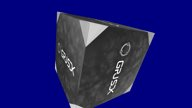</a>

This sample uses OpenCL to execute a Gaussian Blur on an image.

The output will then be stored into a bmp image and also displayed as an OpenGL ES 3.0 texture mapped to a cube.

### [OpenCV101](OpenCV101)

Demonstrates how to use OpenCV from inside a OpenGL ES 3 project.

This is a very basic example that mainly shows how to setup the correct dependency in the Fsl.gen file and
then it does some very basic OpenCV operations. It could be used as a good starting point for a more complex example.

### [OpenCVMatToNativeBatch](OpenCVMatToNativeBatch)

Demonstrates how to take a OpenCV mat and convert it to a Bitmap which is then converted to a Texture2D for use with
the NativeBatch. The texture is then shown on screen and can be compared to the same texture that was loaded using the
normal DemoFramework methods.

The cv::Mat -> Bitmap routines used here are a very basic proof of concept.

### [OpenCVMatToUI](OpenCVMatToUI)

<a href="OpenCVMatToUI/Thumbnail.jpg">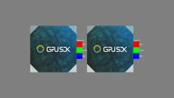</a>

Demonstrates how to take a OpenCV mat and convert it to a Bitmap which is then converted to a Texture2D for use with
the UI frmaework. The texture is then shown on screen and can be compared to the same texture that was loaded using the
normal DemoFramework methods.

The cv::Mat -> Bitmap routines used here are a very basic proof of concept.

### [OpenVX101](OpenVX101)

<a href="OpenVX101/Thumbnail.jpg">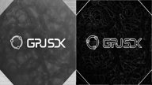</a>

Demonstrate how process a image with OpenVX then use it to render as a texture on the GPU.

### [ParticleSystem](ParticleSystem)

<a href="ParticleSystem/Thumbnail.jpg">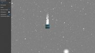</a>

Creates a configurable particle system where you can select the type of primitive each particle will have and the amount of particles.

.

.

### [RenderToTexture](RenderToTexture)

<a href="RenderToTexture/Thumbnail.jpg">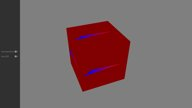</a>

This sample covers how to use OpenGL ES 3.0 to render to a texture.
It also shows how to use the DirectVIV extensions to:

1) Map an existing buffer to be used as a texture and as a FBO.
This scheme uses glTexDirectVIVMap, this function creates a texture which contents are backed by an already existing buffer. In this case we create a buffer using the g2d allocator.

2) Create a texture and obtain a user accessible pointer to modify it, this texture can also be used as a FBO.
This scheme uses glTexDirectVIV, this function creates a Texture in memory, but gives you access to its content buffer in GPU memory via a pointer, so
you can write in it.

### [S01_SimpleTriangle](S01_SimpleTriangle)

<a href="S01_SimpleTriangle/Thumbnail.jpg">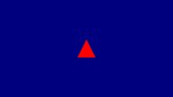</a>

Shows how to render a single colored Triangle using OpenGL ES, this sample serves as a good introduction to
the OpenGL ES 3 Pipeline and the abstraction classes that the DemoFramework provides.

It's basically the typical 'Hello World' program for graphics.

### [S02_ColoredTriangle](S02_ColoredTriangle)

Shows how to render a vertex colored Triangle using OpenGL ES, this demonstrates how to add more than vertex
positions to the vertex attributes.

This is basically the same as the S01 example it just adds vertex colors to the shader.

### [S03_Transform](S03_Transform)

<a href="S03_Transform/Thumbnail.jpg">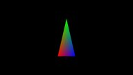</a>

Renders a animated vertex colored triangle.

This shows how to modify the model matrix to rotate a triangle and
how to utilize demoTime.DeltaTime to do frame rate independent animation.

### [S04_Projection](S04_Projection)

This example shows how to:

- Build a perspective projection matrix
- Render two simple 3d models using frame rate independent animation.

### [S05_PrecompiledShader](S05_PrecompiledShader)

Demonstrates how to use a pre-compiled shader using the offline compiler tool 'vCompiler' from Verisilicon.

This currently only works on the Yocto platform.

### [S06_Texturing](S06_Texturing)

<a href="S06_Texturing/Thumbnail.jpg">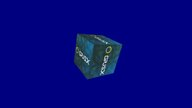</a>

This example shows how to use the Texture class to use a texture in a cube.

It also shows you how to use the ContentManager service to load a 'png' file from the Content directory
into a bitmap utility class which is then used to used to create a OpenGL ES texture.

### [S07_EnvMapping](S07_EnvMapping)

This sample shows how to use a cubemap texture to simulate a reflective material.

It also shows you how to use the ContentManager service to load a 'dds' file from the Content directory
into a Texture utility class which is then used to used to create a OpenGL ES cubemap texture.

### [S08_EnvMappingRefraction](S08_EnvMappingRefraction)

This sample is a variation from the previous sample, again, a cubemap texture is used,
but this time instead of simulating a reflective material a refractive material is simulated.

It also shows you how to use the ContentManager service to load a 'dds' file from the Content directory
into a Texture utility class which is then used to used to create a OpenGL ES cubemap texture.

### [S09_VIV_direct_texture](S09_VIV_direct_texture)

This sample shows how to use the Verisilicon extensions to create a texture without having the need to copy the image data to GL.

### [Scissor101](Scissor101)

<a href="Scissor101/Thumbnail.jpg">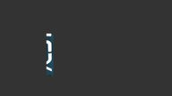</a>

A simple example of how glScissor works.

This is showcased by rendering the insides of a rotating cube and using a animated scissor rectangle to clip.

### [SdfFonts](SdfFonts)

<a href="SdfFonts/Thumbnail.jpg">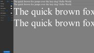</a>

Simple example of bitmap fonts vs SDF bitmap fonts.
This example shows the worst case differences as we only use one resolution for the bitmap font meaning we often upscale the image which gives the worst ouput.
A proper bitmap font solution should have multiple font textures at various DPI's and select the one closest to the actual font rendering size and preferbly also prefer to downscale the image instead of upscaling it.

It also showcases two simple SDF effects:

- Outline
- Shadow

### [Skybox](Skybox)

<a href="Skybox/Thumbnail.jpg">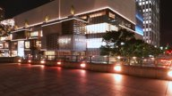</a>

Render a simple skybox using a cubemap.

### [SpatialHashGrid2D](SpatialHashGrid2D)

<a href="SpatialHashGrid2D/Thumbnail.jpg">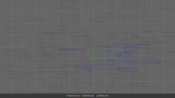</a>

A simple example of how a spatial hash grid works in 2d.

### [SpringBackground](SpringBackground)

<a href="SpringBackground/Thumbnail.jpg">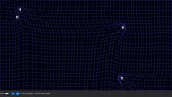</a>

Background test to showcase SPline animations used for simulating a fluid background that can be stimulated by either the spheres or mouse/touch input.

It is then demonstrated how to render the grid using:
- The DemoFramework native batch (Basic or Catmull-Rom splines)
- Linestrips in a VertexBuffer (Catmull-Rom splines)
- Linestrips in a VertexBuffer but using the geometry shader to make quads (Catmull-Rom splines)

### [SRGBFramebuffer](SRGBFramebuffer)

<a href="SRGBFramebuffer/Thumbnail.jpg">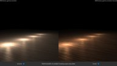</a>

Enables a SRGB Framebuffer if the extension EGL_KHR_gl_colorspace is available.
If unavailable it does normal gamma correction in the shader.

### [Stats](Stats)

<a href="Stats/Thumbnail.jpg">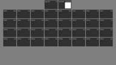</a>

Showcase the new stats services.

### [T3DStressTest](T3DStressTest)

<a href="T3DStressTest/Thumbnail.jpg">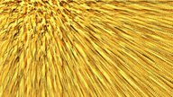</a>

Executes a highly configurable stress test for the OpenGL ES API.

It will procedurally generate a mesh and fur texture that is then rendered to cover the entire screen.

This will often showcase the worst case power consumption of the GPU.

### [Tessellation101](Tessellation101)

<a href="Tessellation101/Thumbnail.jpg">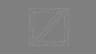</a>

Simple tessellation sample that allows you to select the tessellation level to see how it modifies the level of detail on the selected geometry.

.

### [TessellationSample](TessellationSample)

<a href="TessellationSample/Thumbnail.jpg">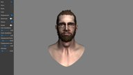</a>

Shows how to load scenes via Assimp and then render them using
- a directional per pixel specular light with support for normal maps.
- tessellation using the geometry shader.

### [TextureCompression](TextureCompression)

<a href="TextureCompression/Thumbnail.jpg">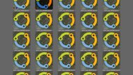</a>

Load and render some ETC2 compressed textures.
It also outputs information about the found compression extensions.

### [VerletIntegration101](VerletIntegration101)

<a href="VerletIntegration101/Thumbnail.jpg">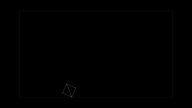</a>

A very simple [verlet integration](https://en.wikipedia.org/wiki/Verlet_integration) example.

It's inspired by: [Coding Math: Episode 36 - Verlet Integration Part I+IV](https://www.youtube.com/watch?v=3HjO_RGIjCU&index=1&list=PL_-Pk4fSWzGv_EAW9hW2ioo9Xtr-9DuoZ)

.

## GLES3.System

### [BasicRenderModelLoader](System/BasicRenderModelLoader)

<a href="System/BasicRenderModelLoader/Thumbnail.jpg">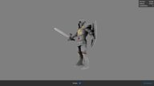</a>

Quick example that showcase how to mix rendering using the basic rendering API and the FslSimpleUI.

### [DevBasicRender](System/DevBasicRender)

Development project for the IBasicRenderSystem.

### [DevBasicRenderCustomShader](System/DevBasicRenderCustomShader)

Development project for custom shaders for the IBasicRenderSystem.

### [DevNativeTexture2D](System/DevNativeTexture2D)

Development project for the Vulkan NativeTexture2D and DynamicNativeTexture2D implementation.
Makes it easy to provoke certain NativeTexture2D/DynamicNativeTexture2D scenarios.

### [DFGraphicsBasic2D](System/DFGraphicsBasic2D)

<a href="System/DFGraphicsBasic2D/Thumbnail.jpg">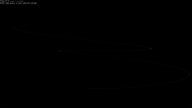</a>

Shows how to use the Demo Frameworks 'basic' 2d rendering capabilities that work across all backends.
The basic2D interface allows you to render ASCII strings using a system provided font and draw colored points.

The functionality in Basic2D is used internally in the framework to render the profiling overlays like the frame rate counter and graph.

### [DFNativeBatch2D](System/DFNativeBatch2D)

<a href="System/DFNativeBatch2D/Thumbnail.jpg">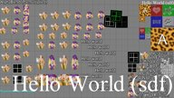</a>

Shows how to use the Demo Frameworks NativeBatch implementatin to render various graphics elements.
The native batch functionality works across various 3D backends and also allows you to use the API native textures for rendering.

The native batch is very useful for quickly getting something on the screen which can be useful for prototyping and debugging.
It is however not a optimized way of rendering things.

### [Gestures](System/Gestures)

<a href="System/Gestures/Thumbnail.jpg">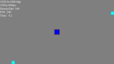</a>

Application used to debug the gesture handling code.

### [OnDemandRendering](System/OnDemandRendering)

<a href="System/OnDemandRendering/Thumbnail.jpg">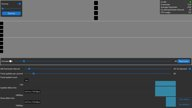</a>

Development project for on demand rendering and demonstrates how to implement it.
It also has some basic 'janky timing' detection animations.

This application has been designed for a **1920x1080dp** screen and will provide a sub-optimal experience for resolutions lower than that.

## GLES3.UI

### [BasicDataBinding](UI/BasicDataBinding)

<a href="UI/BasicDataBinding/Thumbnail.jpg">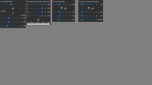</a>

Simple example of UI data binding

### [Benchmark](UI/Benchmark)

<a href="UI/Benchmark/Thumbnail.jpg">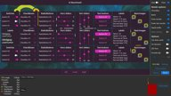</a>

UI benchmark that can be used to benchmark various ways of rendering a UI. This allows you to see what works best on the given hardware.

This application has been designed for a **1920x1080dp** screen and will provide a sub-optimal experience for resolutions lower than that.

### [Charts](UI/Charts)

Simple example of UI chart rendering.

### [Declarative](UI/Declarative)

Experimental declarative UI that use the new data-binding capability to create UI from a XML file.

### [DpiScale](UI/DpiScale)

This sample showcases a UI that is DPI aware vs one rendered using the standard pixel based method.

It also showcases various ways to render scaled strings and the errors that are easy to introduce.

### [Gestures](UI/Gestures)

<a href="UI/Gestures/Thumbnail.jpg">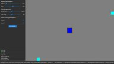</a>

Application used to debug the UI gesture handling code.

### [PixelPerfect](UI/PixelPerfect)

<a href="UI/PixelPerfect/Thumbnail.jpg">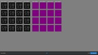</a>

This sample showcases some of the common scaling traps that can occur when trying to achieve pixel perfect rendering.

### [RenderTest](UI/RenderTest)

This sample test the various internal UI rendering primitives.

### [SimpleUI100](UI/SimpleUI100)

A very basic example of how to utilize the DemoFramework's UI library.
The sample displays four buttons and reacts to clicks.

The UI framework that makes it easy to get a basic UI up and running. The main UI code is API independent. It is not a show case of how to render a UI fast but only intended to allow you to quickly get a UI ready that is good enough for a demo.

### [SimpleUI101](UI/SimpleUI101)

A more complex example of how to utilize the DemoFramework's UI library.
It displays various UI controls and ways to utilize them.

The UI framework that makes it easy to get a basic UI up and running. The main UI code is API independent. It is not a show case of how to render a UI fast but only intended to allow you to quickly get a UI ready that is good enough for a demo.

### [SmoothScroll](UI/SmoothScroll)

This sample showcases the difference between sub pixel accuracy vs pixel accuracy when scrolling.

### [ThemeBasicUI](UI/ThemeBasicUI)

Showcase all controls that is part of the Basic UI theme.

<!-- #AG_DEMOAPPS_END# -->
