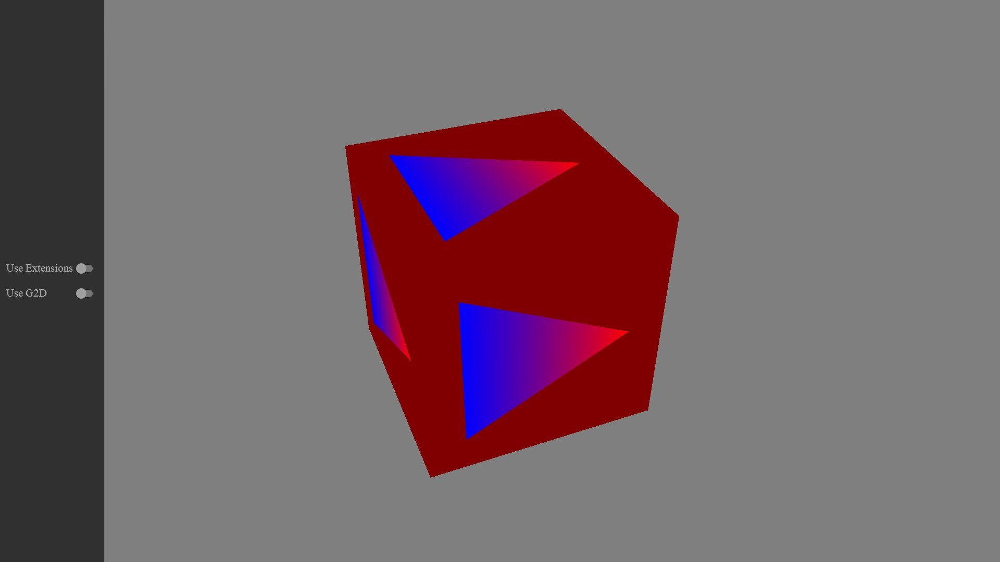

<!-- #AG_DEMOAPP_HEADER_BEGIN# -->
# RenderToTexture

<!-- #AG_DEMOAPP_HEADER_END# -->
<!-- #AG_BRIEF_BEGIN# -->
This sample covers how to use OpenGL ES 3.0 to render to a texture.
It also shows how to use the DirectVIV extensions to:

1) Map an existing buffer to be used as a texture and as a FBO.
This scheme uses glTexDirectVIVMap, this function creates a texture which contents are backed by an already existing buffer. In this case we create a buffer using the g2d allocator.

2) Create a texture and obtain a user accessible pointer to modify it, this texture can also be used as a FBO.
This scheme uses glTexDirectVIV, this function creates a Texture in memory, but gives you access to its content buffer in GPU memory via a pointer, so
you can write in it.
<!-- #AG_BRIEF_END# -->

## Controls

The app can be controlled using:

Key         | Result
------------|---------------------------------------
Left arrow  | Toggle Buffer Mapping extensions
Right arrow | Toggle between G2D Buffer Mapping or GL Buffer Mapping

<!-- #AG_DEMOAPP_COMMANDLINE_ARGUMENTS_BEGIN# -->

Command line arguments':

Argument                        |Description                                                                                                                                                         |Source
--------------------------------|--------------------------------------------------------------------------------------------------------------------------------------------------------------------|---------------
--ActualDpi \<arg>              |ActualDpi [x,y] Override the actual dpi reported by the native window                                                                                               |DemoHost
--DensityDpi \<arg>             |DensityDpi \<number> Override the density dpi reported by the native window                                                                                         |DemoHost
--DisplayId \<arg>              |DisplayId \<number>                                                                                                                                                 |DemoHost
--EGLAlphaSize \<arg>           |Force EGL_ALPHA_SIZE to the given value                                                                                                                             |DemoHost
--EGLBlueSize \<arg>            |Force EGL_BLUE_SIZE to the given value                                                                                                                              |DemoHost
--EGLDepthSize \<arg>           |Force EGL_DEPTH_SIZE to the given value                                                                                                                             |DemoHost
--EGLGreenSize \<arg>           |Force EGL_GREEN_SIZE to the given value                                                                                                                             |DemoHost
--EGLLogConfig                  |Output the EGL config to the log                                                                                                                                    |DemoHost
--EGLLogConfigs \<arg>          |Output the supported configurations to the log. 0=Off, 1=All, 2=HDR. Don't confuse this with LogConfig.                                                             |DemoHost
--EGLLogExtensions              |Output the EGL extensions to the log                                                                                                                                |DemoHost
--EGLRedSize \<arg>             |Force EGL_RED_SIZE to the given value                                                                                                                               |DemoHost
--Window \<arg>                 |Window mode [left,top,width,height]                                                                                                                                 |DemoHost
--AppFirewall                   |Enable the app firewall, reporting crashes on-screen instead of exiting                                                                                             |DemoHostManager
--ContentMonitor                |Monitor the Content directory for changes and restart the app on changes.WARNING: Might not work on all platforms and it might impact app performance (experimental)|DemoHostManager
--ExitAfterDuration \<arg>      |Exit after the given duration has passed. The value can be specified in seconds or milliseconds. For example 10s or 10ms.                                           |DemoHostManager
--ExitAfterFrame \<arg>         |Exit after the given number of frames has been rendered                                                                                                             |DemoHostManager
--ForceUpdateTime \<arg>        |Force the update time to be the given value in microseconds (can be useful when taking a lot of screen-shots). If 0 this option is disabled                         |DemoHostManager
--LogStats                      |Log basic rendering stats (this is equal to setting LogStatsMode to latest)                                                                                         |DemoHostManager
--LogStatsMode \<arg>           |Set the log stats mode, more advanced version of LogStats. Can be disabled, latest, average                                                                         |DemoHostManager
--ScreenshotFormat \<arg>       |Chose the format for the screenshot: bmp, jpg, png or tga (defaults to png)                                                                                         |DemoHostManager
--ScreenshotFrequency \<arg>    |Create a screenshot at the given frame frequency                                                                                                                    |DemoHostManager
--ScreenshotNamePrefix \<arg>   |Chose the screenshot name prefix (defaults to 'Screenshot')                                                                                                         |DemoHostManager
--ScreenshotNameScheme \<arg>   |Chose the screenshot name scheme: frame, sequence or exact (defaults to frame)                                                                                      |DemoHostManager
--Stats                         |Display basic frame profiling stats                                                                                                                                 |DemoHostManager
--StatsFlags \<arg>             |Select the stats to be displayed/logged. Defaults to frame\|cpu. Can be 'frame', 'cpu' or any combination                                                           |DemoHostManager
--Graphics.Profile              |Enable graphics service stats                                                                                                                                       |GraphicsService
--Profiler.AverageEntries \<arg>|The number of frames used to calculate the average frame-time. Defaults to: 60                                                                                      |ProfilerService
--ghelp \<arg>                  |Display option groups: all, demo or host                                                                                                                            |base
-h, --help                      |Display options                                                                                                                                                     |base
-v, --verbose                   |Enable verbose output                                                                                                                                               |base
<!-- #AG_DEMOAPP_COMMANDLINE_ARGUMENTS_END# -->
