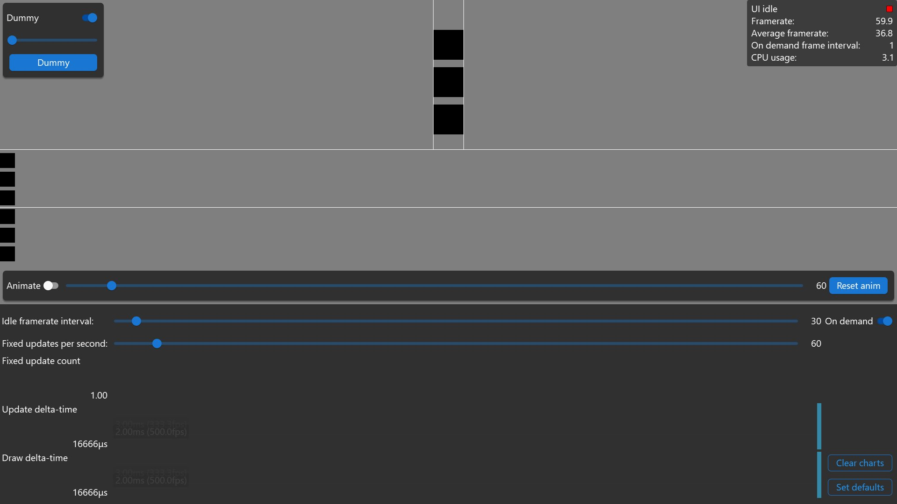

<!-- #AG_DEMOAPP_HEADER_BEGIN# -->
# OnDemandRendering

<!-- #AG_DEMOAPP_HEADER_END# -->
<!-- #AG_BRIEF_BEGIN# -->
Development project for on demand rendering and demonstrates how to implement it.
It also has some basic 'janky timing' detection animations.

This application has been designed for a **1920x1080dp** screen and will provide a sub-optimal experience for resolutions lower than that.
<!-- #AG_BRIEF_END# -->

## Janky timing detection

The example has rudimentary support for detecting janky timings.
To use this run the app with vsync enabled and do not enable g-sync or freesync this will ensure the app can run at a fixed frame rate matching the displays refresh rate.
Move the animation slider so it matches the display's refresh rate and enable the animation.
Move the fixed updates per second slider to match the refresh rate.

The top box moves in sync with the camera at a fixed rate that 100% matches the refresh rate (if you set the slider correctly)
The second box moves according to the delta time supplied to Update.
The third box moves according to the delta time supplied to FixedUpdate. (if the number of fixed updates per second is less than the refresh rate this will be out of sync)

If everything is timed perfectly all three boxes will stay within the white lines.

This basically works by moving the camera at a fixed speed (based on the animation slider).
The other boxes are moved during Update and FixedUpdate based on their respective delta time.

Over time slight errors in time can accumulate which is why we periodically reset the camera and box positions to zero.

## Keyboard controls

The app can be controlled using:

Key         | Result
------------|---------------------------------------
C           | Clear charts
O           | Toggle on demand frame rate.
Up arrow    | Increase idle frame interval fast
Down arrow  | Decrease idle frame interval fast
Left arrow  | Decrease idle frame interval slowly
Right arrow | Increase idle frame interval slowly
W           | Increase fixed updates per second fast
S           | Decrease fixed updates per second fast
A           | Decrease fixed updates per second slowly
D           | Increase fixed updates per second slowly
R           | Reset the animation.
Y           | Toggle the animation on/off
T           | Increase expected animation frames per second fast
G           | Decrease expected animation frames per second fast
F           | Decrease expected animation frames per second slowly
H           | Increase expected animation frames per second slowly
Space       | Reset settings to default

<!-- #AG_DEMOAPP_COMMANDLINE_ARGUMENTS_BEGIN# -->

Command line arguments':

Argument                        |Description                                                                                                                                                         |Source
--------------------------------|--------------------------------------------------------------------------------------------------------------------------------------------------------------------|---------------
--ActualDpi \<arg>              |ActualDpi [x,y] Override the actual dpi reported by the native window                                                                                               |DemoHost
--DensityDpi \<arg>             |DensityDpi \<number> Override the density dpi reported by the native window                                                                                         |DemoHost
--DisplayId \<arg>              |DisplayId \<number>                                                                                                                                                 |DemoHost
--EGLAlphaSize \<arg>           |Force EGL_ALPHA_SIZE to the given value                                                                                                                             |DemoHost
--EGLBlueSize \<arg>            |Force EGL_BLUE_SIZE to the given value                                                                                                                              |DemoHost
--EGLDepthSize \<arg>           |Force EGL_DEPTH_SIZE to the given value                                                                                                                             |DemoHost
--EGLGreenSize \<arg>           |Force EGL_GREEN_SIZE to the given value                                                                                                                             |DemoHost
--EGLLogConfig                  |Output the EGL config to the log                                                                                                                                    |DemoHost
--EGLLogConfigs \<arg>          |Output the supported configurations to the log. 0=Off, 1=All, 2=HDR. Don't confuse this with LogConfig.                                                             |DemoHost
--EGLLogExtensions              |Output the EGL extensions to the log                                                                                                                                |DemoHost
--EGLRedSize \<arg>             |Force EGL_RED_SIZE to the given value                                                                                                                               |DemoHost
--Window \<arg>                 |Window mode [left,top,width,height]                                                                                                                                 |DemoHost
--AppFirewall                   |Enable the app firewall, reporting crashes on-screen instead of exiting                                                                                             |DemoHostManager
--ContentMonitor                |Monitor the Content directory for changes and restart the app on changes.WARNING: Might not work on all platforms and it might impact app performance (experimental)|DemoHostManager
--ExitAfterDuration \<arg>      |Exit after the given duration has passed. The value can be specified in seconds or milliseconds. For example 10s or 10ms.                                           |DemoHostManager
--ExitAfterFrame \<arg>         |Exit after the given number of frames has been rendered                                                                                                             |DemoHostManager
--ForceUpdateTime \<arg>        |Force the update time to be the given value in microseconds (can be useful when taking a lot of screen-shots). If 0 this option is disabled                         |DemoHostManager
--LogStats                      |Log basic rendering stats (this is equal to setting LogStatsMode to latest)                                                                                         |DemoHostManager
--LogStatsMode \<arg>           |Set the log stats mode, more advanced version of LogStats. Can be disabled, latest, average                                                                         |DemoHostManager
--ScreenshotFormat \<arg>       |Chose the format for the screenshot: bmp, jpg, png or tga (defaults to png)                                                                                         |DemoHostManager
--ScreenshotFrequency \<arg>    |Create a screenshot at the given frame frequency                                                                                                                    |DemoHostManager
--ScreenshotNamePrefix \<arg>   |Chose the screenshot name prefix (defaults to 'Screenshot')                                                                                                         |DemoHostManager
--ScreenshotNameScheme \<arg>   |Chose the screenshot name scheme: frame, sequence or exact (defaults to frame)                                                                                      |DemoHostManager
--Stats                         |Display basic frame profiling stats                                                                                                                                 |DemoHostManager
--StatsFlags \<arg>             |Select the stats to be displayed/logged. Defaults to frame\|cpu. Can be 'frame', 'cpu' or any combination                                                           |DemoHostManager
--Version                       |Print version information                                                                                                                                           |DemoHostManager
--Graphics.Profile              |Enable graphics service stats                                                                                                                                       |GraphicsService
--Profiler.AverageEntries \<arg>|The number of frames used to calculate the average frame-time. Defaults to: 60                                                                                      |ProfilerService
--ghelp \<arg>                  |Display option groups: all, demo or host                                                                                                                            |base
-h, --help                      |Display options                                                                                                                                                     |base
-v, --verbose                   |Enable verbose output                                                                                                                                               |base
<!-- #AG_DEMOAPP_COMMANDLINE_ARGUMENTS_END# -->
