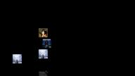
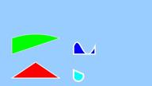
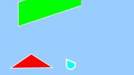
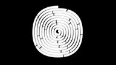

<!-- #AG_PROJECT_NAMESPACE_ROOT# -->
<!-- #AG_PROJECT_CAPTION_BEGIN# -->
# DemoFramework 6.6.0 OpenVG

To [main document](../../README.md)
<!-- #AG_PROJECT_CAPTION_END# -->
## Table of contents
<!-- #AG_TOC_BEGIN# -->
* [Demo applications](#demo-applications)
  * [OpenVG](#openvg)
    * [BitmapFont](#bitmapfont)
    * [CoverFlow](#coverflow)
    * [Example1](#example1)
    * [Example2](#example2)
    * [Example3](#example3)
    * [SimpleBench](#simplebench)
    * [VGStressTest](#vgstresstest)
  * [OpenVG.System](#openvgsystem)
    * [DFGraphicsBasic2D](#dfgraphicsbasic2d)
<!-- #AG_TOC_END# -->

# Demo applications

<!-- #AG_DEMOAPPS_BEGIN# -->

## OpenVG

### [BitmapFont](BitmapFont)

Shows how to render text using a bitmap font in OpenVG.

.

.

### [CoverFlow](CoverFlow)

This sample shows how to use image data in OpenVG. You can think of it as an OpenGL Texture on a Quad. A vgImage is a rectangular shape populated with color information from an image.
This sample also shows that you can transform those images as the paths in previous samples and also can apply special filters like Gaussian Blurs.

.

### [Example1](Example1)

Shows how to draw lines using OpenVG, this sample introduces the concept of Points and segments and
how to integrate them into paths that describe the final shapes that are rendered on screen.

.

### [Example2](Example2)

This sample builds on top of Example1 and shows how to add color to the path strokes and
the path fill area by introducing the concept of "paints" in OpenVG.

.

.

### [Example3](Example3)

This sample will introduce the transformation functions on OpenVG as well as the scissoring function.
Each object will be animated using either vgTranslate, vgScale, vgShear or vgRotate.
The scissoring rectangle will be set at the beginning of the Draw method.

.

### [SimpleBench](SimpleBench)

Small benchmarking application for benchmarking various ways to render points in OpenVG.

.

.

.

### [VGStressTest](VGStressTest)

Executes a configurable stress test for the OpenVG API.

This will often showcase the worst case power consumption.

.

## OpenVG.System

### [DFGraphicsBasic2D](System/DFGraphicsBasic2D)

Shows how to use the Demo Frameworks 'basic' 2d rendering capabilities that work across all backends.
The basic2D interface allows you to render ASCII strings using a system provided font and draw colored points.

The functionality in Basic2D is used internally in the framework to render the profiling overlays like the frame rate counter and graph.

<!-- #AG_DEMOAPPS_END# -->
