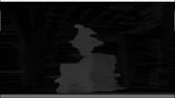

<!-- #AG_PROJECT_NAMESPACE_ROOT# -->
<!-- #AG_PROJECT_CAPTION_BEGIN# -->
# DemoFramework 6.5.1 OpenVX

To [main document](../../README.md)
<!-- #AG_PROJECT_CAPTION_END# -->
## Table of contents
<!-- #AG_TOC_BEGIN# -->
* [Demo applications](#demo-applications)
  * [OpenVX](#openvx)
    * [SoftISP](#softisp)
    * [Stereo](#stereo)
    * [VxTutorial1](#vxtutorial1)
<!-- #AG_TOC_END# -->

# Demo applications

<!-- #AG_DEMOAPPS_BEGIN# -->

## OpenVX

### [SoftISP](SoftISP)

It is a software-based image signal processing(SoftISP) application optimized by GPU. SoftISP --Options
"Enable" Enable high quality noise reduction node

### [Stereo](Stereo)

It is a stereo vision implementations based on a multi resolution strategy running on GPU. GPU kernels are developed on i.MX8 series using extended vision instruction set (EVIS).
Input images are taken by fisheye camera, so they have some distortion.

### [VxTutorial1](VxTutorial1)

<!-- #AG_DEMOAPPS_END# -->
