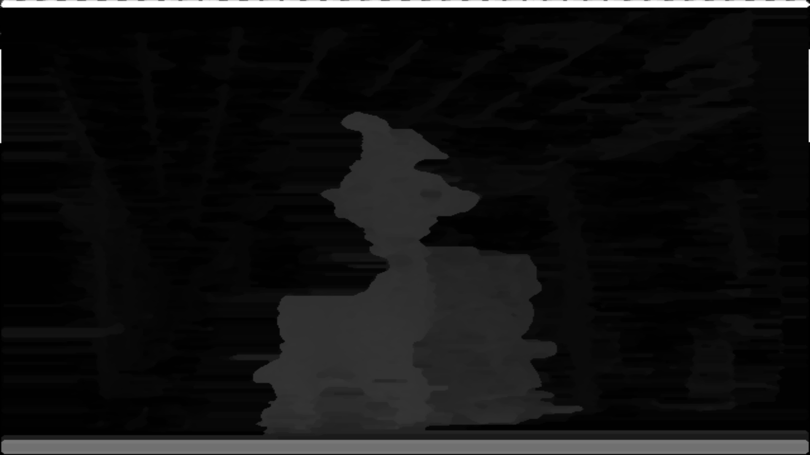

<!-- #AG_DEMOAPP_HEADER_BEGIN# -->
# Stereo

<!-- #AG_DEMOAPP_HEADER_END# -->
<!-- #AG_BRIEF_BEGIN# -->
It is a stereo vision implementations based on a multi resolution strategy running on GPU. GPU kernels are developed on i.MX8 series using extended vision instruction set (EVIS).
Input images are taken by fisheye camera, so they have some distortion.
<!-- #AG_BRIEF_END# -->

<!-- #AG_DEMOAPP_COMMANDLINE_ARGUMENTS_BEGIN# -->
<!-- #AG_DEMOAPP_COMMANDLINE_ARGUMENTS_END# -->
