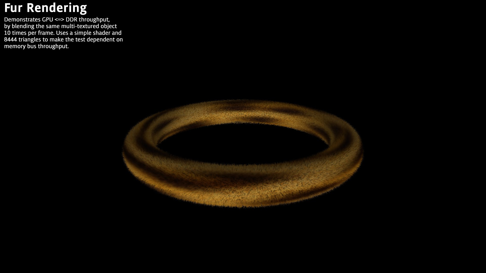

<!-- #AG_DEMOAPP_HEADER_BEGIN# -->
# FurShellRendering

<!-- #AG_DEMOAPP_HEADER_END# -->
<!-- #AG_BRIEF_BEGIN# -->
Illustrates how to render fur over several primitives.

The fur is rendered on a layered approach using a seamless texture as a base and then creating a density bitmap.

.
<!-- #AG_BRIEF_END# -->

<!-- #AG_DEMOAPP_COMMANDLINE_ARGUMENTS_BEGIN# -->

Command line arguments':

Argument                        |Description                                                                                                                                                                                                                                                                                                                |Source
--------------------------------|---------------------------------------------------------------------------------------------------------------------------------------------------------------------------------------------------------------------------------------------------------------------------------------------------------------------------|---------------
--BackgroundColor \<arg>        |Set the background color 0xRRGGBB (use decimal values).                                                                                                                                                                                                                                                                    |Demo
--Demo \<arg>                   |Select the demo to run (0 to 3)                                                                                                                                                                                                                                                                                            |Demo
--ForceFinish \<arg>            |If true each frame will execute a glFinish call                                                                                                                                                                                                                                                                            |Demo
--FurTextureSize \<arg>         |This controls the resolution of the fur density texture, applied on both axis                                                                                                                                                                                                                                              |Demo
--HairDensity \<arg>            |The hair density                                                                                                                                                                                                                                                                                                           |Demo
--HairLength \<arg>             |The length of the hairs                                                                                                                                                                                                                                                                                                    |Demo
--HighShaderPrecision \<arg>    |Shader arithmetic precision. false = low, true = high                                                                                                                                                                                                                                                                      |Demo
--LayerCount \<arg>             |The number of layers to use for rendering the fur                                                                                                                                                                                                                                                                          |Demo
--Lights \<arg>                 |number of light sources used in fragment shader calculations                                                                                                                                                                                                                                                               |Demo
--Quality \<arg>                |Select the rendering quality (low,medium,high).                                                                                                                                                                                                                                                                            |Demo
--RenderMode \<arg>             |The render mode: 0=Multi-pass, 1=Multi-pass VB, 2=OldSchool instancing, 3=ES3 instancing (default).                                                                                                                                                                                                                        |Demo
--ShowNormals \<arg>            |Render the normals                                                                                                                                                                                                                                                                                                         |Demo
--TextureRepeatCountX \<arg>    |Controls the amount of times we show the texture in the x direction (1=once, 2=twice)                                                                                                                                                                                                                                      |Demo
--TextureRepeatCountY \<arg>    |Controls the amount of times we show the texture in the y direction (1=once, 2=twice)                                                                                                                                                                                                                                      |Demo
--TorusMajorSegments \<arg>     |...                                                                                                                                                                                                                                                                                                                        |Demo
--TorusMinorSegments \<arg>     |...                                                                                                                                                                                                                                                                                                                        |Demo
--UseTriangleStrip \<arg>       |Use triangle strips if true, triangle lists if false                                                                                                                                                                                                                                                                       |Demo
--ActualDpi \<arg>              |ActualDpi [x,y] Override the actual dpi reported by the native window                                                                                                                                                                                                                                                      |DemoHost
--DensityDpi \<arg>             |DensityDpi \<number> Override the density dpi reported by the native window                                                                                                                                                                                                                                                |DemoHost
--DisplayId \<arg>              |DisplayId \<number>                                                                                                                                                                                                                                                                                                        |DemoHost
--LogExtensions                 |Output the extensions to the log                                                                                                                                                                                                                                                                                           |DemoHost
--LogLayers                     |Output the layers to the log                                                                                                                                                                                                                                                                                               |DemoHost
--LogSurfaceFormats             |Output the supported surface formats to the log                                                                                                                                                                                                                                                                            |DemoHost
--VkApiDump                     |Enable the VK_LAYER_LUNARG_api_dump layer.                                                                                                                                                                                                                                                                                 |DemoHost
--VkPhysicalDevice \<arg>       |Set the physical device index.                                                                                                                                                                                                                                                                                             |DemoHost
--VkPresentMode \<arg>          |Override the present mode with the supplied value. Known values: VK_PRESENT_MODE_IMMEDIATE_KHR (0), VK_PRESENT_MODE_MAILBOX_KHR (1), VK_PRESENT_MODE_FIFO_KHR (2), VK_PRESENT_MODE_FIFO_RELAXED_KHR (3), VK_PRESENT_MODE_SHARED_DEMAND_REFRESH_KHR (1000111000), VK_PRESENT_MODE_SHARED_CONTINUOUS_REFRESH_KHR (1000111001)|DemoHost
--VkScreenshot \<arg>           |Enable/disable screenshot support (defaults to enabled)                                                                                                                                                                                                                                                                    |DemoHost
--VkValidate \<arg>             |Enable/disable the VK_LAYER_LUNARG_standard_validation layer.                                                                                                                                                                                                                                                              |DemoHost
--Window \<arg>                 |Window mode [left,top,width,height]                                                                                                                                                                                                                                                                                        |DemoHost
--AppFirewall                   |Enable the app firewall, reporting crashes on-screen instead of exiting                                                                                                                                                                                                                                                    |DemoHostManager
--ContentMonitor                |Monitor the Content directory for changes and restart the app on changes.WARNING: Might not work on all platforms and it might impact app performance (experimental)                                                                                                                                                       |DemoHostManager
--ExitAfterDuration \<arg>      |Exit after the given duration has passed. The value can be specified in seconds or milliseconds. For example 10s or 10ms.                                                                                                                                                                                                  |DemoHostManager
--ExitAfterFrame \<arg>         |Exit after the given number of frames has been rendered                                                                                                                                                                                                                                                                    |DemoHostManager
--ForceUpdateTime \<arg>        |Force the update time to be the given value in microseconds (can be useful when taking a lot of screen-shots). If 0 this option is disabled                                                                                                                                                                                |DemoHostManager
--LogStats                      |Log basic rendering stats (this is equal to setting LogStatsMode to latest)                                                                                                                                                                                                                                                |DemoHostManager
--LogStatsMode \<arg>           |Set the log stats mode, more advanced version of LogStats. Can be disabled, latest, average                                                                                                                                                                                                                                |DemoHostManager
--ScreenshotFormat \<arg>       |Chose the format for the screenshot: bmp, jpg, png (default), tga                                                                                                                                                                                                                                                          |DemoHostManager
--ScreenshotFrequency \<arg>    |Create a screenshot at the given frame frequency                                                                                                                                                                                                                                                                           |DemoHostManager
--ScreenshotNamePrefix \<arg>   |Chose the screenshot name prefix (defaults to 'Screenshot')                                                                                                                                                                                                                                                                |DemoHostManager
--ScreenshotNameScheme \<arg>   |Chose the screenshot name scheme: frame (default), sequence, exact.                                                                                                                                                                                                                                                        |DemoHostManager
--Stats                         |Display basic frame profiling stats                                                                                                                                                                                                                                                                                        |DemoHostManager
--StatsFlags \<arg>             |Select the stats to be displayed/logged. Defaults to frame\|cpu. Can be 'frame', 'cpu' or any combination                                                                                                                                                                                                                  |DemoHostManager
--Version                       |Print version information                                                                                                                                                                                                                                                                                                  |DemoHostManager
--Graphics.Profile              |Enable graphics service stats                                                                                                                                                                                                                                                                                              |GraphicsService
--Profiler.AverageEntries \<arg>|The number of frames used to calculate the average frame-time. Defaults to: 60                                                                                                                                                                                                                                             |ProfilerService
--ghelp \<arg>                  |Display option groups: all, demo or host                                                                                                                                                                                                                                                                                   |base
-h, --help                      |Display options                                                                                                                                                                                                                                                                                                            |base
-v, --verbose                   |Enable verbose output                                                                                                                                                                                                                                                                                                      |base
<!-- #AG_DEMOAPP_COMMANDLINE_ARGUMENTS_END# -->

