<!-- #AG_PROJECT_NAMESPACE_ROOT# -->
<!-- #AG_PROJECT_CAPTION_BEGIN# -->
# DemoFramework 6.5.0 Vulkan

To [main document](../../README.md)
<!-- #AG_PROJECT_CAPTION_END# -->
## Table of contents
<!-- #AG_TOC_BEGIN# -->
* [Demo applications](#demo-applications)
  * [Vulkan](#vulkan)
    * [AntiAliasing](#antialiasing)
    * [Bloom](#bloom)
    * [ComputeParticles](#computeparticles)
    * [DisplacementMapping](#displacementmapping)
    * [DynamicTerrainTessellation](#dynamicterraintessellation)
    * [EffectOffscreen](#effectoffscreen)
    * [FractalShader](#fractalshader)
    * [FurShellRendering](#furshellrendering)
    * [GammaCorrection](#gammacorrection)
    * [Gears](#gears)
    * [GenerateMipMaps](#generatemipmaps)
    * [GpuTimestamp](#gputimestamp)
    * [HDR01_BasicToneMapping](#hdr01_basictonemapping)
    * [HDR02_FBBasicToneMapping](#hdr02_fbbasictonemapping)
    * [HDR03_SkyboxToneMapping](#hdr03_skyboxtonemapping)
    * [HDR04_HDRFramebuffer](#hdr04_hdrframebuffer)
    * [LineBuilder101](#linebuilder101)
    * [MeshInstancing](#meshinstancing)
    * [ModelInstancing](#modelinstancing)
    * [ModelLoaderBasics](#modelloaderbasics)
    * [ModelViewer](#modelviewer)
    * [MultipleViewportsFractalShader](#multipleviewportsfractalshader)
    * [NativeWindowTest](#nativewindowtest)
    * [ObjectSelection](#objectselection)
    * [OpenCL101](#opencl101)
    * [OpenCLGaussianFilter](#openclgaussianfilter)
    * [OpenCV101](#opencv101)
    * [OpenCVMatToNativeBatch](#opencvmattonativebatch)
    * [OpenCVMatToUI](#opencvmattoui)
    * [OpenVX101](#openvx101)
    * [Scissor101](#scissor101)
    * [Screenshot](#screenshot)
    * [SdfFonts](#sdffonts)
    * [ShaderClock](#shaderclock)
    * [Skybox](#skybox)
    * [SpatialHashGrid2D](#spatialhashgrid2d)
    * [SRGBFramebuffer](#srgbframebuffer)
    * [Stats](#stats)
    * [T3DStressTest](#t3dstresstest)
    * [TessellationPNTriangles](#tessellationpntriangles)
    * [TextureCompression](#texturecompression)
    * [Texturing](#texturing)
    * [TexturingArrays](#texturingarrays)
    * [TexturingCubeMap](#texturingcubemap)
    * [Triangle](#triangle)
    * [Vulkan101](#vulkan101)
    * [VulkanComputeMandelbrot](#vulkancomputemandelbrot)
    * [VulkanInfo](#vulkaninfo)
  * [Vulkan.System](#vulkansystem)
    * [BasicRenderModelLoader](#basicrendermodelloader)
    * [CustomAppServices](#customappservices)
    * [DevBasicRender](#devbasicrender)
    * [DevBasicRenderCustomShader](#devbasicrendercustomshader)
    * [DevBatch](#devbatch)
    * [DevNativeTexture2D](#devnativetexture2d)
    * [DFGraphicsBasic2D](#dfgraphicsbasic2d)
    * [DFNativeBatch2D](#dfnativebatch2d)
    * [EasingFunctions](#easingfunctions)
    * [Gestures](#gestures)
    * [InputEvents](#inputevents)
    * [OnDemandRendering](#ondemandrendering)
  * [Vulkan.UI](#vulkanui)
    * [BasicDataBinding](#basicdatabinding)
    * [Benchmark](#benchmark)
    * [Charts](#charts)
    * [Declarative](#declarative)
    * [DpiScale](#dpiscale)
    * [Gestures](#gestures)
    * [PixelPerfect](#pixelperfect)
    * [RenderTest](#rendertest)
    * [SimpleUI100](#simpleui100)
    * [SimpleUI101](#simpleui101)
    * [SmoothScroll](#smoothscroll)
    * [ThemeBasicUI](#themebasicui)
<!-- #AG_TOC_END# -->

# Demo applications

<!-- #AG_DEMOAPPS_BEGIN# -->

## Vulkan

### [AntiAliasing](AntiAliasing)

<a href="AntiAliasing/Thumbnail.jpg">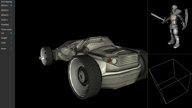</a>

Example of various forms of anti aliasing.
Demonstrates enabling fast MSAA resolve using GL_EXT_multisampled_render_to_texture.

### [Bloom](Bloom)

<a href="Bloom/Thumbnail.jpg">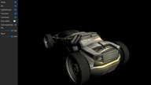</a>

A example of how to create a bloom effect. The idea is not to create the most accurate bloom,
but something that is fairly fast to render.

Instead of increasing the kernal size to get a good blur we do a fairly fast approximation by
downscaling the original image to multiple smaller render-targets and then blurring these
using a relative small kernel and then finally rescaling the result to the original size.

### [ComputeParticles](ComputeParticles)

<a href="ComputeParticles/Thumbnail.jpg">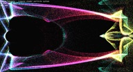</a>

Attraction based particle system. A shader storage buffer is used to store particle on which the compute shader does some physics calculations.
The buffer is then used by the graphics pipeline for rendering with a gradient texture for.
Demonstrates the use of memory barriers for synchronizing vertex buffer access between a compute and graphics pipeline

Based on a example called [ComputeParticles](https://github.com/SaschaWillems/Vulkan) by Sascha Willems.
Recreated as a DemoFramework freestyle window sample in 2016.

### [DisplacementMapping](DisplacementMapping)

<a href="DisplacementMapping/Thumbnail.jpg">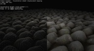</a>

Uses tessellation shaders to generate additional details and displace geometry based on a heightmap.

Based on a example called [Displacement mapping](https://github.com/SaschaWillems/Vulkan) by Sascha Willems.
Recreated as a DemoFramework freestyle window sample in 2016.

### [DynamicTerrainTessellation](DynamicTerrainTessellation)

<a href="DynamicTerrainTessellation/Thumbnail.jpg">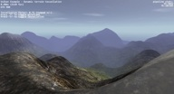</a>

Renders a terrain with dynamic tessellation based on screen space triangle size,
resulting in closer parts of the terrain getting more details than distant parts.
The terrain geometry is also generated by the tessellation shader using a 16 bit height map for displacement.
To improve performance the example also does frustum culling in the tessellation shader.

Based on a example called [Dynamic terrain tessellation](https://github.com/SaschaWillems/Vulkan) by Sascha Willems.
Recreated as a DemoFramework freestyle window sample in 2016.

### [EffectOffscreen](EffectOffscreen)

Shows how to render to a offscreen texture. The texture is then used to render the next pass where it applies a very simple 'water' like effect.

### [FractalShader](FractalShader)

<a href="FractalShader/Thumbnail.jpg">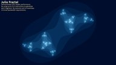</a>

Can render both the julia and mandelbrot set.
Was used to demonstrates GPU shader performance by using up to 515 instructions each fragment while generating the julia set.

No texture and no overdraw, minimal bandwidth requirements.

### [FurShellRendering](FurShellRendering)

<a href="FurShellRendering/Thumbnail.jpg">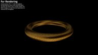</a>

Illustrates how to render fur over several primitives.

The fur is rendered on a layered approach using a seamless texture as a base and then creating a density bitmap.

.

### [GammaCorrection](GammaCorrection)

<a href="GammaCorrection/Thumbnail.jpg">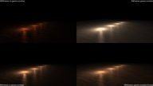</a>

A simple example of how to do gamma correction it shows the difference that SRGB textures and gamma correction makes to the output by comparing
it to the uncorrected rendering methods.

### [Gears](Gears)

Vulkan interpretation of glxgears.
Procedurally generates separate meshes for each gear, with every mesh having it's own uniform buffer object for animation.
Also demonstrates how to use different descriptor sets.

Based on a example called [Vulkan Gears](https://github.com/SaschaWillems/Vulkan) by Sascha Willems.
Recreated as a DemoFramework freestyle window sample in 2016.

### [GenerateMipMaps](GenerateMipMaps)

<a href="GenerateMipMaps/Thumbnail.jpg">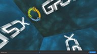</a>

A simple example that shows how to generate mipmaps at runtime.

### [GpuTimestamp](GpuTimestamp)

Simple example that showcase the vkCmdWriteTimestamp functionality on supported devices.

### [HDR01_BasicToneMapping](HDR01_BasicToneMapping)

As normal framebuffer values are clamped between 0.0 and 1.0 it means that any light value above 1.0 gets clamped.
Because of this its not really possible to differentiate really bright lights from normal lights.
To take advantage of the light information that normally gets discarded we use a tone mapping algorithm to try and
preserve it. This demo applies the tonemapping right away in the lighting shader so no temporary floating point framebuffer is needed.

### [HDR02_FBBasicToneMapping](HDR02_FBBasicToneMapping)

<a href="HDR02_FBBasicToneMapping/Thumbnail.jpg">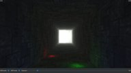</a>

As normal framebuffer values are clamped between 0.0 and 1.0 it means that any light value above 1.0 gets clamped.
Because of this its not really possible to differentiate really bright lights from normal lights.
To take advantage of the light information that normally gets discarded we use a tone mapping algorithm to try and
preserve it. This demo applies the tonemapping as a postprocessing step on the fully lit scene,
so a temporary floating point framebuffer is needed.

This sample outputs to a LDR screen.

### [HDR03_SkyboxToneMapping](HDR03_SkyboxToneMapping)

Render a HDR skybox and apply various tonemapping algorithms to it.

This sample outputs to a LDR screen.

### [HDR04_HDRFramebuffer](HDR04_HDRFramebuffer)

<a href="HDR04_HDRFramebuffer/Thumbnail.jpg">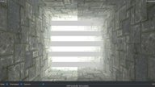</a>

Demonstrates how to enable HDRFramebuffer mode if available.
The render a test scene using a pattern that makes it easy to detect if the display actually enabled HDR mode.

This sample outputs to a HDR screen if supported.

### [LineBuilder101](LineBuilder101)

<a href="LineBuilder101/Thumbnail.jpg">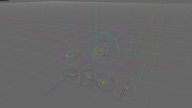</a>

A simple example of dynamic line rendering using the LineBuilder helper class.
The line builder has 'Add' methods for most FslBase.Math classes like BoundingBox, BoundingSphere, BoundingFrustrum, Ray, etc.

### [MeshInstancing](MeshInstancing)

<a href="MeshInstancing/Thumbnail.jpg">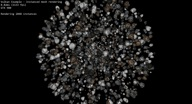</a>

Shows the use of instancing for rendering many copies of the same mesh using different attributes and textures.
A secondary vertex buffer containing instanced data, stored in device local memory,
is used to pass instance data to the shader via vertex attributes with a per-instance step rate.
The instance data also contains a texture layer index for having different textures for the instanced meshes.

Based on a example called [Mesh instancing](https://github.com/SaschaWillems/Vulkan) by Sascha Willems.
Recreated as a DemoFramework freestyle window sample in 2016.

### [ModelInstancing](ModelInstancing)

<a href="ModelInstancing/Thumbnail.jpg">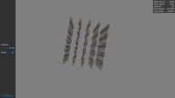</a>

Shows the use of instancing for rendering many copies of the same mesh.

### [ModelLoaderBasics](ModelLoaderBasics)

<a href="ModelLoaderBasics/Thumbnail.jpg">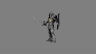</a>

### [ModelViewer](ModelViewer)

<a href="ModelViewer/Thumbnail.jpg">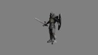</a>

Expands the ModelLoaderBasics example with:

- A arcball camera
- Multiple different scenes (Knight, Dragon, Car, etc)
- More advanced shaders for directional per pixel specular light with support for gloss and normal maps.

### [MultipleViewportsFractalShader](MultipleViewportsFractalShader)

<a href="MultipleViewportsFractalShader/Thumbnail.jpg">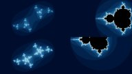</a>

Demonstrates how to utilize multiple viewports.
It reuses the fractal shaders from the FractalShader demo to render the julia and mandelbrot sets.

No texture and no overdraw, minimal bandwidth requirements.

### [NativeWindowTest](NativeWindowTest)

Check that vkGetPhysicalDeviceSurfaceCapabilitiesKHR reports the expected values before and after swapchain creation for the given native window implementation.

### [ObjectSelection](ObjectSelection)

<a href="ObjectSelection/Thumbnail.jpg">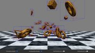</a>

Shows how to select (pick) 3d objects using the mouse via Axis Aligned Bounding Boxes (AABB).

Beware that AABB's often represent quite a rough fit and therefore is best used as a quick way to determine
if there might be a collision and then utilize a more precise calculation to verify it.

### [OpenCL101](OpenCL101)

Simple application that allows you to get your system's Vulkan available platforms.

Demonstrates how to use OpenCL from inside a Vulkan project.

This is a very basic example that mainly shows how to setup the correct dependency in the Fsl.gen file and
then it does some very basic OpenCL operations. It could be used as a good starting point for a more complex example.

### [OpenCLGaussianFilter](OpenCLGaussianFilter)

<a href="OpenCLGaussianFilter/Thumbnail.jpg">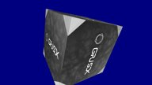</a>

This sample uses OpenCL to execute a Gaussian Blur on an image.

The output will then be stored into a bmp image and also displayed as an Vulkan texture mapped to a cube.

### [OpenCV101](OpenCV101)

Demonstrates how to use OpenCV from inside a Vulkan project.

This is a very basic example that mainly shows how to setup the correct dependency in the Fsl.gen file and
then it does some very basic OpenCV operations. It could be used as a good starting point for a more complex example.

### [OpenCVMatToNativeBatch](OpenCVMatToNativeBatch)

Demonstrates how to take a OpenCV mat and convert it to a Bitmap which is then converted to a Texture2D for use with
the NativeBatch. The texture is then shown on screen and can be compared to the same texture that was loaded using the
normal DemoFramework methods.

The cv::Mat -> Bitmap routines used here are a very basic proof of concept.

### [OpenCVMatToUI](OpenCVMatToUI)

Demonstrates how to take a OpenCV mat and convert it to a Bitmap which is then converted to a Texture2D for use with
the UI frmaework. The texture is then shown on screen and can be compared to the same texture that was loaded using the
normal DemoFramework methods.

The cv::Mat -> Bitmap routines used here are a very basic proof of concept.

### [OpenVX101](OpenVX101)

Demonstrate how process a image with OpenVX then use it to render as a texture on the GPU.

### [Scissor101](Scissor101)

A simple example of how scissoring works in Vulkan.

This is showcased by rendering the insides of a rotating cube and using a animated scissor rectangle to clip.

### [Screenshot](Screenshot)

<a href="Screenshot/Thumbnail.jpg">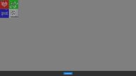</a>

Shows how to take a screenshot from code.

### [SdfFonts](SdfFonts)

<a href="SdfFonts/Thumbnail.jpg">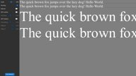</a>

Simple example of bitmap fonts vs SDF bitmap fonts.
This example shows the worst case differences as we only use one resolution for the bitmap font meaning we often upscale the image which gives the worst ouput.
A proper bitmap font solution should have multiple font textures at various DPI's and select the one closest to the actual font rendering size and preferbly also prefer to downscale the image instead of upscaling it.

It also showcases two simple SDF effects:

- Outline
- Shadow

### [ShaderClock](ShaderClock)

<a href="ShaderClock/Thumbnail.jpg">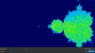</a>

Simple example that showcase the device extension VK_KHR_shader_clock.

### [Skybox](Skybox)

Render a simple skybox using a cubemap.

### [SpatialHashGrid2D](SpatialHashGrid2D)

<a href="SpatialHashGrid2D/Thumbnail.jpg">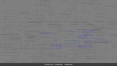</a>

A simple example of how a spatial hash grid works in 2d.

### [SRGBFramebuffer](SRGBFramebuffer)

<a href="SRGBFramebuffer/Thumbnail.jpg">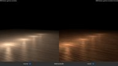</a>

Enables a SRGB Framebuffer if its available.
If unavailable it does normal gamma correction in the shader.

### [Stats](Stats)

<a href="Stats/Thumbnail.jpg">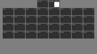</a>

Showcase the new stats services.

### [T3DStressTest](T3DStressTest)

<a href="T3DStressTest/Thumbnail.jpg">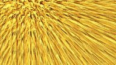</a>

Executes a highly configurable stress test for the Vulkan API.

It will procedurally generate a mesh and fur texture that is then rendered to cover the entire screen.

This will often showcase the worst case power consumption of the GPU.

### [TessellationPNTriangles](TessellationPNTriangles)

<a href="TessellationPNTriangles/Thumbnail.jpg">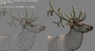</a>

Generating curved PN-Triangles on the GPU using tessellation shaders to add details to low-polygon meshes,
based on [this paper](http://alex.vlachos.com/graphics/CurvedPNTriangles.pdf), with shaders from
[this tutorial](http://onrendering.blogspot.de/2011/12/tessellation-on-gpu-curved-pn-triangles.html).

Based on a example called [PN-Triangles](https://github.com/SaschaWillems/Vulkan) by Sascha Willems.
Recreated as a DemoFramework freestyle window sample in 2016.

### [TextureCompression](TextureCompression)

<a href="TextureCompression/Thumbnail.jpg">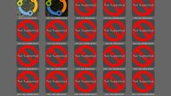</a>

Load and render the supported compressed textures.
It also outputs information about the compression support.

### [Texturing](Texturing)

<a href="Texturing/Thumbnail.jpg">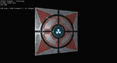</a>

Shows how to upload a 2D texture into video memory for sampling in a shader.
Loads a compressed texture into a host visible staging buffer and copies all mip levels to a device local optimal tiled image for best performance.

Also demonstrates the use of combined image samplers. Samplers are detached from the actual texture image and
only contain information on how an image is sampled in the shader.

Based on a example called [Texture mapping](https://github.com/SaschaWillems/Vulkan) by Sascha Willems.
Recreated as a DemoFramework freestyle window sample in 2016.

### [TexturingArrays](TexturingArrays)

<a href="TexturingArrays/Thumbnail.jpg">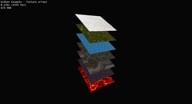</a>

Texture arrays allow storing of multiple images in different layers without any interpolation between the layers.
This example demonstrates the use of a 2D texture array with instanced rendering. Each instance samples from a different layer of the texture array.

Based on a example called [Texture arrays](https://github.com/SaschaWillems/Vulkan) by Sascha Willems.
Recreated as a DemoFramework freestyle window sample in 2016.

### [TexturingCubeMap](TexturingCubeMap)

<a href="TexturingCubeMap/Thumbnail.jpg">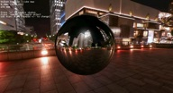</a>

Building on the basic texture loading example, a cubemap texture is loaded into a staging buffer and
is copied over to a device local optimal image using buffer to image copies for all of it's faces and mip maps.

The demo then uses two different pipelines (and shader sets) to display the cubemap as a skybox (background) and as a source for reflections.

Based on a example called [Cube maps](https://github.com/SaschaWillems/Vulkan) by Sascha Willems.
Recreated as a DemoFramework freestyle window sample in 2016.

### [Triangle](Triangle)

<a href="Triangle/Thumbnail.jpg">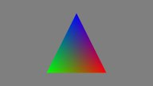</a>

Most basic example. Renders a colored triangle using an indexed vertex buffer.
Vertex and index data are uploaded to device local memory using so-called "staging buffers".
Uses a single pipeline with basic shaders loaded from SPIR-V and and single uniform block for passing matrices that is updated on changing the view.

This example is far more explicit than the other examples and is meant to be a starting point for learning Vulkan from the ground up.
Much of the code is boilerplate that you'd usually encapsulate in helper functions and classes (which is what the other examples do).

### [Vulkan101](Vulkan101)

<a href="Vulkan101/Thumbnail.jpg">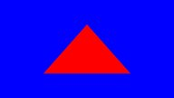</a>

Renders a red triangle.

### [VulkanComputeMandelbrot](VulkanComputeMandelbrot)

<a href="VulkanComputeMandelbrot/Thumbnail.jpg">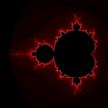</a>

Calculating and drawing of the Mandelbrot set using the core Vulkan API

Based on a sample by Norbert Nopper from VKTS Examples [VKTS_Sample08](https://github.com/McNopper/Vulkan/blob/master/VKTS_Example08)
Recreated as a DemoFramework freestyle console sample in 2016.

.

### [VulkanInfo](VulkanInfo)

Commandline tool to dump vulkan system information to the console.

This is a easy way to quickly query the hardware capabilities as reported by vulkan.

## Vulkan.System

### [BasicRenderModelLoader](System/BasicRenderModelLoader)

<a href="System/BasicRenderModelLoader/Thumbnail.jpg">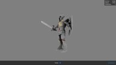</a>

Quick example that showcase how to mix rendering using the basic rendering API and the FslSimpleUI.

### [CustomAppServices](System/CustomAppServices)

A example of how to register custom app specific services.

### [DevBasicRender](System/DevBasicRender)

Development project for the IBasicRenderSystem.

### [DevBasicRenderCustomShader](System/DevBasicRenderCustomShader)

Development project for custom shaders for the IBasicRenderSystem.

### [DevBatch](System/DevBatch)

<a href="System/DevBatch/Thumbnail.jpg">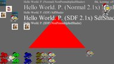</a>

Development project for the basic quad batch implementation that is used to implement the native batch for Vulkan.
The NativeBatch implementation is what allows the UI library to work with Vulkan.
.

### [DevNativeTexture2D](System/DevNativeTexture2D)

Development project for the Vulkan NativeTexture2D and DynamicNativeTexture2D implementation.
Makes it easy to provoke certain NativeTexture2D/DynamicNativeTexture2D scenarios.

### [DFGraphicsBasic2D](System/DFGraphicsBasic2D)

Shows how to use the Demo Frameworks 'basic' 2d rendering capabilities that work across all backends.
The basic2D interface allows you to render ASCII strings using a system provided font and draw colored points.

The functionality in Basic2D is used internally in the framework to render the profiling overlays like the frame rate counter and graph.

### [DFNativeBatch2D](System/DFNativeBatch2D)

<a href="System/DFNativeBatch2D/Thumbnail.jpg">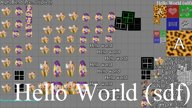</a>

Shows how to use the Demo Frameworks NativeBatch implementatin to render various graphics elements.
The native batch functionality works across various 3D backends and also allows you to use the API native textures for rendering.

The native batch is very useful for quickly getting something on the screen which can be useful for prototyping and debugging.
It is however not a optimized way of rendering things.

### [EasingFunctions](System/EasingFunctions)

<a href="System/EasingFunctions/Thumbnail.jpg">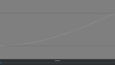</a>

Visualize the supported easing functions.

### [Gestures](System/Gestures)

<a href="System/Gestures/Thumbnail.jpg">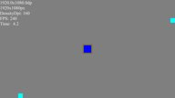</a>

Application used to debug the gesture handling code.

### [InputEvents](System/InputEvents)

Demonstrates how to receive various input events and logs information about them onscreen and to to the log.

This can also be used to do some basic real time tests of the input system when porting the framework to a new platform.

### [OnDemandRendering](System/OnDemandRendering)

<a href="System/OnDemandRendering/Thumbnail.jpg">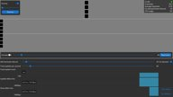</a>

Development project for on demand rendering and demonstrates how to implement it.
It also has some basic 'janky timing' detection animations.

This application has been designed for a **1920x1080dp** screen and will provide a sub-optimal experience for resolutions lower than that.

## Vulkan.UI

### [BasicDataBinding](UI/BasicDataBinding)

Simple example of UI data binding

### [Benchmark](UI/Benchmark)

<a href="UI/Benchmark/Thumbnail.jpg">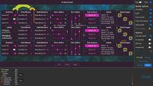</a>

UI benchmark that can be used to benchmark various ways of rendering a UI. This allows you to see what works best on the given hardware.

This application has been designed for a **1920x1080dp** screen and will provide a sub-optimal experience for resolutions lower than that.

### [Charts](UI/Charts)

<a href="UI/Charts/Thumbnail.jpg">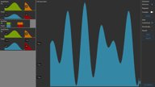</a>

Simple example of UI chart rendering.

### [Declarative](UI/Declarative)

<a href="UI/Declarative/Thumbnail.jpg">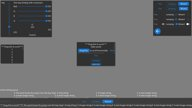</a>

Experimental declarative UI that use the new data-binding capability to create UI from a XML file.

### [DpiScale](UI/DpiScale)

This sample showcases a UI that is DPI aware vs one rendered using the standard pixel based method.

It also showcases various ways to render scaled strings and the errors that are easy to introduce.

### [Gestures](UI/Gestures)

<a href="UI/Gestures/Thumbnail.jpg">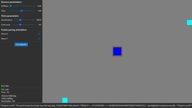</a>

Application used to debug the UI gesture handling code.

### [PixelPerfect](UI/PixelPerfect)

<a href="UI/PixelPerfect/Thumbnail.jpg">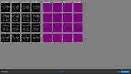</a>

This sample showcases some of the common scaling traps that can occur when trying to achieve pixel perfect rendering.

### [RenderTest](UI/RenderTest)

<a href="UI/RenderTest/Thumbnail.jpg">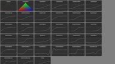</a>

This sample test the various internal UI rendering primitives.

### [SimpleUI100](UI/SimpleUI100)

<a href="UI/SimpleUI100/Thumbnail.jpg">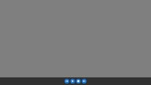</a>

A very basic example of how to utilize the DemoFramework's UI library.
The sample displays four buttons and reacts to clicks.

The UI framework that makes it easy to get a basic UI up and running. The main UI code is API independent. It is not a show case of how to render a UI fast but only intended to allow you to quickly get a UI ready that is good enough for a demo.

### [SimpleUI101](UI/SimpleUI101)

<a href="UI/SimpleUI101/Thumbnail.jpg">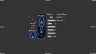</a>

A more complex example of how to utilize the DemoFramework's UI library.
It displays various UI controls and ways to utilize them.

The UI framework that makes it easy to get a basic UI up and running. The main UI code is API independent. It is not a show case of how to render a UI fast but only intended to allow you to quickly get a UI ready that is good enough for a demo.

### [SmoothScroll](UI/SmoothScroll)

<a href="UI/SmoothScroll/Thumbnail.jpg">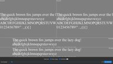</a>

This sample showcases the difference between sub pixel accuracy vs pixel accuracy when scrolling.

### [ThemeBasicUI](UI/ThemeBasicUI)

Showcase all controls that is part of the Basic UI theme.

<!-- #AG_DEMOAPPS_END# -->
