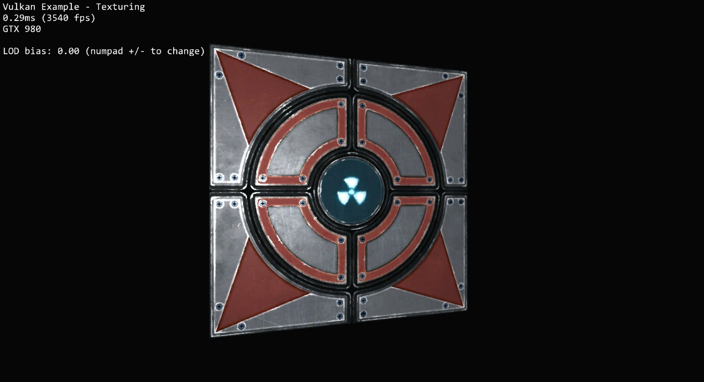

<!-- #AG_DEMOAPP_HEADER_BEGIN# -->
# Texturing

<!-- #AG_DEMOAPP_HEADER_END# -->
<!-- #AG_BRIEF_BEGIN# -->
Shows how to upload a 2D texture into video memory for sampling in a shader.
Loads a compressed texture into a host visible staging buffer and copies all mip levels to a device local optimal tiled image for best performance.

Also demonstrates the use of combined image samplers. Samplers are detached from the actual texture image and
only contain information on how an image is sampled in the shader.

Based on a example called [Texture mapping](https://github.com/SaschaWillems/Vulkan) by Sascha Willems.
Recreated as a DemoFramework freestyle window sample in 2016.
<!-- #AG_BRIEF_END# -->

<!-- #AG_DEMOAPP_COMMANDLINE_ARGUMENTS_BEGIN# -->

Command line arguments':

Argument                       |Description                                                                                                                                                          |Source
-------------------------------|---------------------------------------------------------------------------------------------------------------------------------------------------------------------|---------------
--pd \<arg>                    |Set the physical device index.                                                                                                                                       |Demo
--DisplayId \<arg>             |DisplayId \<number>                                                                                                                                                  |DemoHost
--Window \<arg>                |Window mode [left,top,width,height]                                                                                                                                  |DemoHost
--AppFirewall                  |Enable the app firewall, reporting crashes on-screen instead of exiting                                                                                              |DemoHostManager
--ContentMonitor               |Monitor the Content directory for changes and restart the app on changes. WARNING: Might not work on all platforms and it might impact app performance (experimental)|DemoHostManager
--ExitAfterFrame \<arg>        |Exit after the given number of frames has been rendered                                                                                                              |DemoHostManager
--ForceUpdateTime \<arg>       |Force the update time to be the given value in microseconds (can be useful when taking a lot of screen-shots). If 0 this option is disabled                          |DemoHostManager
--LogStats                     |Log basic rendering stats (this is equal to setting LogStatsMode to latest)                                                                                          |DemoHostManager
--LogStatsMode \<arg>          |Set the log stats mode, more advanced version of LogStats. Can be disabled, latest, average                                                                          |DemoHostManager
--ScreenshotFrequency \<arg>   |Create a screenshot at the given frame frequency                                                                                                                     |DemoHostManager
--Stats                        |Display basic frame profiling stats                                                                                                                                  |DemoHostManager
--Profiler.AverageEntries \<arg>|The number of frames used to calculate the average frame-time. Defaults to: 60                                                                                       |ProfilerService
--ghelp \<arg>                 |Display option groups: all, demo or host                                                                                                                             |base
-h, --help                     |Display options                                                                                                                                                      |base
-v, --verbose                  |Enable verbose output                                                                                                                                                |base
<!-- #AG_DEMOAPP_COMMANDLINE_ARGUMENTS_END# -->
