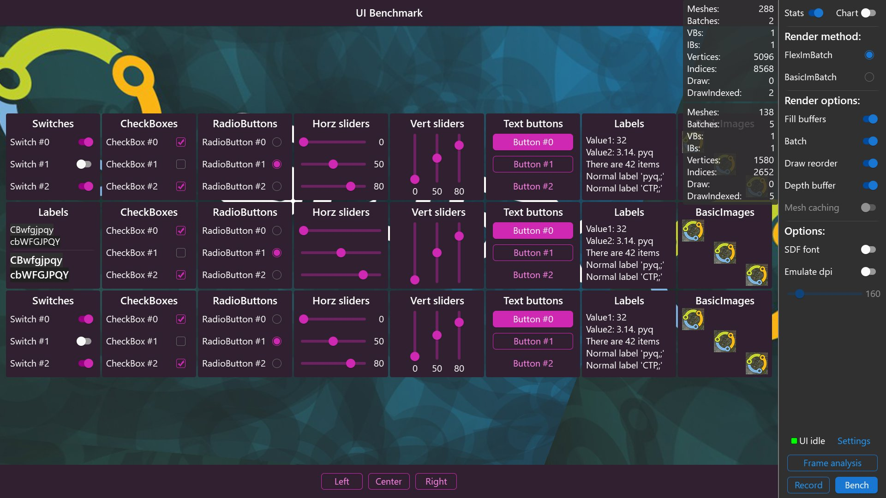

<!-- #AG_DEMOAPP_HEADER_BEGIN# -->
# Benchmark

<!-- #AG_DEMOAPP_HEADER_END# -->
<!-- #AG_BRIEF_BEGIN# -->
UI benchmark that can be used to benchmark various ways of rendering a UI. This allows you to see what works best on the given hardware.

This application has been designed for a **1920x1080dp** screen and will provide a sub-optimal experience for resolutions lower than that.
<!-- #AG_BRIEF_END# -->

## Important

As with all benchmarking apps its very important that you try to run the benchmark with a fixed CPU clock and fixed GPU clock to get comparable numbers between tests. This also goes for CPU+GPU power-management since it often allows the processor to dynamically scale is performance, which will have a huge effect on recorded numbers. It makes it hard to compare results between various 'optimizations' as it can can seem like they will have no measurable effect. But in fact they will allow the processor to remain at a lower clock speed while keeping the measured times equal or slightly larger, so to compare optimization you really need to keep the CPU and GPU clocks fixed if possible.

Beware that both device and room temperature can affect your systems  performance as well, this is especially true for mobile devices. Running other applications at the same time as the benchmark will also impact the results.

## Playground scene

The playground allows you to play around with the test UI and toggle various rendering options to directly see the effect. In this documentation ***test-app*** refers to the purple UI being rendered.

### Quick toggles

Toggle|Description
------|-------------------------
Stats |Show UI stats.
Chart |Show the CPU usage chart.

### Render method

Select the render method used for rendering the 'test-app'. Beware changing the batcher method will restart it.

Render method|Description
-------------|------------------------
FlexImBatch  |A immediate mode batcher that supports various options that can be toggled on/off in realtime.
BasicImBatch |A immediate mode batcher that has a fixed set of optimizations. The main purpose is to have a comparison point to the more flexible batchers.

### Render optimizations

The render optimizations that the render method uses and/or allow you to modify at runtime without restarting the test-app.

Render optimizations |On                                                                                  | Off
---------------------|------------------------------------------------------------------------------------|-------------------------------------------------------------------
Fill buffers         | Vertex buffers are index buffers are filled before a new one is created.           | Each mesh has its own VB+IB.
Batch                | Meshes with the same material are batched together                                 | Meshes are rendered individually.
Draw call reordering | Draw calls are reordered if possible to reduce the amount of material switches.    | Everything is drawn in the requested order.
Depth buffer         | The batcher is depth buffer aware and can use it to improve the batching. This will only have a effect if the UI is rendered with both opaque and transparent materials.         | The depth buffer can not be used to reduce overdraw.
Mesh caching         | Meshes are cached between frames and only regenerated if modified.                 | All meshes are recreated every frame.

### Options

Other test-app options that can be changed dynamically.

Options     |Description
------------|----------------------------
SDF font    | If on all text is rendered using a SDF font material. If its off a standard bitmap font is used. As the SDF font is a different material it will cause more material changes and therefore greatly benefit from draw call reordering optimization.
Emulate DPI | If enabled you can change the test UI dpi at runtime, beware that it will load/unload textures if necessary and therefore it can be slow on some platforms.

### Settings

Various other options.

Settings            |Description
--------------------|-----------------------------------
No opaque materials |Disable all opaque materials, forcing them to be transparent. This will restart the test-app.
UI stats            |If enabled, the 'stats' overlay will also show the 'main app blue UI' stats.
Show busy           |If enabled, the UI idle indicator will show 'orange' if the 'main app blue UI' is busy. This is mainly of interest to the app developer.

### Other buttons

Button |Description
-------|-----------------------------------
Bench  |Switch to the benchmark scene.
Record |Switch to the record scene where you can record a custom benchmark sequence.

## Keybindings

### Playground keybindings

The app 'playground' scene can be controlled using:

Key         | Result
------------|---------------------------------------
T           | Show stats on/off
C           | Show chart on/off
F           | Toggle render optimization 'fill buffers' on/off
B           | Toggle render optimization 'batch' on/off
R           | Toggle render optimization 'draw reorder' on/off
I           | Toggle render optimization 'prefer fast reorder' on/off (on normally uses a constrained linear reorder, off a spatial grid reorder)
D           | Toggle render optimization 'depth buffer' on/off
M           | Toggle render optimization 'mesh caching' on/off
O           | Toggle on demand rendering on/off
S           | Toggle SDF fonts on/off
E           | Toggle emulate dpi on/off
F2          | Show the 'root' color changer
Left arrow  | dpi slider decrease
Right arrow | dpi slider increase
Up arrow    | dpi slider increase by one
Down arrow  | dpi slider decrease by one
Space       | Clear graph
Escape      | Quit the app

### Record keybindings

The app 'record' scene can be controlled using:

Key         | Result
------------|---------------------------------------
R           | Start/stop record.
P           | Start/stop playback the recording if present
S           | Stop recording/playback
Escape      | Go back to the previous scene or if recording this will stop the recording.

### Benchmark keybindings

The app 'benchmark' scene can be controlled using:

Key         | Result
------------|---------------------------------------
Escape      | Cancel benchmark and go back to the previous scene.

### Results keybindings

The app 'results' scene can be controlled using:

Key         | Result
------------|---------------------------------------
T           | If comparing two results this will toggle between them.
Escape      | go back to the previous scene.

<!-- #AG_DEMOAPP_COMMANDLINE_ARGUMENTS_BEGIN# -->

Command line arguments':

Argument                        |Description                                                                                                                                                                                                                                                                                                                |Source
--------------------------------|---------------------------------------------------------------------------------------------------------------------------------------------------------------------------------------------------------------------------------------------------------------------------------------------------------------------------|---------------
--Compare \<arg>                |Always compare a benchmark to the supplied result file                                                                                                                                                                                                                                                                     |Demo
--NoChart                       |Disable the chart UI                                                                                                                                                                                                                                                                                                       |Demo
--RunDefaultBench               |Run the default bench, this forces the use of the default input recording and forces the scene to bench                                                                                                                                                                                                                    |Demo
--Scene \<arg>                  |Select the scene to start: bench, play, record, result                                                                                                                                                                                                                                                                     |Demo
--ShowSystemIdle                |Indicate if the system UI is idle or not                                                                                                                                                                                                                                                                                   |Demo
--View \<arg>                   |View the file as the current result, this will launch the app into the result screen.                                                                                                                                                                                                                                      |Demo
--ActualDpi \<arg>              |ActualDpi [x,y] Override the actual dpi reported by the native window                                                                                                                                                                                                                                                      |DemoHost
--DensityDpi \<arg>             |DensityDpi \<number> Override the density dpi reported by the native window                                                                                                                                                                                                                                                |DemoHost
--DisplayId \<arg>              |DisplayId \<number>                                                                                                                                                                                                                                                                                                        |DemoHost
--LogExtensions                 |Output the extensions to the log                                                                                                                                                                                                                                                                                           |DemoHost
--LogLayers                     |Output the layers to the log                                                                                                                                                                                                                                                                                               |DemoHost
--LogSurfaceFormats             |Output the supported surface formats to the log                                                                                                                                                                                                                                                                            |DemoHost
--VkApiDump                     |Enable the VK_LAYER_LUNARG_api_dump layer.                                                                                                                                                                                                                                                                                 |DemoHost
--VkPhysicalDevice \<arg>       |Set the physical device index.                                                                                                                                                                                                                                                                                             |DemoHost
--VkPresentMode \<arg>          |Override the present mode with the supplied value. Known values: VK_PRESENT_MODE_IMMEDIATE_KHR (0), VK_PRESENT_MODE_MAILBOX_KHR (1), VK_PRESENT_MODE_FIFO_KHR (2), VK_PRESENT_MODE_FIFO_RELAXED_KHR (3), VK_PRESENT_MODE_SHARED_DEMAND_REFRESH_KHR (1000111000), VK_PRESENT_MODE_SHARED_CONTINUOUS_REFRESH_KHR (1000111001)|DemoHost
--VkScreenshot \<arg>           |Enable/disable screenshot support (defaults to enabled)                                                                                                                                                                                                                                                                    |DemoHost
--VkValidate \<arg>             |Enable/disable the VK_LAYER_LUNARG_standard_validation layer.                                                                                                                                                                                                                                                              |DemoHost
--Window \<arg>                 |Window mode [left,top,width,height]                                                                                                                                                                                                                                                                                        |DemoHost
--AppFirewall                   |Enable the app firewall, reporting crashes on-screen instead of exiting                                                                                                                                                                                                                                                    |DemoHostManager
--ContentMonitor                |Monitor the Content directory for changes and restart the app on changes.WARNING: Might not work on all platforms and it might impact app performance (experimental)                                                                                                                                                       |DemoHostManager
--ExitAfterDuration \<arg>      |Exit after the given duration has passed. The value can be specified in seconds or milliseconds. For example 10s or 10ms.                                                                                                                                                                                                  |DemoHostManager
--ExitAfterFrame \<arg>         |Exit after the given number of frames has been rendered                                                                                                                                                                                                                                                                    |DemoHostManager
--ForceUpdateTime \<arg>        |Force the update time to be the given value in microseconds (can be useful when taking a lot of screen-shots). If 0 this option is disabled                                                                                                                                                                                |DemoHostManager
--LogStats                      |Log basic rendering stats (this is equal to setting LogStatsMode to latest)                                                                                                                                                                                                                                                |DemoHostManager
--LogStatsMode \<arg>           |Set the log stats mode, more advanced version of LogStats. Can be disabled, latest, average                                                                                                                                                                                                                                |DemoHostManager
--ScreenshotFormat \<arg>       |Chose the format for the screenshot: bmp, jpg, png or tga (defaults to png)                                                                                                                                                                                                                                                |DemoHostManager
--ScreenshotFrequency \<arg>    |Create a screenshot at the given frame frequency                                                                                                                                                                                                                                                                           |DemoHostManager
--ScreenshotNamePrefix \<arg>   |Chose the screenshot name prefix (defaults to 'Screenshot')                                                                                                                                                                                                                                                                |DemoHostManager
--ScreenshotNameScheme \<arg>   |Chose the screenshot name scheme: frame, sequence or exact (defaults to frame)                                                                                                                                                                                                                                             |DemoHostManager
--Stats                         |Display basic frame profiling stats                                                                                                                                                                                                                                                                                        |DemoHostManager
--StatsFlags \<arg>             |Select the stats to be displayed/logged. Defaults to frame\|cpu. Can be 'frame', 'cpu' or any combination                                                                                                                                                                                                                  |DemoHostManager
--Version                       |Print version information                                                                                                                                                                                                                                                                                                  |DemoHostManager
--Graphics.Profile              |Enable graphics service stats                                                                                                                                                                                                                                                                                              |GraphicsService
--Profiler.AverageEntries \<arg>|The number of frames used to calculate the average frame-time. Defaults to: 60                                                                                                                                                                                                                                             |ProfilerService
--ghelp \<arg>                  |Display option groups: all, demo or host                                                                                                                                                                                                                                                                                   |base
-h, --help                      |Display options                                                                                                                                                                                                                                                                                                            |base
-v, --verbose                   |Enable verbose output                                                                                                                                                                                                                                                                                                      |base
<!-- #AG_DEMOAPP_COMMANDLINE_ARGUMENTS_END# -->
