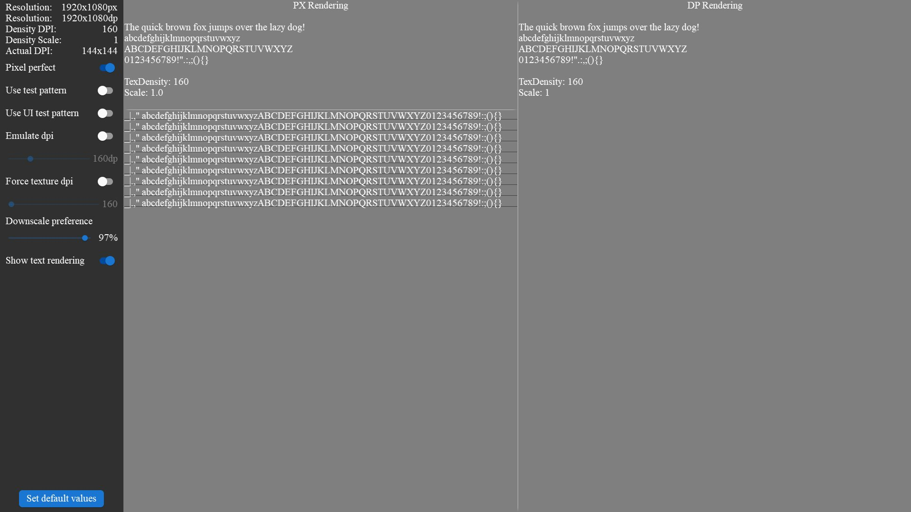
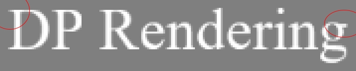
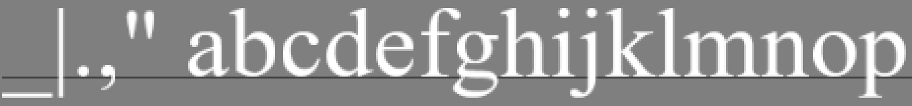
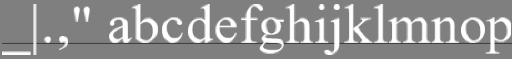
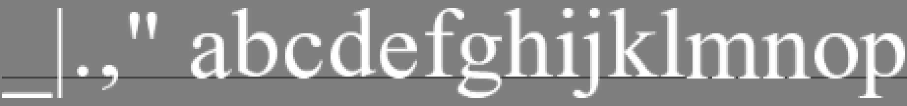
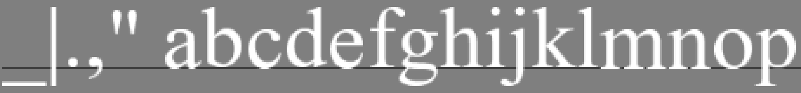
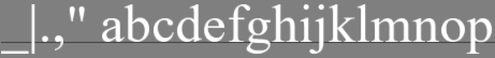

<!-- #AG_DEMOAPP_HEADER_BEGIN# -->
# DpiScale

<!-- #AG_DEMOAPP_HEADER_END# -->
<!-- #AG_BRIEF_BEGIN# -->
This sample showcases a UI that is DPI aware vs one rendered using the standard pixel based method.

It also showcases various ways to render scaled strings and the errors that are easy to introduce.
<!-- #AG_BRIEF_END# -->

## Controls

The app can be controlled using:

Key         | Result
------------|---------------------------------------
P           | Toggle pixel perfect rendering on/off
T           | Toggle test pattern on/off
U           | Toggle UI test pattern on/off
D           | Toggle emulate dpi on/off
Delete      | dpi slider decrease by one
Page down   | dpi slider increase by one
Left arrow  | dpi slider decrease
Right arrow | dpi slider increase
F           | Force texture DPI on/off
Up arrow    | Increase texture dpi
Down arrow  | Decrease texture dpi
Q           | Slider downscale preference decrease
E           | Slider downscale preference increase
Space       | Reset settings to default

## Example 1 - Blurry

Texture rendered at native resolution but off by 0.5 pixel

Texture 160dpi Scale 1.00

Native                                                            |4x zoom
------------------------------------------------------------------|----------------------------------------------
  |
|

## Example 2 - Details

Texture downscaled but small details gets lost and glyphs gets slightly blurred

Texture 320dpi Scale 0.75

Native                                                            |4x zoom
------------------------------------------------------------------|----------------------------------------------
  |
|
|

## Example 3 - String scaling issues

Reference texture 160dpi scale 1.0

Native                                                          |4x zoom
----------------------------------------------------------------|--------------------------------------------
|

Texture 160dpi scale 0.8375

#|Native                                                          |4x zoom
-|----------------------------------------------------------------|--------------------------------------------
1||
2||
3||
4||
5||
6||
7||
8||

1. Naive scaling of everything. This is basically a font position * scale factor.
    - Not pixel perfect so the text is blurry due to characters being rendered to sub pixel positions.
    - Very small glyphs can be reduced to a size of zero.
2. We ensure that each glyph is starts and ends at a full pixel
    - glyph width and height might be slightly off.
    - Glyphs do not hit the correct position on the baseline.
    - Line width compared to the naively scaled one is off.
    - Very small glyphs can be reduced to a size of zero.
3. Baseline aware and we ensure that each glyph is starts and ends at a full pixel
    - glyph width and height might be slightly off.
    - Line width compared to the naively scaled one is off.
    - Simple kerning is inaccurate.
    - Very small glyphs can be reduced to a size of zero.
4. Baseline aware and we ensure that each glyph is starts and ends at a full pixel. FontWidth & layoutWidth is scaled and rounded to a full pixel (so the font is pixel perfect in width).
    - On some scalings the glyph alignment to the baseline is off by one pixel.
    - Glyph width and height might be slightly off.
    - The simple kerning is slightly off.
    - Very small glyphs can be reduced to a size of zero.
5. Baseline aware and we ensure that each glyph is starts and ends at a full pixel. FontWidth & layoutWidth is scaled and rounded to a full pixel and more precise height scaling (pixel perfect width and height).
    - Glyph width and height might be slightly off.
    - The simple kerning is slightly off.
    - Very small glyphs can be reduced to a size of zero.
6. Baseline aware and we ensure that each glyph is starts and ends at a full pixel. FontWidth & layoutWidth is scaled and rounded to a full pixel and more precise height scaling (pixel perfect width and height). We ensure a glyph cant be smaller than one pixel.
    - Glyph width and height might be slightly off.
    - The simple kerning is slightly off.
7. Same as 6 except rendered using the demo framework string rendering. The output should be exactly the same as 6, and it has the same issues as well.

### Another example

Reference texture 480dpi scale 1.0

Native                                                          |4x zoom
----------------------------------------------------------------|--------------------------------------------
|

Texture 480dpi scale 0.8333333

#|Native                                                          |4x zoom
-|----------------------------------------------------------------|--------------------------------------------
1||
2||
3||
4||
5||
6||
7||
8||

<!-- #AG_DEMOAPP_COMMANDLINE_ARGUMENTS_BEGIN# -->

Command line arguments':

Argument                        |Description                                                                                                                                                                                                                                                                                                                |Source
--------------------------------|---------------------------------------------------------------------------------------------------------------------------------------------------------------------------------------------------------------------------------------------------------------------------------------------------------------------------|---------------
--TestPattern                   |Enable the test pattern                                                                                                                                                                                                                                                                                                    |Demo
--UITestPattern                 |Enable the UI test pattern                                                                                                                                                                                                                                                                                                 |Demo
--ActualDpi \<arg>              |ActualDpi [x,y] Override the actual dpi reported by the native window                                                                                                                                                                                                                                                      |DemoHost
--DensityDpi \<arg>             |DensityDpi \<number> Override the density dpi reported by the native window                                                                                                                                                                                                                                                |DemoHost
--DisplayId \<arg>              |DisplayId \<number>                                                                                                                                                                                                                                                                                                        |DemoHost
--LogExtensions                 |Output the extensions to the log                                                                                                                                                                                                                                                                                           |DemoHost
--LogLayers                     |Output the layers to the log                                                                                                                                                                                                                                                                                               |DemoHost
--LogSurfaceFormats             |Output the supported surface formats to the log                                                                                                                                                                                                                                                                            |DemoHost
--VkApiDump                     |Enable the VK_LAYER_LUNARG_api_dump layer.                                                                                                                                                                                                                                                                                 |DemoHost
--VkPhysicalDevice \<arg>       |Set the physical device index.                                                                                                                                                                                                                                                                                             |DemoHost
--VkPresentMode \<arg>          |Override the present mode with the supplied value. Known values: VK_PRESENT_MODE_IMMEDIATE_KHR (0), VK_PRESENT_MODE_MAILBOX_KHR (1), VK_PRESENT_MODE_FIFO_KHR (2), VK_PRESENT_MODE_FIFO_RELAXED_KHR (3), VK_PRESENT_MODE_SHARED_DEMAND_REFRESH_KHR (1000111000), VK_PRESENT_MODE_SHARED_CONTINUOUS_REFRESH_KHR (1000111001)|DemoHost
--VkScreenshot \<arg>           |Enable/disable screenshot support (defaults to enabled)                                                                                                                                                                                                                                                                    |DemoHost
--VkValidate \<arg>             |Enable/disable the VK_LAYER_LUNARG_standard_validation layer.                                                                                                                                                                                                                                                              |DemoHost
--Window \<arg>                 |Window mode [left,top,width,height]                                                                                                                                                                                                                                                                                        |DemoHost
--AppFirewall                   |Enable the app firewall, reporting crashes on-screen instead of exiting                                                                                                                                                                                                                                                    |DemoHostManager
--ContentMonitor                |Monitor the Content directory for changes and restart the app on changes.WARNING: Might not work on all platforms and it might impact app performance (experimental)                                                                                                                                                       |DemoHostManager
--ExitAfterDuration \<arg>      |Exit after the given duration has passed. The value can be specified in seconds or milliseconds. For example 10s or 10ms.                                                                                                                                                                                                  |DemoHostManager
--ExitAfterFrame \<arg>         |Exit after the given number of frames has been rendered                                                                                                                                                                                                                                                                    |DemoHostManager
--ForceUpdateTime \<arg>        |Force the update time to be the given value in microseconds (can be useful when taking a lot of screen-shots). If 0 this option is disabled                                                                                                                                                                                |DemoHostManager
--LogStats                      |Log basic rendering stats (this is equal to setting LogStatsMode to latest)                                                                                                                                                                                                                                                |DemoHostManager
--LogStatsMode \<arg>           |Set the log stats mode, more advanced version of LogStats. Can be disabled, latest, average                                                                                                                                                                                                                                |DemoHostManager
--ScreenshotFormat \<arg>       |Chose the format for the screenshot: bmp, jpg, png or tga (defaults to png)                                                                                                                                                                                                                                                |DemoHostManager
--ScreenshotFrequency \<arg>    |Create a screenshot at the given frame frequency                                                                                                                                                                                                                                                                           |DemoHostManager
--ScreenshotNamePrefix \<arg>   |Chose the screenshot name prefix (defaults to 'Screenshot')                                                                                                                                                                                                                                                                |DemoHostManager
--ScreenshotNameScheme \<arg>   |Chose the screenshot name scheme: frame, sequence or exact (defaults to frame)                                                                                                                                                                                                                                             |DemoHostManager
--Stats                         |Display basic frame profiling stats                                                                                                                                                                                                                                                                                        |DemoHostManager
--StatsFlags \<arg>             |Select the stats to be displayed/logged. Defaults to frame\|cpu. Can be 'frame', 'cpu' or any combination                                                                                                                                                                                                                  |DemoHostManager
--Version                       |Print version information                                                                                                                                                                                                                                                                                                  |DemoHostManager
--Graphics.Profile              |Enable graphics service stats                                                                                                                                                                                                                                                                                              |GraphicsService
--Profiler.AverageEntries \<arg>|The number of frames used to calculate the average frame-time. Defaults to: 60                                                                                                                                                                                                                                             |ProfilerService
--ghelp \<arg>                  |Display option groups: all, demo or host                                                                                                                                                                                                                                                                                   |base
-h, --help                      |Display options                                                                                                                                                                                                                                                                                                            |base
-v, --verbose                   |Enable verbose output                                                                                                                                                                                                                                                                                                      |base
<!-- #AG_DEMOAPP_COMMANDLINE_ARGUMENTS_END# -->
