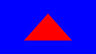

<!-- #AG_PROJECT_NAMESPACE_ROOT# -->
<!-- #AG_PROJECT_CAPTION_BEGIN# -->
# DemoFramework 6.5.0 Window

To [main document](../../README.md)
<!-- #AG_PROJECT_CAPTION_END# -->
## Table of contents
<!-- #AG_TOC_BEGIN# -->
* [Demo applications](#demo-applications)
  * [Window](#window)
    * [VulkanTriangle](#vulkantriangle)
    * [Window101](#window101)
  * [Window.System](#windowsystem)
    * [InputEvents](#inputevents)
<!-- #AG_TOC_END# -->

# Demo applications

<!-- #AG_DEMOAPPS_BEGIN# -->

## Window

### [VulkanTriangle](VulkanTriangle)

Demonstrates how to use the Freestyle window project type to create a window for use with Vulkan.

Then renders a simple triangle to it.

The triangle rendering code is based on a sample by Norbert Nopper from VKTS Examples [VKTS_Sample02](https://github.com/McNopper/Vulkan/blob/master/VKTS_Example02)
Recreated as a DemoFramework freestyle window sample in 2016.

### [Window101](Window101)

Just shows how to create a native window using the FslNativeWindow library.

This can be used to develop support for a new platform.

## Window.System

### [InputEvents](System/InputEvents)

Demonstrates how to receive various input events and logs information about them to the log.

This can also be used to do some basic real time tests of the input system when porting the framework to a new platform.

<!-- #AG_DEMOAPPS_END# -->
