
# FslSimpleUI

This document gives provides advice for people implementing a custom UI system. First by providing a important overview and then by doing a deep dive on the basic UI implementation used by the framework called FslSimpleUI.

## Table of contents

<!-- #AG_TOC_BEGIN# -->
* [Designing a custom UI solution](#designing-a-custom-ui-solution)
  * [Dpi awareness](#dpi-awareness)
  * [Text rendering](#text-rendering)
  * [Pixel perfect rendering](#pixel-perfect-rendering)
  * [Performance](#performance)
* [Implementation deep dive](#implementation-deep-dive)
  * [History](#history)
  * [Design choices](#design-choices)
  * [Sprite system](#sprite-system)
  * [Control colors](#control-colors)
  * [Control layout](#control-layout)
  * [Control rendering: draw command list generation](#control-rendering-draw-command-list-generation)
  * [Control rendering: draw command list processing](#control-rendering-draw-command-list-processing)
  * [Image concepts](#image-concepts)
* [Appendices](#appendices)
  * [Appendix: UI execution order](#appendix-ui-execution-order)
  * [Appendix: Layout systems](#appendix-layout-systems)
  * [Appendix: Render system](#appendix-render-system)
  * [Appendix: Event system](#appendix-event-system)
<!-- #AG_TOC_END# -->

# Designing a custom UI solution

When designing a modern custom UI system you will need to consider at least the following:

* dpi awareness
* text rendering
* pixel perfect rendering
* performance

## Dpi awareness

### Element size

A key aspect of any UI system designed to run on various displays is that you want to ensure that all buttons and text have a certain minimum size so that text can be read and buttons are big enough to press. Many existing UI systems rely on rendering items by their pixel size, which leads to varying physical sizes when rendered on screens with varying DPI.

These are the physical sizes of a item designed to be rendered on a 160dpi screen when rendered using pixels as size units.

80 dpi  | 160dpi | 640dpi
--------|--------|--------
||

Because of this many modern systems use a density independent abstraction that represents a physical size. This could be centimeters or inches but most systems decided to use a custom unit.

For example

UI system | Physical size| Density independent 'pixel'
----------|--------------|-----------------------------
[Android](https://material.io/design/layout/pixel-density.html#pixel-density-on-android) | 1/160 inch | 1dp at 160dpi is equal to one pixel, 1 dp at 640dpi is equal to four pixels.
[Wpf](https://docs.microsoft.com/en-us/dotnet/api/system.windows.frameworkelement.width?view=netcore-3.1)     | 1/96 inch  | 1px at 96dpi is qual to one pixel, 1px at 384dpi is equal to four pixels.

By representing the UI as having a physical size it will ensure that its elements are of the same physical size no matter what screen DPI you use it on.

These are the physical sizes of a item designed to be rendered on a 160dpi screen when rendered using a physical size unit.

80 dpi  | 160dpi | 640dpi
--------|--------|--------
||

While the actual physical sizes remains fixed, the actual physical pixels rendered are different.

### Element scaling

Most UI systems rely on bitmap images in the UI but unfortunately bitmap images become blurred when scaled. So we need a strategy for rendering the element that tries to mitigate that problem.

Taking a native 160dpi image and scaling it up to higher DPI's lead to severely blurred images, the more you upscale it, the worse it looks. Taking a 640dpi native image and scaling it down to lower DPI's also leads to blurry images especially the smaller the image gets, but in general this will look nicer.

The first row is native 160dpi up-scaled, the second  is native 640dpi down-scaled and the third is native sized images.

Method|160 dpi | 320 dpi | 640 dpi
------|--------|---------|--------
Upscale|||
Downscale|||
Native|||

### Animated example

The animation below shows native vs the given scaling algorithm.

Upscale bilinear | Upscale nearest | Downscale bilinear | Downscale nearest
-----------------|-----------------|--------------------|-------------------
 |  |  | 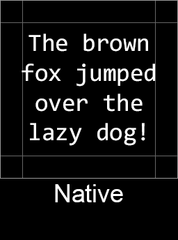 |

Lets zoom in a bit to make it even more clear

Upscale bilinear | Upscale nearest | Downscale bilinear | Downscale nearest
-----------------|-----------------|--------------------|-------------------
 | 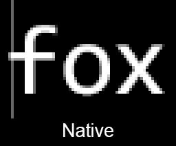 |  |  |

### A strategy

So ideally a UI system needs to have multiple flavors of each image available to ensure that scaling will be minimal and often a 'downscale' will be the preferred choice.

The following example has 160, 320 and 640 dpi native flavors and then downscales the closest higher resolution to create the 240 and 480dpi rendering.

160 dpi | 240 dpi | 320 dpi | 480 dpi | 640 dpi
--------|---------|---------|---------|--------
||||

For target platforms that allow screens to be switched at runtime or allow the app to be moved between monitors we need to be able to switch between these various flavors at runtime to provide the optimal experience.

This strategy of using multiple flavors/resolution of a image closely resemble the strategy used by texture mipmaps.

### Image design traps

While this strategy solves a lot of issues, you still need to be careful, when designing the images. For example the one pixel white lines used in the above example will probably look very thin on a 640dpi display and it could become blurry or disappear at various scaling levels. So better graphics would probably use around four pixels to represent the line as this should prevent it from disappearing when scaled and it will also make the 'physical' size the same, when compared to the 160dpi natively rendered version.

### Device type / user distance

Finally a UI also needs to be aware of what type of device the UI is being rendered on. There is a huge difference between rendering something that is big enough to be read from a phone and the same UI being rendered on a TV with the user placed a couple of meters away.

## Text rendering

Text rendering is a very complicated topic, but even if we just stick to the basics there are a lot of things you need to be aware of. The most important part is once again to use a physical size for representing the text to ensure everything renders at the expected sizes.

Using vector graphics for rendering the actual text is the optimal solution since that ensures that it looks good no matter what DPI is being used. But for many platforms that is not a option and they instead rely on rendering bitmap fonts. Since the bitmap fonts are images, we can apply the same strategy of having multiple flavors of the font as we do with other images, which should keep the bitmap scaling issues at a minimum.

### Bitmap vs SDF

A alternative choice is to use Signed Distance Field fonts (SDF) which scales a lot better and allows for various effects to be applied to the font.

2x scaled at 100% zoom | 2x scaled at 200% zoom
-----------------------|--------------
|

The SDF fonts will appear 'sharp' in all resolutions, while the bitmap based one can be blurred.
The above bitmap/SDF example is a **worst case comparison** as it up-scales the font images which produces the worst looking images, if you have multiple resolutions of the bitmap font available, then the scaling will often be of the downscale variant and it should rarely be scaled by as much as 200%.

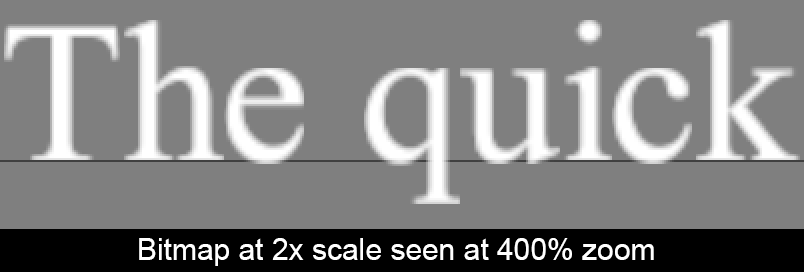

Rendering the actual font bitmaps with correct scaling and alignment to the font baseline is complex and all solutions have to make various sacrifices to ensure the rendered glyphs are as sharp as possible. The exact rendering and scaling issues will be examined closer in the "Pixel perfect rendering" section.

Examples                                                       | Description
---------------------------------------------------------------|-------------
[Vulkan.UI.DpiScale](../DemoApps/Vulkan/UI/DpiScale/README.md) | Pixel perfect bitmap font rendering.
[Vulkan.SdfFonts](../DemoApps/Vulkan/SdfFonts/README.md)       | SDF based font rendering.

## Pixel perfect rendering

Rendering images that starts or ends at sub pixel positions will produce slightly blurry output if rendered using a linear filter, and slightly incorrect looking images if rendered using a 'nearest' filter.

The image used in the following example is a checkerboard pattern of fully red and blue pixels created to make it easy to spot scaling and sub pixel rendering that cause blurriness or incorrect rendering. **Beware** to be able to see these examples correctly your document reader also need to handle images correctly. So the first image should be the correct output of the red/blue checkerboard pattern and the following three have slight errors caused by the linear filtering and sub pixel positions.

description| example
-----------|---------------------------------------------------
No Zoom    | 
200% zoom  | 

Due to the specific design of the image all errors tend to produce a magenta color due to the mixing of the red and blue colors. On a normal image it would just look blurry instead which is much harder to spot for many people.

While the blurriness can be mostly removed by using a 'nearest' texture filter vs a 'linear' one, the 'nearest' filter will still produce a less accurate image than one that actually deals with the issue of sub pixel precision to avoid the issue all together. In many cases where the image is actually intended to be scaled it also tend to look worse.

A good test to see how well a custom UI handles scaling and pixel precision issues when rendering at 1:1 resolution is to replace all graphics with a red/blue checkerboard pattern as any issues will be clearly visible (linear filtering should be used as well to make it easier to spot).

For good measure here is a animated comparison with native vs off by half a pixel in x (bilinear filtering).

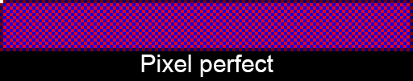

### Pixel perfect scaling

The main rule is to ensure that the resulting image starts and ends at a full pixel. However if you animate the scaling, it might look more fluid with sub pixel precision. So it is often a good idea to differentiate between fixed scaling for static content and scaling done for animation.

This also means that any UI element being scaled up/down because of the screen DPI should start and end at a full native pixel coordinate, even though it might produce a slightly smaller/larger end result. The benefit should be, that it will be less blurry and it will only be off by up to 1 pixel.

### Pixel perfect bitmap font rendering

The same issue affects bitmap font based rendering. The following text for example is rendered at native resolution pixel correct and the second is off by 0.5 pixel (Texture 160dpi Scale 1.00)

Description   |Native                                                            |4x zoom
--------------|------------------------------------------------------------------|----------------------------------------------
Pixel Perfect |  |
Half pixel off||

The blurring on the 0.5 sub-pixel rendering is obvious.


Scaling text strings rendered with bitmap fonts is a bit tricky. Just scaling everything according to a scale factor and rendering it with sub pixel precision will lead to blurry text as each individual char is an image and any image rendered at a sub pixel position becomes blurry. So a ideal solution will produce a rendering string that is roughly the same pixel size as the 'naive' solution, while making sure each individual character starts and ends on a full pixel boundary.

Texture 160dpi scale 0.8375

1. Naive scaling with glyphs at sub pixel positions.
2. Pixel perfect scaling all glyphs start and ends at pixel positions.

 #|Native                                            |4x zoom
--|--------------------------------------------------|--------------------------------------------
 1||
 2||

The second solution provides a less blurry rendering of the font but the height of each individual glyph might be slightly off. But since that applies to all texting being rendered with that font at the given size, it will probably be unnoticeable by most people.  See ```Vulkan.UI.DpiScale``` for more details.

Here is an example animation of the basic scaling vs the pixel aware result:

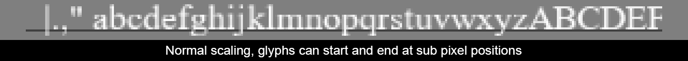

### Scrolling UI elements

As with animated scaling scrolling of ui elements can be done using sub pixel precision but it might cause flickering and blurriness. Try the ```Vulkan.UI.SmoothScroll``` example to get a better feeling for what fits your use case. If you need to have a very slow scroll speed on a low DPI display and your UI elements can handle it then sub pixel precision might be best.

But as a general recommendation for UI elements containing small details, it will probably be best to stick to per pixel scrolling.

### Common traps

It is easy to accidentally render a UI element at a sub pixel position. For example by

* Working in density-independent pixels and converting them to a specific physical pixel coordinate without rounding it.
* Scrolling done with floating point based speeds.
* Scaling a image by a percentage can easily produce a sub pixel based size.
* Using floating points for element calculations and trying to center a element like this: ```(ScreenWidth - ElementWidth) / 2.0f```. Can easily produce a sub pixel coordinate.

### Recommendation

* All UI control user facing values should be represented in density-independent pixels (dp).
  * This can easily be a floating point type.
* All internal rendering and layout should be done in integers and by using actual native pixels as coordinates and sizes.
  * The native pixel sizes should be calculated from their density-independent size and rounded nicely to fit on the native pixel grid.
* If sub pixel precision scrolling is desired for some reason, apply the scroll offset just before generating the triangles.
* Sub pixel precision makes most sense for low DPI displays and for certain kinds of scaling animations or some kind of scrolling.
* Process input gestures in density independent pixels. Convert the final positions to native pixels and send that in the events that target the UI controls, so the controls wont have to convert dp -> px to locate the touched window and similar.

This ensures that all elements will be rendered at pixel perfect positions and most calculations can be done in simple integers with no precision issues.

Examples                                                               | Description
-----------------------------------------------------------------------|-------------
[Vulkan.UI.DpiScale](../DemoApps/Vulkan/UI/DpiScale/README.md)         | Pixel perfect bitmap font rendering.
[Vulkan.UI.PixelPerfect](../DemoApps/Vulkan/UI/PixelPerfect/README.md) | Sub pixel offsets cause blurry images.
[Vulkan.UI.SmoothScroll](../DemoApps/Vulkan/UI/SmoothScroll/README.md) | Sub pixel scrolling issues.

## Performance

To get acceptable rendering performance

* Use texture atlases for the UI graphics.
* Use texture compression to save memory bandwidth.
* Batch as many draw operations together as possible.
* Use as few vertex and index buffers as possible and minimize the number of update calls.
* Take advantage of shaders to prevent overdraw.
* Utilize opaque rendering as much as possible to save memory bandwidth.

### Take advantage of shaders

For example if you need to have a background image with a gradient overlay rendered on top like this:


The easy way to render this is to:

1. Render the opaque background.
2. Render the transparent background (the dialog shadows etc).
3. Render the transparent gradient on top.
4. Render the transparent label.

Which is one opaque and three transparent draw operations. Here we can take advantage of shaders and combine the rendering of the background and the gradient overlay into one opaque rendering operation.

1. Render the opaque 'caption with gradient area'.
2. Render the rest of the opaque background.
3. Render the transparent background.
4. Render the transparent label.

This becomes two opaque and two transparent draw operations. But it comes with the tradeoff that we need to switch shaders during rendering.  So we unfortunately also went from having two draw calls to using three, which means that we need to do profiling to figure out whats most efficient for the given platform.

Another possibility would be to merge the background caption area mesh with the label mesh at runtime and thereby reducing the draw operations to:

1. Render the opaque 'caption with gradient area with no label'.
2. Render the opaque 'caption with gradient area with label'.
3. Render the rest of the opaque background.
4. Render the transparent background.

For this simple example it would probably not be worth it, but for more complex scenarios it could be.
The 'optimization' here has the nice advantage that all draw operation can use the same z-coordinate, so it suddenly becomes possible to render the window using a perspective transformation with full rotation support.  This is something that would normally require us to render the window to a offscreen texture before applying the result to a perspective rendered quad.  So we could save a lot of bandwidth with this optimization.  Basically we trade a extra shader switch and more complex mesh generation for rendering to a offscreen texture + rendering of the 3d quad. So in this case the optimization should be much faster on all GPU's. That being said the mesh generation code can become quite complex so if its worth the time to program really depends on your use case.

---

# Implementation deep dive

## History

If you have no interest in the UI system's history you can safely jump to ["design choices"](#design-choices). Historically the FslSimpleUI system was created back in 2014 specifically for the framework in roughly 10 man days and was used successfully for five years with minimal changes. Due to the severe time constraints it was decided to focus on the minimal feature set that would be needed by the demo apps. Furthermore some shortcuts where taken like having each control work in pixel coordinates and render its graphics directly using a simple immediate mode quad batcher.

When we decided to create this document it was logical to extend the UI system in the process. But at that point in time we had 170+ apps and a lot of them using the UI. So it was pretty important to keep the breaking changes to a minimum.

### Modernization, phase one

Phase one was to update the controls to utilize 'dp' values instead of 'px' for all front facing values, which were then converted to 'px' before doing all the layout and rendering. Since we now had two different unit types it became very important to never mix them by accident and to ensure we got as much help as possible from the compiler we created specific 'dp' and 'px' types in the base library which really helped minimize the issues during the transition.

We also moved from each control utilizing textures to the new [sprite system](#sprite-system). Another big addition was the addition of basic theme support and a update to all apps to take advantage of the new theme.

This was completed for the 5.6.0 release. Which meant that the UI in all samples were rendered pixel perfect, had proper physical sizes on all platforms (that can report the display DPI) and that we loaded the best available texture atlas for the given DPI.  All in all this meant the UI looked much crisper on all displays and all clickable elements would be large enough to be touched.

### Modernization, phase two

For phase two the main focus was on creating the new [benchmark application](../DemoApps/Vulkan/UI/Benchmark/README.md) which could show and measure the direct performance effect of various rendering optimizations and highlight the performance difference between various rendering API's. To ensure that the app provided the best possible experience we would need to be able to switch various optimizations on & off at run-time to ensure that we got immediate feedback from the option that was modified. So we needed a lot more control of the rendering code. The first thing that was done was to extract the actual rendering code out of each UI control and replace the immediate mode quad batcher with a more advanced rendering system.

We did that by generating a 'draw command list' which each control could add its draw commands to. The 'draw command list' could then be processed by a 'render-system' which we could create various implementations of.
The initial 'render-system' was basically just issuing the draw-commands from the list 'in order' to the immediate mode quad batcher.

Since the rendering systems required more control of the actual rendering process it was time to retire the old 'immediate mode quad batcher' and to do this we created a basic rendering abstraction *FslGraphics3D.BasicRender* which would provide the ability to create textures, materials, vertex-buffers, index buffers and use those to do some basic rendering. This new system would serve as the main rendering API abstraction for code that needed to run on various graphics API's (OpenGL ES, Vulkan, etc) and replace the old backend code used for the immediate mode quad batcher and other things. The new rendering layer meant that we could generalize the handling of 'deferred destruction of resources', modification of 'in use' resources and use it for all API's where before it was mostly done in Vulkan specific code. This had the additional benefit that there is only one place that needs to be changed if we want to try a different strategy in our resource handling. Once the BasicRender code and migration of the base systems were in place it was time to create a new UI render-system using the new render backend.

To get a quick working starting point we basically re-created a 'immediate mode quad batcher' on top of the new rendering backend. This was then extended with various improved rendering strategies that can be toggled on and off at run-time. Compared to the old system it had the additional benefit that the 'batching' code behaved the same way for all API's instead of having API specific batching code like we did in the old system. See '[draw command list processing](#draw-command-list-processing-render-system)' for more details

This is the current state of the implementation for release 5.8.0.

## Design choices

The FslSimpleUI follows the above [recommendations](#recommendation).

* It uses multiple flavors of each texture atlas.
  * The basic theme has atlas flavors for: 80, 96, 160, 320, 480 and 640dpi.
* All UI control user facing values are represented in density-independent pixels. Just like Android we use "dp" as our unit (1dp at 160dpi equals 1px).
* All internal rendering and layout are done in integers and use actual native pixels as coordinates and sizes.
  * All pixel sizes are calculated from their rounded 'dp' sizes.
* Sub pixel precision offsets can be applied to the final coordinates to allow for sub pixel precision, if so desired.
  * Currently none of the scroll controls utilize sub pixel precision.

The system is designed as a retained mode UI system and fully support both opaque and transparent materials.
However the current rendering implementation utilizes a form of batched immediate mode rendering.

The FslSimpleUI provides a minimum feature set that just covers exactly what the samples are likely to need.

* Proper DPI handling / scaling.
* Basic control set
* Layout system
* Basic touch / mouse input
* Basic theme support.
* Animation aware (so the system knows if its animating or idle)

Some common UI features that were skipped

* Activities (proper activity / modal dialog support)
* Various controls
  * Text edit controls
  * Scroll-bars/scroll panel
* Input gestures
* A keyboard focus system for controls
* A game-pad focus system for controls
* Data-binding
* Minimum and maximum control sizes.

## Sprite system

To support complex UI rendering with custom shaders we utilize a material system.

The UI material system has two layers

* The SpriteMaterial which represents the rendering systems material types.
  * This normally contains information about the shaders and the textures needed by them.
  * Has information about transparency requirements.
* The higher level Sprite which contains at least one SpriteMaterial and represents a UI image concept.

### SpriteMaterial

Represents low level information needed by the rendering system, which can be used to batch rendering calls properly.

### Sprites

Is designed to represent image requirement concepts from the UI controls point of view. For more details  see [image concepts](#image-concepts)

Name                      | Concept
--------------------------|----------------------------------------------------------
BasicImageSprite          | An atlas image that does not utilize trim.
ImageSprite               | An atlas image that can contain trimmed images.
BasicNineSliceSprite      | An atlas image representing a nine slice without trim.
NineSliceSprite           | An atlas image representing a nine slice that can contain a bit of trim outside the scaling areas.
PatchImageSprite          | An atlas image that represents a patch image.

Having these Sprite concepts allows us to design UI controls that

* are very explicit about the requirements they place on their 'graphics' resources.
* receive all the necessary 'content-configuration' in one object.

furthermore it allows us to validate the user supplied information at creation time and in their full context.

## Control colors

All control colors are in the standard non-premultiplied R8G8B8A8 format. However it recommended the [render-system](#control-rendering-draw-command-list-processing) stores pre-multiplied colors in the vertex colors.

To facility changing the color of a window and all of its children each window contains the following

* parent base color
* window base color

Multiplying the parent-base-color with the window-base-color produces the final-color which will be propagated to all child windows.

## Control layout

We utilize a simple two pass system, where all elements are first measured and then arranged.
During the measure phase each element is supplied with the available size from its parent and should return its desired pixel size. After the measuring completes all elements are arranged utilize their desired sizes to guide the layout. The final arranged position and size will then be utilized during rendering.  To speed the layout process up various layout values are cached and will only be regenerated if deemed necessary.

It's a simple system that can handle most use cases fairly well.

<a href="ClassDiagrams/Images/UIRender_OverviewControlLayout.svg">
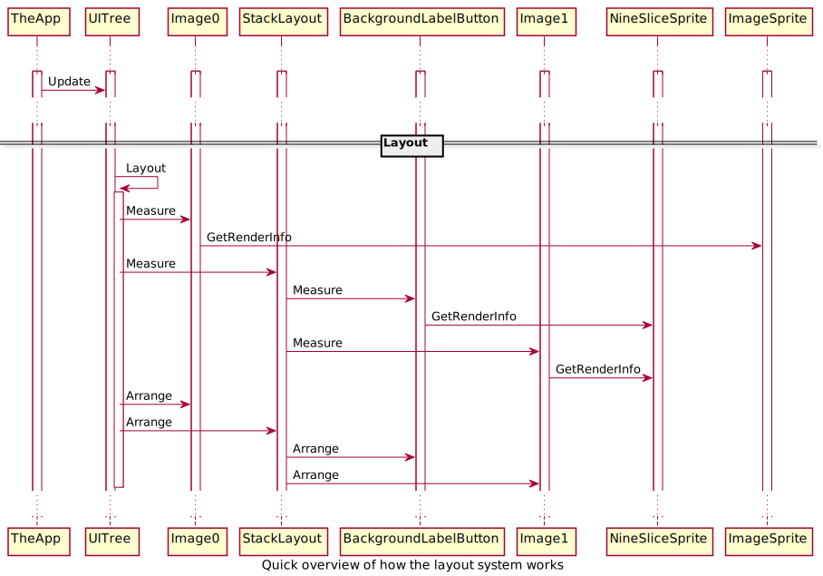
</a>

### Layout cache invalidation

If a layout related window property is modified the window will be marked as dirty if it wasn't already. When the window layout is marked as dirty it will inform the UITree which will mark all its parents as dirty as well, beware that this does not cause all the parents children to be marked as dirty, only the parents themselves.

## Control rendering: draw command list generation

Each control is given access to a mesh manager where it can create a mesh for each sprite it needs to render, each sprite-mesh must be registered before the actual drawing starts and can only be rendered once during draw operation. This provides the render system with information about the number of vertices, indices and materials that the control will need as well as proper lifetime info. The render system can then utilize this information to allocate buffers with the right capacity before we start rendering.

During rendering the UI-tree will call each window that has registered to draw in the correct order ([depth-first, pre-order](https://en.wikipedia.org/wiki/Tree_traversal)) and supply it with a DrawCommandList where it can register which of its meshes to draw and in what order (but each mesh can only be rendered once!).

<a href="ClassDiagrams/Images/UIRender_OverviewControlDraw.svg">
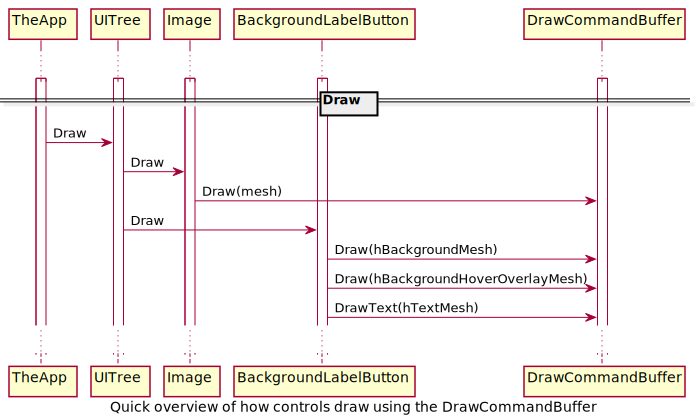
</a>

## Control rendering: draw command list processing

This is where the actual rendering takes place and the actual render processing is fully defined by the actual implementation.

One of the first performance problems a render system will encounter is that the draw commands generated from the [depth-first, pre-order](https://en.wikipedia.org/wiki/Tree_traversal) traversal of the UI tree wont be optimal for batching the draw commands.

For example:

If we have a simple stack layout with three BackgroundLabelButton's like this:

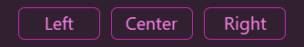

In the UI tree it would be represented like this

* UniformStackLayout (Horizontal)
  * BackgroundLabelButton
    * A. SpriteMesh: Background
    * B. SpriteMesh: label with SDF font
  * BackgroundLabelButton
    * C. SpriteMesh: Background
    * D. SpriteMesh: label with SDF font
  * BackgroundLabelButton
    * E. SpriteMesh: Background
    * F. SpriteMesh: label with SDF font

So as we process the UI tree in [depth-first, pre-order](https://en.wikipedia.org/wiki/Tree_traversal) we end up with a draw command list that look like this: ```A, B, C, D, E, F```

When processed naively this will result in the following rendering operations:

Draw      | Content    | Material            | Draw call #
----------|------------|---------------------| :-:
A         | Background | TextureAtlas        | 1
B         | SDF font   | TextureAtlasSDFFont | 2
C         | Background | TextureAtlas        | 3
D         | SDF font   | TextureAtlasSDFFont | 4
E         | Background | TextureAtlas        | 5
F         | SDF font   | TextureAtlasSDFFont | 6

Since a standard batcher will only batch consecutive instances of the same material it will not be able to optimize that at all.

If we examine the UI control hierarchy above we actually discover that none of the individual controls overlap. and therefore we do not need to change material that often. So if we hand optimized the rendering operations the optimal batching would be:

Draw    | Material            | Draw call #
--------|---------------------|--------------------
A, C, E | TextureAtlas        | 1
B, D, F | TextureAtlasSDFFont | 2

This optimal rendering order could be achieved if the render-system took into account the bounding rectangle of the 'draw' operation and reordered the order of the draw calls so that batching could occur, this is not necessarily simple to do nor free. So a good reordering algorithm will balance the CPU cost versus the GPU savings.

The above example is very simple and actual modern UI will be a lot more complicated. It would be a common thing to be able to have controls that have both transparent and opaque elements and even might have various complex materials that requires multiple UV coordinates.

So a optimal rendering-system will need to

* Handle opaque & transparent materials
  * Opaque elements are faster to render and should be rendered front to back to take advantage of the depth-buffer. This is especially important for embedded systems like mobile devices.
  * Transparent elements need to be rendered back to font
* Consider material and draw bounding rectangle.
* Handle maximum bucket size (to ensure we never submit more than the GPU can handle in one batch)
* Deal with shaders requiring more than one set of UV coordinates to allow for complex materials
  * This does not mean it would need to mix and match them, just that it supports more than one.
* Cache meshes, so only changed meshes get regenerated between frames.

### IMBatch (FlexRenderSystem)

This is the fully flexible default render system used by the benchmark, it supports a number of capabilities that can be enabled/disabled at run-time.

* Command list preprocessing
  * Process each command and split it into opaque and transparent queues (if depth buffer available) else just use one transparent queue.
    * The opaque queue stores it draw-commands in 'front to back' order
    * The transparent queue stores draw-commands in 'back to front' order.
  * Reorder the draw commands according to material and overlap to improve batching.
* Mesh vertex/index generation
* Final vertex/index buffer management
  * On demand vertex + index buffer creation
  * Upload of new mesh data
* Actual draw calls

### FlexRenderSystem: Draw call reordering

The system current supports two simple reordering algorithms

Algorithm        |Description
-----------------|------
Linear           |On material differences it backtracks through the command list and looks for overlaps and material compatibility. This can be pretty slow.
LinearConstrained|On material differences it backtracks through N elements in the command list looking for overlaps and material compatibility. The performance of this will be much more consistent. This is the default reordering method.

#### Draw calls: Normal

The default UI uses two materials, one opaque and one transparent.

Description |Draw calls|Example&nbsp;&nbsp;&nbsp;&nbsp;&nbsp;&nbsp;&nbsp;&nbsp;&nbsp;&nbsp;&nbsp;&nbsp;&nbsp;&nbsp;&nbsp;&nbsp;&nbsp;&nbsp;&nbsp;&nbsp;&nbsp;&nbsp;&nbsp;&nbsp;&nbsp;&nbsp;&nbsp;&nbsp;&nbsp;&nbsp;&nbsp;&nbsp;&nbsp;&nbsp;&nbsp;&nbsp;&nbsp;&nbsp;&nbsp;&nbsp;&nbsp;&nbsp;&nbsp;&nbsp;&nbsp;&nbsp;&nbsp;&nbsp;&nbsp;&nbsp;&nbsp;&nbsp;&nbsp;&nbsp;&nbsp;&nbsp;&nbsp;&nbsp;&nbsp;&nbsp;&nbsp;&nbsp;&nbsp;&nbsp;&nbsp;&nbsp;&nbsp;&nbsp;&nbsp;&nbsp;&nbsp;&nbsp;&nbsp;&nbsp;&nbsp;&nbsp;&nbsp;&nbsp;&nbsp;&nbsp;&nbsp;&nbsp;&nbsp;&nbsp;&nbsp;&nbsp;&nbsp;&nbsp;&nbsp;&nbsp;&nbsp;&nbsp;&nbsp;&nbsp;&nbsp;&nbsp;&nbsp;&nbsp;&nbsp;
------------| :-: |------------------------
**Draw as commanded.** In this configuration we execute the 'draw' commands as requested the only optimization we do is to use one big vertex and index buffer. Rendering this way leads to a lot of draw calls. *Config: Depth buffer, reordering and batching disabled.*|245|
**Batching enabled.** By enabling batching we group each consecutive draw command that utilize the same material, so we can save a few draw calls. *Config: Depth buffer and reordering disabled.*|66|
**Batching and draw command reordering.** By enabling draw call reordering we investigate if its possible to reorder some of the draw calls in a way that wont affect the final output. *Config: Depth buffer disabled*|22|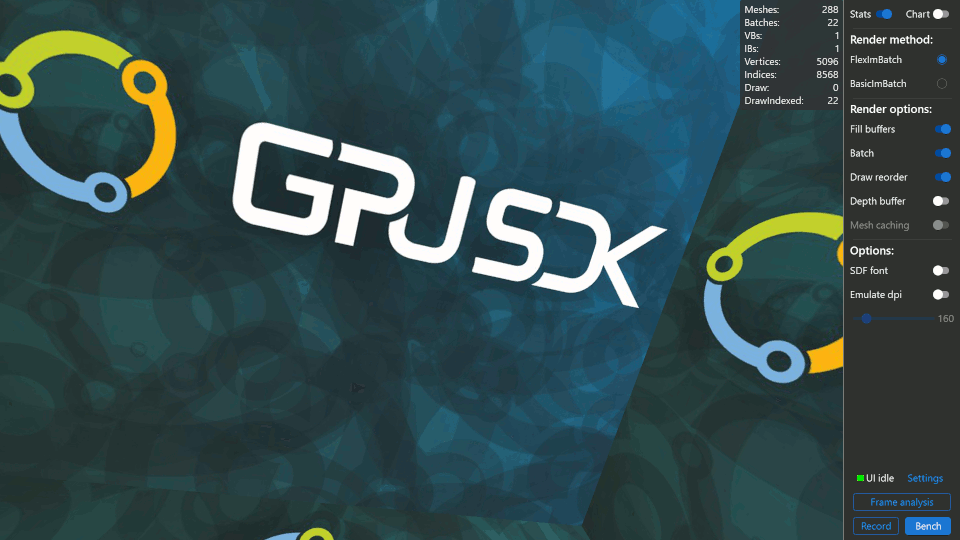
**Full optimization.** The depth buffer allow us to split the draw calls into two queues, one for opaque and one for transparent. Since we only use two materials this split automatically orders everything perfectly. The opaque entries rendered front to back with depth-buffer writes enabled, the transparent rendered back to front with depth-buffer compare enabled. This finally gets us down to two draw calls which is the best possible scenario for rendering a two material UI. (Config: all optimizations enabled)|2|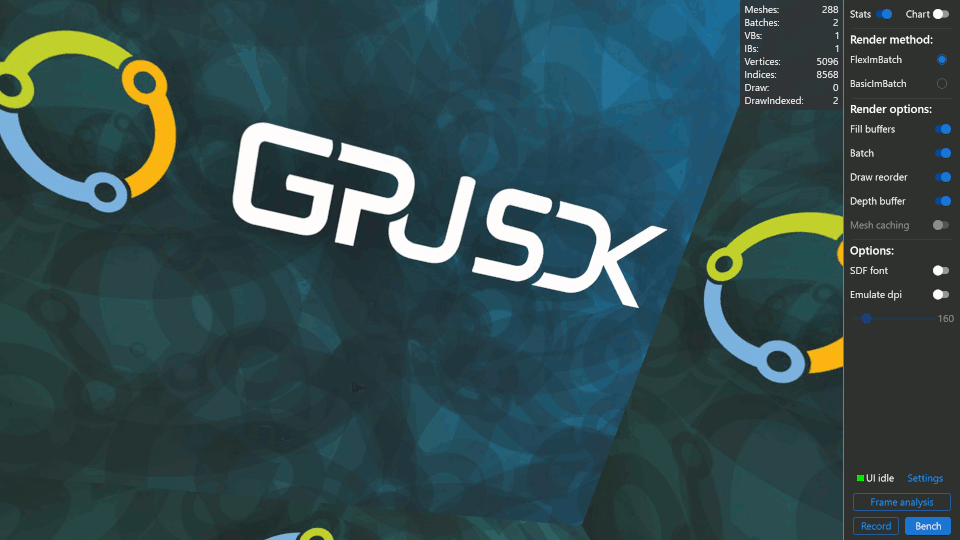

#### Draw calls: SDF

When SDF is enabled we still use the opaque and transparent material but a a third SDF material is added for the font rendering

Description |Draw calls|Example&nbsp;&nbsp;&nbsp;&nbsp;&nbsp;&nbsp;&nbsp;&nbsp;&nbsp;&nbsp;&nbsp;&nbsp;&nbsp;&nbsp;&nbsp;&nbsp;&nbsp;&nbsp;&nbsp;&nbsp;&nbsp;&nbsp;&nbsp;&nbsp;&nbsp;&nbsp;&nbsp;&nbsp;&nbsp;&nbsp;&nbsp;&nbsp;&nbsp;&nbsp;&nbsp;&nbsp;&nbsp;&nbsp;&nbsp;&nbsp;&nbsp;&nbsp;&nbsp;&nbsp;&nbsp;&nbsp;&nbsp;&nbsp;&nbsp;&nbsp;&nbsp;&nbsp;&nbsp;&nbsp;&nbsp;&nbsp;&nbsp;&nbsp;&nbsp;&nbsp;&nbsp;&nbsp;&nbsp;&nbsp;&nbsp;&nbsp;&nbsp;&nbsp;&nbsp;&nbsp;&nbsp;&nbsp;&nbsp;&nbsp;&nbsp;&nbsp;&nbsp;&nbsp;&nbsp;&nbsp;&nbsp;&nbsp;&nbsp;&nbsp;&nbsp;&nbsp;&nbsp;&nbsp;&nbsp;&nbsp;&nbsp;&nbsp;&nbsp;&nbsp;&nbsp;&nbsp;&nbsp;&nbsp;&nbsp;
------------| :-: |------------------------
**SDF font, draw as commanded.** In this configuration we execute the 'draw' commands as requested the only optimization we do is to use one big vertex and index buffer. *Config: SDF font, depth buffer, reordering and batching disabled.*|245|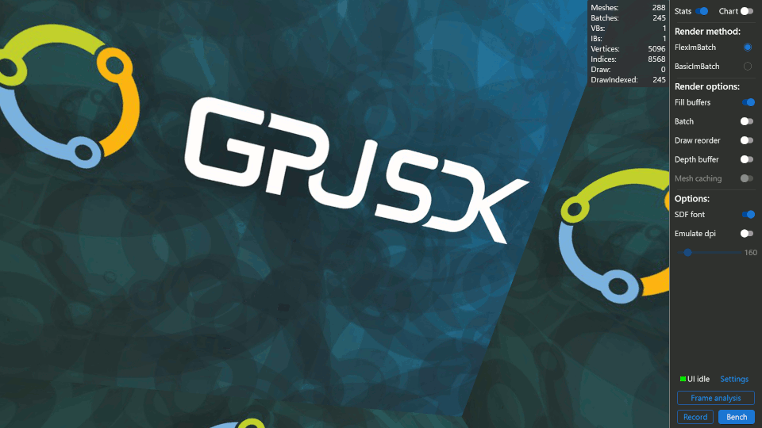
**SDF font, batching enabled.** Since we now have three materials and because its used for the font we get quite a few extra material switches compared to the two material situation. *Config: SDF font, depth buffer and reordering disabled.*|172|
**SDF font, batching and draw command reordering.** The more materials we have the more efficient it will be to re-order the draw calls compared to just batching consecutive materials. *Config: SDF font, depth buffer disabled.*|34|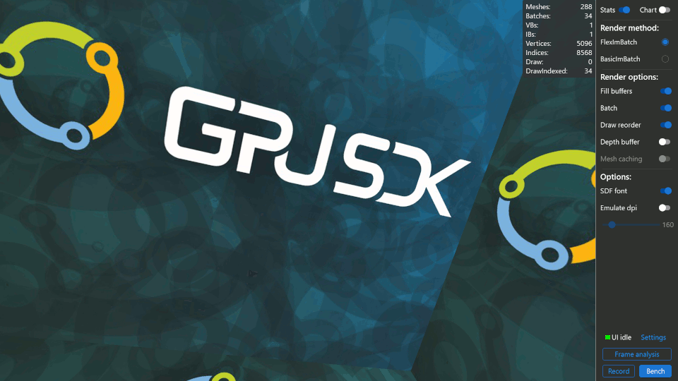
**SDF font, full optimization.**  Since the depth buffer basically 'groups' one of the materials it simplifies the reordering. (Config: SDF font, all optimizations enabled)|9|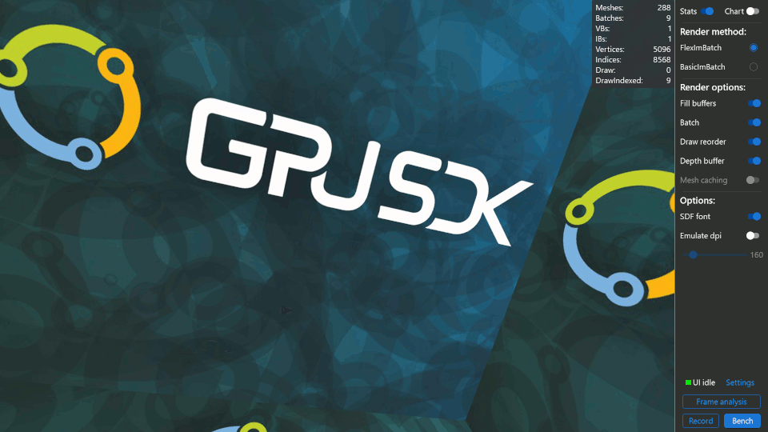

---

## Image concepts

### Trim

Trims transparent pixels from the sprites border and shrink the image size, which allows for tighter texture atlas packing and speeds up rendering, as we do not waste processing power rendering fully transparent pixels.

Untrimmed | Trim margin 0 | Trim margin 1 | Trim margin 2
----------|---------------|---------------|----------------------------
||||

For size and rendering purposes there are generally no difference between the rendered result of a trimmed or non-trimmed image, since the atlas contains information about the number of trimmed pixels. We take that into account during rendering. However using a trim margin of zero could lead to slightly different rendering results between a trimmed and non-trimmed image.

The rendering of a trimmed image is just slightly more complicated as we need to take the number of trimmed pixels into account for both positioning and scaling. This is why we have both BasicImageSprites and ImageSprites, which allows for a control to simplify its calculations by only operating on images without trim.

It's very important to calculate the x+y scale factors for "trim offset + trimmed image size" based on the scaled and rounded full image size and both the "trimOffset + trimmedSize" needs to be done in floats to ensure we have the correct precision.

### NineSlice / NinePatch

A nine-slice AKA nine-patch is a simple strategy for specifying which areas of a image to scale. It is commonly used to render window backgrounds.

A nine patch is divided into nine regions:

Regions | Source image | Scaling slices | Content slices
--------|--------------|----------------|----------------------
|||

The scaling slices specify what will be scaled and what will remain a fixed size.

.             |No scale | Scaling | No scaling
--------------|---------|---------|--------------
**No scaling**| 1       | 2       | 3
**Scaling**   | 4       | 5       | 6
**No scaling**| 7       | 8       | 9

So regions 1, 3, 7 and 9 will never be scaled.
Region 2 and 8 will be scaled in width but remain fixed in height.
Region 4 and 6 will remain fixed in width and scaled in height.
Region 5 will be scaled in both width and height.

The content slices specify where content can be placed on the nine slice image. The content will be placed inside region 5.

Normal image scaling vs nine-slice based scaling

Unscaled image | 2x scaled | NineSlice 2x scaled
---------------|-----------|--------------------
||

A nine slice can be represented by two simple thickness structures. One for the scaling slices and one for the content slices.

Thickness member | description
-----------------|--------------------------------------------------
Left             | The location of the first x slice from x=0.
Right            | The location of the second x slice from x=imageWidth-1.
Top              | The location of the first y slice from y=0.
Bottom           | The location of the second y slice from y=imageHeight-1.

### N-Patch

This is basically just a more flexible version of the nine-patch scheme. Using a n-patch you can specify N number of patches and for each region you can specify how it should be scaled.

N-Patch is flexible in the way you can specify N vertical slices and M horizontal slices depending on your needs. It also allows you to specify X content regions.

Source image | Scaling slices | Content slices
-------------|----------------|----------------------
||

One simple way to define the patch is to use the Android ".9" scheme as specified [here](https://developer.android.com/studio/write/draw9patch).

Basically a extra border line is added around the source image.  The left and top lines are used to specify the scaling areas. The right and bottom line specify the content/fill areas.

Source Image | Source '.9' image | Slices
-------------|-------------------|----------------
||

# Appendices

## Appendix: UI execution order

This is the basic execution order.

<a href="ClassDiagrams/Images/UIRender_ExecutionOrder.svg">
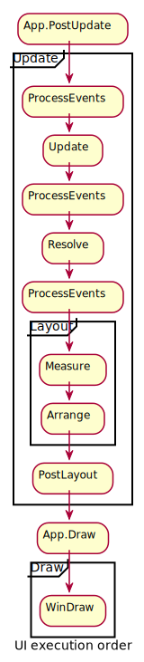
</a>

## Appendix: Layout systems

Layout type       | Description
------------------|--------------------------
CanvasLayout      | Basically a manual layout that will be similar to using a old school specific position. This should rarely be used.
ComplexStackLayout| Horizontal or vertical stack with auto, star, dp or px sizes. This is basically a very light grid implementation for one row or column.
FillLayout        | Very basic layout that automatically fills the available space, all children then shares that.
GridLayout        | Grid layout with support for cells sizes of auto, star, dp or px cell sizes.
StackLayout       | Horizontal or vertical stack layout with optional spacing.
UniformStackLayout| Horizontal or vertical stack layout with optional spacing and a uniform element size (will match the size of the largest element)
UniformWrapLayout | Horizontal or vertical wrap layout with optional spacing. Will layout elements next to each other until the available size is used, then start a new row and continue there (all elements will be given the size of the largest element).
WrapLayout        | Horizontal or vertical wrap layout with optional spacing. Will layout elements next to each other until the available size is used, then start a new row and continue there.

## Appendix: Render system

Many UI implementations have decided to just use transparent materials to ensure better draw call batching which can **sacrifice** quite a bit of **performance on embedded devices**.
But as can be seen in these examples it does reduce the draw calls considerably and it can simplify the render system a lot. If you basically just have one transparent material a simple batching strategy should be able to batch everything down into one draw call. This optimization starts to fail as soon as someone decides to introduce another material like a SDF font.

Description |Draw calls|Example&nbsp;&nbsp;&nbsp;&nbsp;&nbsp;&nbsp;&nbsp;&nbsp;&nbsp;&nbsp;&nbsp;&nbsp;&nbsp;&nbsp;&nbsp;&nbsp;&nbsp;&nbsp;&nbsp;&nbsp;&nbsp;&nbsp;&nbsp;&nbsp;&nbsp;&nbsp;&nbsp;&nbsp;&nbsp;&nbsp;&nbsp;&nbsp;&nbsp;&nbsp;&nbsp;&nbsp;&nbsp;&nbsp;&nbsp;&nbsp;&nbsp;&nbsp;&nbsp;&nbsp;&nbsp;&nbsp;&nbsp;&nbsp;&nbsp;&nbsp;&nbsp;&nbsp;&nbsp;&nbsp;&nbsp;&nbsp;&nbsp;&nbsp;&nbsp;&nbsp;&nbsp;&nbsp;&nbsp;&nbsp;&nbsp;&nbsp;&nbsp;&nbsp;&nbsp;&nbsp;&nbsp;&nbsp;&nbsp;&nbsp;&nbsp;&nbsp;&nbsp;&nbsp;&nbsp;&nbsp;&nbsp;&nbsp;&nbsp;&nbsp;&nbsp;&nbsp;&nbsp;&nbsp;&nbsp;&nbsp;&nbsp;&nbsp;&nbsp;&nbsp;&nbsp;&nbsp;&nbsp;&nbsp;&nbsp;
------------| :-: |------------------------
**No opaque materials, all optimizations enabled.** Disabling all opaque materials will allow everything to be rendered in one draw call, but it will most likely be a lot slower to render on embedded systems than the opaque aware implementation that use two draw calls. Note: while all optimizations are enabled here the only one that actually matter is the material batching as we just have one material it will always batch everything. *Config: no opaque materials, all optimizations enabled* |1|
**No opaque materials, SDF font, batching enabled.** So the fully transparent UI is upgraded with a SDF font material and batching is still the only optimization. Due to the high number of material switches we get quite a few draw calls. *Config: No opaque materials, SDF font, depth buffer and reordering disabled.* |132|
**No opaque materials, SDF font, batching and draw command reordering.** By just introducing some basic draw command reordering its very easy to see the improvement. *Config: No opaque materials, SDF font, depth buffer disabled.* |6|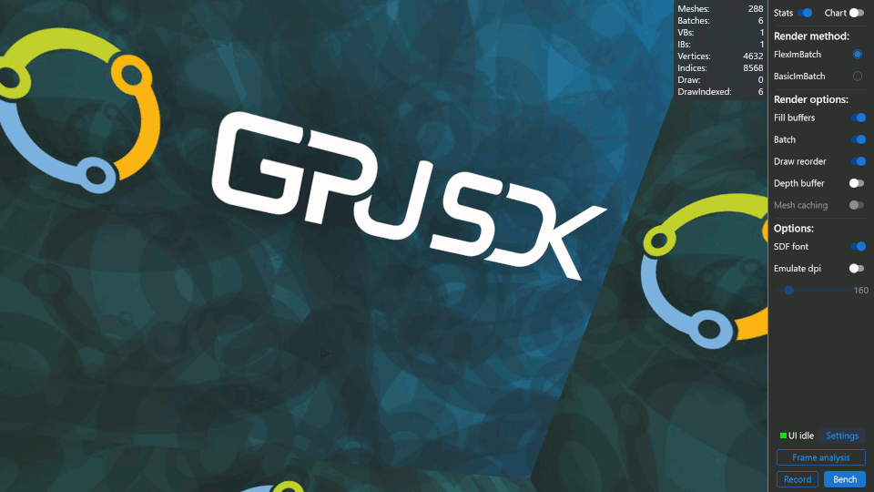

## Appendix: Event system

Window events can be send using one of these routing strategies.

Routing strategy | description
-----------------|----------------
Direct           | Only the targeted window receive the event
Tunnel           | The event travel through all direct parents, starting at the root parent then moving closer and closer.
Bubble           | The event bubbles from the receiver through each direct parent
Paired           | The event is first tunneled as a preview then bubbled as a final event.

If we take this window hierarchy:

window hierarchy                                                   |
-------------------------------------------------------------------|
|

If the target is window G then.

Routing strategy | description
-----------------|----------------
Direct           | G receives the message as the only one
Tunnel           | The message is send to A->C->F->G
Bubble           | The message is send to G->F->C->A
Paired           | The message is send as a preview to A->C->F->G then to G->F->C->A

Furthermore we have two different event types

Type        | description
------------|----------------
Basic       | Simple event
Transaction | Transaction events will always have at least a begin and end event.

Transaction events are for example used for mouse clicks so that a mouse button press will send a WindowInputClickEvent with IsBegin==true when the event starts followed by a WindowInputClickEvent with IsBegin==false when the mouse button is released.

