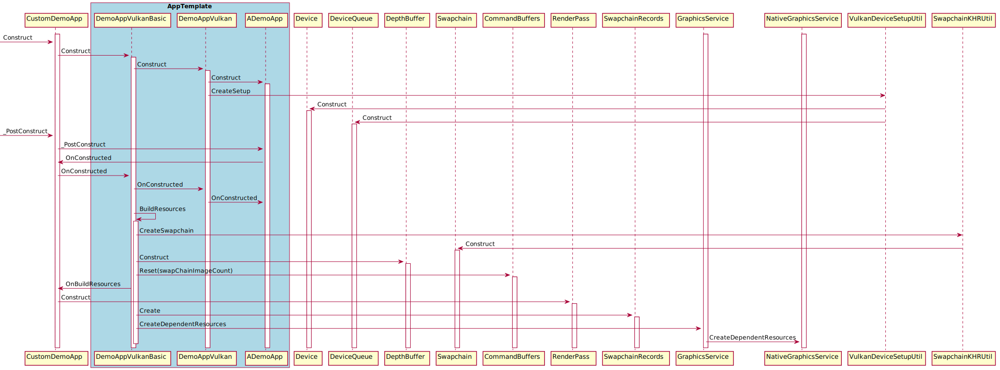
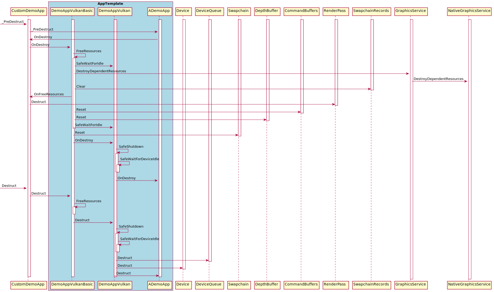
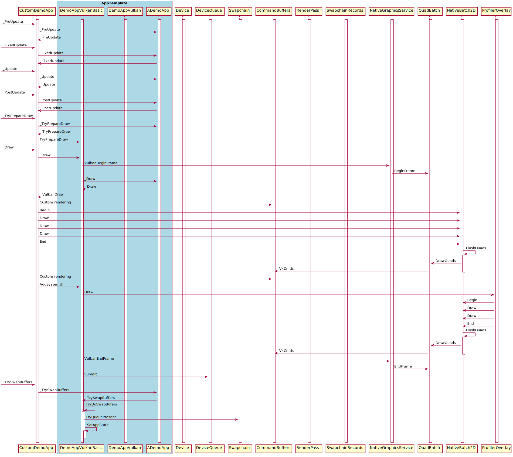
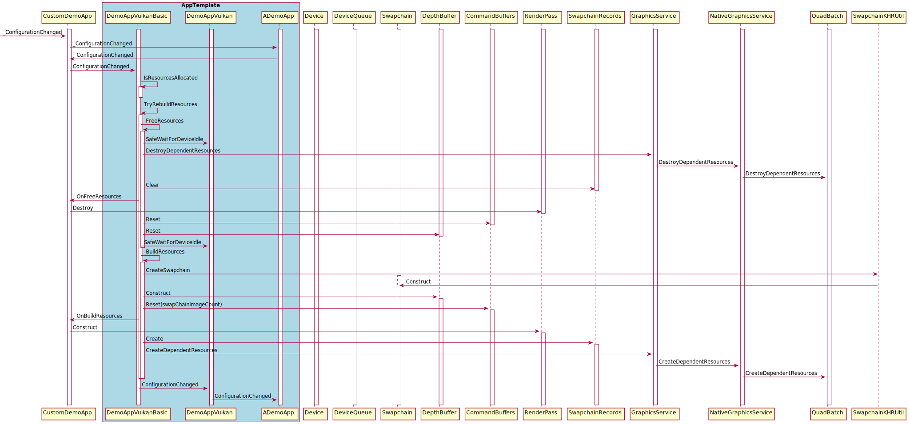
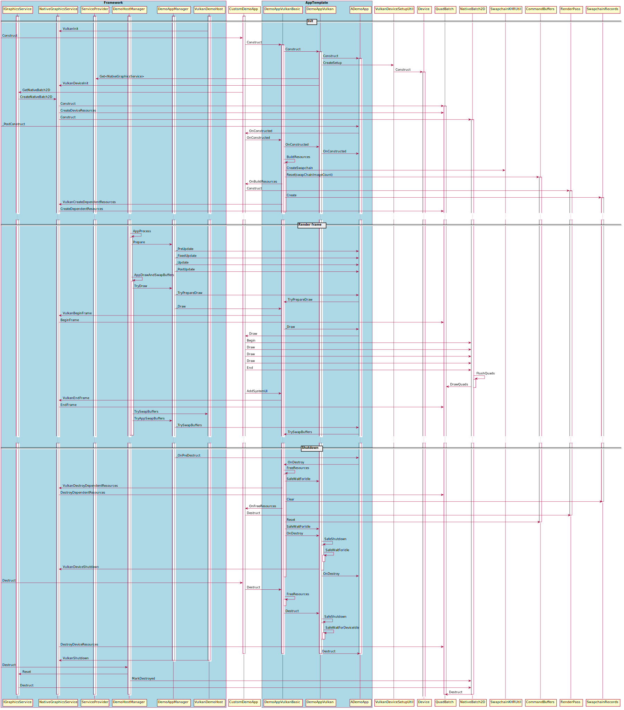

# Vulkan

The support in the demo framework is still **in development** so this release is marked as **early access**.
Early access means everything is subject to changes and still in development.

**The Vulkan demo host has not been finalized, so some changes might occur in future releases.**
  
The ```Vulkan``` project template is the recommended way to create a new Vulkan samples.

Vulkan is a low level "no secrets" type of API that might seem intimidating at first glance and its not really recommended for beginners. It requires a lot of attention to detail, knowledge of how to write properly threaded code and issues related to that. It also requires a lot of setup work just to get something on the screen and even more to make sure you handle all the possible error cases that can occur both during setup and while the app is running. Vulkan's 'front heavy' design basically makes it hard/time-consuming to create small demos but fits well with a well thought through rendering engine. However once you get all the setup and error handling done you will find that rendering something becomes *fairly* simple.

This is where the frameworks Vulkan app template helps out as it handles most of the setup for you based on our experience with writing Vulkan samples which should make it a lot faster to get something on the screen to start working on the actual rendering sample or experiment.

However to truly take proper advantage of Vulkan features and gain the desired performance benefits its really recommended to create a 'proper' multi-threaded engine for interacting with it and the engine should be designed with knowledge of how Vulkan works and not be something that is based on the old OpenGL way of thinking.

## The vulkan demo host

Most demo-hosts do a lot of setup and are responsible for doing the frame 'SwapBuffers' call, but due to the flexibility and low level nature of Vulkan we had to make a number of adjustments to the Vulkan demo hosts responsibility.

Currently it takes care of:

- Common command line parameters
- Vulkan instance creation this included enabling extensions.
- Vulkan window creation using the "Vulkan Native Window System".
- Selecting the physical vulkan device to use.

The normal SwapBuffers responsibility is given to the Application instead using ```_TrySwapBuffers```.

## Getting started

As Vulkan is a very low level interface it's more complex to create a template that will fit all Vulkan project types.
Therefore we chosen to create a flexible solution that allows for various app templates to be easily implemented.
Each template is designed for a specific demo type and usage pattern based on what we observed to be common for Vulkan samples.

Project           | Class              | Description
------------------|--------------------|-----------------------------------------------------------------------------------
None              | DemoAppVulkan       | This is the base class for Window based Vulkan apps. A app using this is basically a freestyle app that needs to handle resize, lost resources, stats overlay and screenshot support. **(Not recommended)**
Vulkan            | DemoAppVulkanBasic  | Defaults to double buffered rendering with support for resize strategies, resource loss and stats overlay. Support for screenshots will be added soon. **(Recommended)**
WillemsVulkan     | DemoAppVulkan based | A sample that does not use AssImp. **(Not recommended)**
WillemsMeshVulkan | DemoAppVulkan based | A sample that use AssImp for model loading. **(Not recommended)**

The WillemsVulkan project type exist to make it easier to port a existing sample that use [Sascha Willems framework](https://github.com/SaschaWillems/Vulkan). Its not recommend to use the Willems vulkan templates unless you know what you are doing.

Apps based on DemoAppVulkan take on a lot of responsibility, for example just minimizing the vulkan window on Windows can invalidate the Swapchain requiring you to rebuild it and anything dependent on it. Furthermore the swap chain can not be recreated before the window becomes visible again which is another thing that need to be handled. There are a lot of such small 'gotchas' every Vulkan app needs to deal with which is why its recommended to use the DemoAppVulkanBasic template which has strategies in place for all of these things.

Due to the low level nature of Vulkan, its philosophy of 'no secrets' and because the app has become responsible for doing the 'SwapBuffers' call there is also no 'easy' way to add the '--Stats' overlay. So the app has become responsible for making sure its supported and we currently only have a strategy in place for how to do this for DemoAppVulkanBasic type projects where it must call ```AddSystemUI``` during ```VulkanDraw```. While it technically is possible to render a overlay on top of any Vulkan app its not as cheap performance wise as when the app is cooperating. However we will look into enabling this fallback for any app that doesn't call ```AddSystemUI``` in a future release.

Taking a screenshot is also a lot more involved and complex under Vulkan so we encountered some of the same issues and considerations as we did for rendering the '--Stats' overlay. But we have not had time to implement a strategy for this yet but it is expected to be completed soon.

## DemoAppVulkanBasic

This is the recommended template for new Vulkan projects. It defines a strategy for creating resources, the swapchain (including recreation) and how a frame is rendered. It also includes all the code that provides support for rendering the '--Stats' overlay. Furthermore it supports various resize strategies and has quite a few helper methods that makes creating up a basic Vulkan sample easier.

The sample defaults to a double buffered setup, no depth buffer and allows for two frames to be 'in flight' at once.
Having two frames in flight ensures that we dont spend time waiting for the GPU to finish one frame before we start rendering the next one which should utilize the GPU resources better. Beware that most examples on the net wait for the GPU to be done between frames which ensures they dont have to deal with some synchronization issues but at the cost of lower performance. But its not a ideal way to do things for a production application. Which is why we prefer to showcase and deal with this like most real production applications would. The main thing to remember when allowing in-flight frames is that each frame being rendered should only change resources that it owns and things not being used by any other in-flight frame.

The template also defines a init, shutdown, resize, frame and recovery strategy.

If you have OpenGL ES 2+3 experience it can be useful to try to compare the implementation of some of the samples that exist for both API's to see the differences. Many of the samples have been constructed in a way that makes a diff fairly easy to perform.

### Basic template configuration

Various parameters can be tweaked by modifying the ```DemoAppVulkanSetup``` struct supplied to the ```DemoAppVulkanBasic``` constructor.

To do this change:

```C++
CustomDemoApp::CustomDemoApp(const DemoAppConfig& config)
  : DemoAppVulkanBasic(config)
{
}
```

to

```C++
namespace
{
  VulkanBasic::DemoAppVulkanSetup CreateSetup()
  {
    VulkanBasic::DemoAppVulkanSetup setup;
    // Enable depth buffer
    setup.DepthBuffer = VulkanBasic::DepthBufferMode::Enabled;
    return setup;
  }
}

CustomDemoApp::CustomDemoApp(const DemoAppConfig& config)
  : DemoAppVulkanBasic(config, CreateSetup())
{
}
```

It also allows you to tweak the active resize strategy, the VkPresentModeKHR, swapchain image usage flags and more.

### Init sequence

Due to Vulkans low level nature it requires more work to handle its resources. The DemoAppVulkanBasic template basically splits it into two resource types.

- Device dependent
- Swapchain dependent/related.

The device dependent resources are normally created during construction and are not affected by the swap chain being lost or window resizing. Where the swap chain dependent resources are created in the OnBuildResources call which allows them to be freed and recreated on demand. For example if the swap chain becomes invalid.

A high level sequence overview.

<a href="Images/DemoAppVulkanBasic_Flow_Init.svg">

</a>

While BuildResources can be manually called from the Constructor it's not recommended to do so as it makes error handling more complex and there could also be issues with virtual methods.

### Shutdown sequence

A high level sequence overview.

<a href="Images/DemoAppVulkanBasic_Flow_Shutdown.svg">

</a>

As we rely on virtual methods and because we technically could have a exception occur during the shutdown sequence all resources are freed during the ```_PreDestruct``` call which calls ```OnDestroy``` in the *CustomDemoApp*.

If the CustomDemoApp needs to shutdown something that could possibly fail we recommend that it overloads the OnDestroy method and implements its shutdown sequence there. For things in the shutdown sequence that are known to not throw the standard destructor can be used as usual.

### Frame sequence

A high level sequence overview.

<a href="Images/DemoAppVulkanBasic_Flow_Draw.svg">

</a>

The call sequence can be interrupted at any of the ```_Try``` method calls if they fail, causing a recovery strategy to execute.

### Frame sequence recovery

During the frame sequence any ```_Try``` method is allowed to fail and can request a specific recovery strategy to be used. Currently the frame sequence has these ```_Try``` method.

```C++
AppDrawResult _TryPrepareDraw(const DemoTime& demoTime) override;
AppDrawResult _TrySwapBuffers(const DemoTime& demoTime) override;
```

They can return

```C++
enum class AppDrawResult
{
  //! The operation failed  (use default handling, which is to restart the app)
  Failed,
  //! Not ready to draw (but keep asking every 'frame')
  NotReady,
  //! Something went wrong but we should be able to recover, restart the draw loop (TryPrepare, Draw, Etc)
  Retry,
  //! Everything completed successfully
  Completed,
};
```

### Resize

When the window is resized it can be necessary to recreate various Vulkan objects and the app might also be dependent on the window size. To support a wide range of scenarios the app template supports various resize strategies.

However you need to be aware that all demo framework apps by default are destroyed then recreate when a resize occurs. This also means that everything is restarted from scratch unless the app implements some kind of load/save state system.

So any resize strategies in DemoAppVulkanBasic has no effect unless this overall DemoFramework strategy is changed.
This can be done in the apps ```CustomDemoApp_Register.cpp``` file by changing:

```C++
namespace Fsl
{
  // Configure the demo environment to run this demo app in a Vulkan host environment
  void ConfigureDemoAppEnvironment(HostDemoAppSetup& rSetup)
  {
    DemoAppHostConfigVulkan config;

    DemoAppRegister::Vulkan::Register<CustomDemoApp>(rSetup, "Vulkan.CustomDemoApp", config);
  }
}
```

to

```C++
namespace Fsl
{
  // Configure the demo environment to run this demo app in a Vulkan host environment
  void ConfigureDemoAppEnvironment(HostDemoAppSetup& rSetup)
  {
    // 1. Change the default demo-framework app resize strategy to allow the app to keep running on resize
    CustomDemoAppConfig customDemoAppConfig;
    customDemoAppConfig.RestartOnResize = false;

    DemoAppHostConfigVulkan config;

    // 2. Supply the customDemoAppConfig to the register method
    DemoAppRegister::Vulkan::Register<CustomDemoApp>(rSetup, "Vulkan.CustomDemoApp", config, customDemoAppConfig);
  }
}
```

With that done the Vulkan app template resize strategy will be used and the VulkanDemoAppBasic app template supports these strategies:

Strategy name    | Description
-----------------|-----------------------------------------------------------------------------------------------------
Disabled         | The application takes full control and responsibility for supporting the resize.
RebuildResources | The Resized method is called and it is responsible for recreating dependent resources. **(Default)**

The policy can be changed by modifying the ```DemoAppVulkanSetup``` struct supplied to the ```DemoAppVulkanBasic``` constructor.

Change:

```C++
CustomDemoApp::CustomDemoApp(const DemoAppConfig& config)
  : DemoAppVulkanBasic(config)
{
}
```

to

```C++
namespace
{
  VulkanBasic::DemoAppVulkanSetup CreateSetup()
  {
    VulkanBasic::DemoAppVulkanSetup setup;
    setup.ActiveResizeStrategy = VulkanBasic::ResizeStrategy::Disabled;
    return setup;
  }
}

CustomDemoApp::CustomDemoApp(const DemoAppConfig& config)
  : DemoAppVulkanBasic(config, CreateSetup())
{
}
```

#### Resize strategy Disabled

The applications "Resized" method is called and its up to it to recreate all resources that requires it.

#### Resize strategy RebuildResources

The RebuildResources resize policy checks if any resources are allocated and if there is it call DestroyResources followed by BuildResources. While this can be slightly expensive it requires a minimum amount of work to support for most apps and it will be less expensive than destroying and restarting the app. Furthermore as the app isn't restarted there is no need to save any state for most apps as only Vulkan 'dependent' resources are destroyed and recreated.

Beware that the app is responsible for making sure that it supports resizing, so anything that is dependent on the window size will need to be updated. This is what the ```Resized``` callback is for.

A high level sequence overview.

<a href="Images/DemoAppVulkanBasic_Flow_Resize.svg">

</a>

Following a successful ```Resized``` operation the normal frame sequence is resumed.

## Build resources

It's recommended to look at some of the existing samples to get a good idea for how they implement their build resources method.

The ```OnBuildResources``` method must create and return the main render pass and the DemoAppVulkanBasic contains a ```CreateBasicRenderPass``` method that can be used to get started. But more advanced apps will want to create their own.

The ```OnBuildResources``` method is supplied a ```BuildResourcesContext``` struct that contain information about the context we are building resources for so its recommended to take a closer look at that struct.

## Using physical device features

Vulkan requires that many physical device features are enabled when creating the Vulkan instance and the instance is created by the Vulkan demo host which provides a mechanism for interacting with it.

For example to enable various texture compression formats we can request them to be enabled. This can be done in the apps ```CustomDemoApp_Register.cpp``` file by changing:

```C++
namespace Fsl
{
  // Configure the demo environment to run this demo app in a Vulkan host environment
  void ConfigureDemoAppEnvironment(HostDemoAppSetup& rSetup)
  {
    DemoAppHostConfigVulkan config;

    DemoAppRegister::Vulkan::Register<CustomDemoApp>(rSetup, "Vulkan.CustomDemoApp", config);
  }
}
```

to

```C++
namespace Fsl
{
  // Configure the demo environment to run this demo app in a Vulkan host environment
  void ConfigureDemoAppEnvironment(HostDemoAppSetup& rSetup)
  {
    using namespace Vulkan;

    DemoAppHostConfigVulkan config;
    config.AddPhysicalDeviceFeatureRequest(PhysicalDeviceFeature::TextureCompressionASTC_LDR, FeatureRequirement::Optional);
    config.AddPhysicalDeviceFeatureRequest(PhysicalDeviceFeature::TextureCompressionBC, FeatureRequirement::Optional);
    config.AddPhysicalDeviceFeatureRequest(PhysicalDeviceFeature::TextureCompressionETC2, FeatureRequirement::Optional);

    DemoAppRegister::Vulkan::Register<CustomDemoApp>(rSetup, "Vulkan.CustomDemoApp", config);
  }
}
```

Since all of them are set to Optional in this example that means that the application needs to handle that all of them might be unavailable.

## Extensions and layers

Extensions and layers can be requested in the same way as physical device features. This can be done in the apps ```CustomDemoApp_Register.cpp``` file.

### Instance layers

```C++
namespace Fsl
{
  // Configure the demo environment to run this demo app in a Vulkan host environment
  void ConfigureDemoAppEnvironment(HostDemoAppSetup& rSetup)
  {
    using namespace Vulkan;

    DemoAppHostConfigVulkan config;
    // This is just a example (VK_LAYER_LUNARG_api_dump can actually be enabled/disabled from the command line)
    config.AddInstanceLayerRequest("VK_LAYER_LUNARG_api_dump"), FeatureRequirement::Required);

    DemoAppRegister::Vulkan::Register<CustomDemoApp>(rSetup, "Vulkan.CustomDemoApp", config);
  }
}
```

### Instance extensions

```C++
namespace Fsl
{
  // Configure the demo environment to run this demo app in a Vulkan host environment
  void ConfigureDemoAppEnvironment(HostDemoAppSetup& rSetup)
  {
    using namespace Vulkan;

    DemoAppHostConfigVulkan config;
    config.AddInstanceExtensionRequest("VK_EXT_debug_utils"), FeatureRequirement::Optional);

    DemoAppRegister::Vulkan::Register<CustomDemoApp>(rSetup, "Vulkan.CustomDemoApp", config);
  }
}
```

### Device extensions

Are not currently supported!

The plan is to enable them via the same scheme we employ for Device extensions.

## Hints

### Misc tips

- [RenderDoc](https://renderdoc.org/) can be extremely useful while debugging a Vulkan app. Take advantage of it.
- All Vulkan samples support ```--LogExtensions``` which logs all available extensions.
- All Vulkan samples support ```--LogLayers``` which logs all available layers.
- All Vulkan samples support ```--VkApiDump``` which enable the VK_LAYER_LUNARG_api_dump layer.
- All Vulkan samples support ```--VkPhysicalDevice``` which allows you to select the physical device.
- DemoAppVulkanBasic samples support ```--VkPresentMode``` which can be used to override the present mode chosen by the app.

### Texture compression

- Its highly recommended to utilize it as much as possible it to save bandwidth, memory and improve performance
- For cross platform support always support multiple compression formats as no format will work everywhere.

### Validation

- Its highly recommended to enable the VK_LAYER_LUNARG_standard_validation while developing a Vulkan app. If you dont use it your app will most likely contain errors. So save time and just use it!
- Debug builds enable VK_LAYER_LUNARG_standard_validation by default.
- The ```--VkValidate``` argument can be used to enable or disable it from the command line.

## Known issues

- As most of these samples are simple they currently perform many small Vulkan allocations. This is not something that should be done for a real production workload!
- Most samples refill the command-buffer every frame even when its not strictly necessary.
- The UI meshes are currently rebuild every frame, even when the UI is not modified.
- DemoAppVulkanBasic: The depth buffer format selection can not be modified.
- Package FslUtil.Vulkan1_0: is still a work in progress.
- The physical device feature request mechanism does not support 'grouping' a request like 'TextureCompressionASTC_LDR, TextureCompressionBC or TextureCompressionETC2. To do this the app should set all of them to optional and then check if it got one of them.
- Device extensions can not be requested.
- Console based Vulkan apps do not have a DemoHost yet. So they are 100% freestyle apps.
- The samples often chose the 'simple' but not optimal solution for doing things as its simpler to understand. A common example is texture loading which most samples load from the main thread and in sequence not taking advantage of the abilities for Vulkan to do this from multiple threads. Even for the case were we only want to use one thread it has multiple synchronization points to ensure that once the 'load' call returns the texture is ready. For a real production application it would be more optimal to 'batch' the loading requests and then wait for all of them to complete at the end instead. A future update will most likely introduce a more optimal loader that enables this scenario.
- Some samples work on uncompressed textures just because its supported on all platforms and its performance is good enough for whats being demonstrated.
- The ```--VkPresentMode``` is currently ignored by Vulkan samples not based on DemoAppVulkanBasic.
- The ```--Stats``` is currently not supported by Vulkan samples not based on DemoAppVulkanBasic.

Feature       | Description
--------------|---------------
Stats overlay | Are supported on demos that use DemoAppVulkanBasic as a base class and if they call the right methods. Its up to the app developer to ensure its available and tested.
Screenshot    | Screenshots are currently not supported for Vulkan apps.

## Detailed sequence

<a href="Images/DemoAppVulkanBasic_Flow_Detailed.svg">

</a>

## Class diagrams

### Class diagram DemoAppVulkanBasic

<a href="Images/DemoAppVulkanBasic_Classes.svg">

</a>

## Demo conversion status

The current conversion status for converting the VulkanSamples to use the DemoAppVulkanBasic class.

Name                       |Converted|
---------------------------|---------|
ComputeParticles           |         |
DevBatch                   |    Y    |
DFGraphicsBasic2D          |    Y    |
DFNativeBatch2D            |    Y    |
DFSimpleUI100              |    Y    |
DFSimpleUI101              |    Y    |
DisplacementMapping        |         |
DynamicTerrainTessellation |         |
GammaCorrection            |    Y    |
Gears                      |         |
HDR01_BasicToneMapping     |    Y    |
HDR02_FBBasicToneMapping   |    Y    |
HDR03_SkyboxTonemapping    |    Y    |
InputEvents                |    Y    |
LineBuilder                |    Y    |
MeshInstancing             |         |
OpenCL101                  |    Y    |
OpenCLGaussianFilter       |    Y    |
OpenCV101                  |    Y    |
OpenCVMatToNativeBatch     |    Y    |
OpenCVMatToUI              |    Y    |
OpenVX101                  |    Y    |
Scissor101                 |    Y    |
Skybox                     |    Y    |
TessellationPNTriangles    |         |
TextureCompression         |    Y    |
Texturing                  |         |
TexturingArrays            |         |
TexturingCubeMap           |         |
Triangle                   |         |
Vulkan101                  |    Y    |
VulkanComputeMandelbrot    |         |
VulkanInfo                 |         |
