# DemoFramework 5.1.1

A multi-platform framework for fast and easy demo development.

The framework abstracts away all the boilerplate & OS specific code of allocating windows, creating the context,
texture loading, shader compilation, render loop, animation ticks, benchmarking graph overlays etc.
Thereby allowing the demo/benchmark developer to focus on writing the actual 'demo' code.

Therefore demos can be developed on PC or Android where the tool chain and debug facilities often allows for faster turnaround time and
then compiled and deployed without code changes for other supported platforms.

The framework also allows for ‘real’ comparative benchmarks between the different OS and windowing systems,
since the exact same demo/benchmark code run on all of them.

## Supported app templates:

* Console. A freestyle project that runs in a console like environment.
* G2D (early access)
* OpenCL (early access)
* OpenCV (early access)
* OpenGL ES 2, 3, 3.1
* OpenVG
* OpenVX (early access)
* Vulkan (early access)
* Window. A freestyle project that runs in a window based environment.

    

## Supported operating systems

* Android NDK
* Linux with various windowing systems (Yocto).
* Ubuntu 16.04
* Windows 7+

## Table of contents

<!-- #AG_TOC_BEGIN# -->
* [Introduction](#introduction)
  * [Technical overview](#technical-overview)
* [Building](#building)
  * [Reasoning](#reasoning)
  * [Build system per platform](#build-system-per-platform)
  * [Scripts](#scripts)
* [Demo application details](#demo-application-details)
  * [Method overview](#method-overview)
  * [Execution order of methods during a frame](#execution-order-of-methods-during-a-frame)
  * [Content loading](#content-loading)
  * [Demo registration](#demo-registration)
  * [Dealing with screen resolution changes](#dealing-with-screen-resolution-changes)
  * [Exit](#exit)
* [Demo playback](#demo-playback)
  * [Command line arguments](#command-line-arguments)
  * [Default keyboard mappings.](#default-keyboard-mappings.)
  * [Demo single stepping / pause.](#demo-single-stepping-/-pause.)
* [Demo applications](#demo-applications)
  * [Console](#console)
  * [G2D](#g2d)
  * [GLES2](#gles2)
  * [GLES3](#gles3)
  * [OpenCL](#opencl)
  * [OpenCV](#opencv)
  * [OpenVG](#openvg)
  * [OpenVX](#openvx)
  * [Vulkan](#vulkan)
  * [Window](#window)
<!-- #AG_TOC_END# -->

# Introduction

## Technical overview

* Written in a limited subset of [C++ 11](https://en.wikipedia.org/wiki/C%2B%2B11) and
uses [RAII](http://en.wikipedia.org/wiki/Resource_Acquisition_Is_Initialization) to manage resources.
* Uses a limited subset of [STL](https://en.wikipedia.org/wiki/Standard_Template_Library) to make it easier to port.
* No copyleft restrictions from GPL / L-GPL licenses.
* Allows for direct access to the expected API’s (EGL, OpenGL ES 2, OpenGL ES 3, OpenVG, OpenCV, etc)
* Package based architecture that ensures your app only has dependencies to the libs it uses.
* Content pipeline:
  * Automatically compile Vulkan shaders during build.
* Services
  * Keyboard, mouse and GamePad.
  * Persistent data manager
  * Assets management (models, textures)
* Defines a standard way for handling
  * Init, shutdown & window resize.
  * Program input arguments.
  * Input events like keyboard, mouse and touch.
  * Fixed time-step and variable time-step demo implementations.
  * Logging functionality.
* Provides optional helper classes for commonly used tasks:
  * Matrix, Vector3, GLShader, GLTexture, etc
* Easy access to optional libs like:
  [GLM](http://glm.g-truc.net/0.9.8/index.html),
  [GLI](http://gli.g-truc.net/0.8.2/index.html),
  [RapidJSON](http://rapidjson.org/) and
  [Assimp](http://assimp.sourceforge.net/)

# Building

See the setup guides for your platform:
* [Android](Doc/Setup_guide_android_sdk+ndk_on_windows.md)
* [Ubuntu 16.04](Doc/Setup_guide_ubuntu16.04.md)
* [Windows](Doc/Setup_guide_windows.md)
* [Yocto](Doc/Setup_guide_yocto.md)

For details about the build system see the [FslBuildGen document](./Doc/FslBuildGen.docx).

## Reasoning

While writing this we currently have twenty-five OpenGL ES 2 samples, fifty-three OpenGL ES 3.x samples,
fourteen Vulkan samples, eight OpenVG samples, two G2D samples, three OpenCL samples, two OpenCV samples,
two OpenVX sample and four other samples. Which is *113 sample applications*.

The demo framework currently runs on at least four platforms so using a traditional approach we would have to
maintain 113 * 4 = *452 build files* for the samples alone.
Maintaining 452 or even just 114 build files would be an extremely time consuming and error prone process.
So ideally, we wanted to use a build tool that supported

1. Minimalistic build description files, that are used to ‘auto generate’ real build files.
2. Proper package dependency support.
3. A good developer experience
   * co-existence of debug, release and other variants.
   * re-use of already build libs for other samples.
   * full source access to all used packages inside IDE’s.
4. Support for Windows, Ubuntu, Yocto and Android NDK.
5. Ensure a similar source layout for all samples.

The common go-to solution for C++ projects these days would be to use CMake, but when we started this project it was not nearly as
widely used, the build files were not as minimalistic as we would like, the package dependencies were not handled as easy as we would
have liked, it had no Android NDK support and the sample layout would have to be manually enforced.

As no existing system really fit, we made the controversial choice of creating our own minimalistic system.
It uses a minimalistic build-meta-data file with no scripting capabilities (as we want everything to be build the same way).
From the meta data files + the content of the folders ‘include’ and ‘source’ we then generate the platform dependent build files
using various templates that can be changed in one location. This means that once the ‘build-meta-data’ file has been created it
would basically never have to change unless the source code gets new dependencies to other packages.

Over the years, we been using this approach we have not really touched any of the build-meta-data files (Fsl.gen) since they were
initially created. If we ever needed any build file changes we could instead update the template in one location and have it affect
all samples right away.

Here is an example ‘Fsl.gen’ build-meta-data file for the GLES2.Blur sample app:

```XML
<?xml version="1.0" encoding="UTF-8"?>
<FslBuildGen xmlns:xsi="http://www.w3.org/2001/XMLSchema-instance" xsi:noNamespaceSchemaLocation="../../../FslBuildGen.xsd">
  <Executable Name="GLES2.Blur" NoInclude="true">
    <ImportTemplate Name="DemoAppGLES2"/>
    <Dependency Name="EnvironmentMappingShared"/>
    <Platform Name="Windows" ProjectId="F73214FE-7A4B-4D7D-89EC-416B25E643BF"/>
  </Executable>
</FslBuildGen>
```

It basically specifies that this directory contains an executable package with no include directory,
that it uses the ‘DemoAppGLES2’ template and has a dependency on a package called ‘EnvironmentMappingShared’ then it
defines a ‘ProjectId’ for visual studio for windows.

Another example is the ‘Fsl.gen’ file for the FslGraphics package which has had lots of files added over the years,
but its build file has been untouched.

```XML
<?xml version="1.0" encoding="UTF-8"?>
<FslBuildGen xmlns:xsi="http://www.w3.org/2001/XMLSchema-instance" xsi:noNamespaceSchemaLocation="../../FslBuildGen.xsd">
  <Library Name="FslGraphics">
    <Dependency Name="FslBase"/>
    <Platform Name="Windows" ProjectId="0E59129C-BD25-4810-97C5-98E54599F134"/>
  </Library>
</FslBuildGen>
```

It specifies a ‘library’ (static library), with a dependency to ‘FslBase’ and a windows visual studio project id.

While CMake has improved a lot since we initially looked, it would requires more manual work to keep the
samples up to date than our current solution.

It's worth mentioning that its entirely possible generate 'CMakeLists.txt' with this system, in fact we do just that internally for the
android gradle+cmake build.

## Build system per platform

Operating System | Build system
--- | ---
Android|gradle + cmake (Android Studio can be used with the generated projects)
Ubuntu|make
Windows|Visual studio 2015, 2017 (IDE or msbuild)
Yocto|make

## Scripts

### FslBuildGen.py

Is a cross-platform build-file generator. Which main purpose is to keep all build files consistent, in sync and up to date.
See the [FslBuildGen document](./Doc/FslBuildGen.docx) for details.

### FslBuild.py

Extends the technology behind FslBuildGen with additional knowledge about how to execute the build system for a given platform.
So basically, FslBuild works like this
1.	Invoke the build-file generator that updates all build files if necessary.
2.	Filter the builds request based on the provided feature and extension list.
3.	Build all necessary build files in the correct order.

#### Useful arguments

FslBuild comes with a few useful arguments

Argument|Description
-------------------|---
--ListRequirements | List the requirement tree and exit.
--ListVariants     | List all variants.
--RequireFeatures  | The list of features that are required for a executable package to be build. For example [OpenGLES2] to build all executables that use OpenGLES2.
--UseFeatures      | Allows you to limit what’s build based on a provided feature list. For example [EGL,OpenGLES2]. This parameter defaults to all features.
--UseExtensions    | The list of available extensions to build for. For example [OpenGLES3.1:EXT_geometry_shader,OpenGLES3.1:EXT_tessellation_shader] to allow the OpenGLES3.1 extensions EXT_geometry_shader and EXT_tessellation_shader. You can also specify * for all extensions (default).
--Variants         | Define the variants you wish to build (if any). For yocto for example you select the window system and build type using --Variants [config=Debug,WindowSystem=FB]
--BuildTime        | Time the build and print the result and the end.
-t 'sdk'           | Build all demo framework projects
-v                 | Set verbosity level
--                 | arguments written after this is send directly to the native build system.

#### Important notes

* Don’t modify the auto-generated files.
The FslBuild scripts are responsible for creating all the build files for a platform and verifying dependencies.
Since all build files are auto generated you can never modify them directly as the next build will overwrite your changes.
Instead add your changes to the ‘Fsl.gen’ files as they control the build file generation!
* The ‘Fsl.gen’ file is the real build file.
* All include and source files in the respective folders are automatically added to the build files.

### FslBuildContent.py

This only runs the content builder part of the build process.

```
FslBuildContent.py
```
Build the current directories package content.

### FslBuildNew.py

Generate a new project of the specified type. This is basically a project wizard that will prepare a new project directory with a basic template
for the chosen project type.

```
FslBuildNew.py GLES2 FlyingPigsApp
```
Create the FlyingPigsApp sample app directory using the GLES2 template.

### FslBuildCheck.py

Package build environment checker. Based on what features the package uses this will try to detect setup errors.
It also has the capability to scan the source for common mistakes.

```
FslBuildCheck.py
```
Check the current build environment to see if the package can be build.

```
FslBuildCheck.py --scan
```
Scan the current package and see if there is any common mistakes with for example include guards, tabs, etc.

### FslBuildDoc.py

A new **work in progress* tool that helps keep the README.md files similar and that fills out various areas of the root README.md file.

```
FslBuildDoc.py
```

### FslResourceScan.py

This is a stand alone tool used to scan for 'graphics' files like textures and models and determine if a there is a 'License.json'
file accompanying them

```
FslResourceScan.py . -v --list
```
Scan the current directory and all it subdirectories for graphics files and license issues, then list all licenses found.

# Demo application details

The following description of the demo application details uses a GLES2 demo named ‘S01_SimpleTriangle’ as example.
It lists the default methods that a demo should implement, the way it can provide customized parameters to the windowing system and
how asset management is made platform agnostic.

## Method overview

This is a list of the methods that every Demo App is most likely to override .

```C++
// Init
S01_SimpleTriangle(const DemoAppConfig& config)
// Shutdown
~S01_SimpleTriangle()
// OPTIONAL: Custom resize logic (if the app requested it). The default logic is to
// restart the app.
void Resized(const Point2& size)
// OPTIONAL: Fixed time step update method that will be called the set number of times
// per second. The fixed time step update is often used for physics.
void FixedUpdate(const DemoTime& demoTime)
// OPTIONAL: Variable time step update method.
void Update(const DemoTime& demoTime)
// Put the rendering calls here
void Draw(const DemoTime& demoTime)
```

When the constructor is invoked, the Demo Host API will already be setup and ready for use,
the demo framework will use EGL to configure things as requested by your EGL config and API version.

It is recommended that you do all your setup in the constructor.

This also means that you should never try to shutdown EGL in the destructor since the framework will do it at the appropriate time.
The destructor should only worry about resources that your demo app actually allocated by itself.

### Resized

The resized method will be called if the screen resolution changes (if your app never changes resolution this will never be called) .

### FixedUpdate

Is a fixed time-step update method that will be called the set number of times per second. The fixed time step update is often used for physics.

### Update

Will be called once before every draw call and you will normally update your animation using delta time.
For example if you need to move your object 10 units horizontally per second you would do something like

```C++
_positionX += 10 * demoTime.DeltaTime;
```

### Draw

Should be used to render graphics.

### Fixed or variable timestep update

Depending on what your demo is doing, you might use one or the other - or both.
It’s actually a very complex topic once you start to dig into it, but in general anything that need precision and
predictable/repeatable calculations, like for example physics, often benefits from using fixed time steps.
It really depends on your algorithm and it’s recommended to do a couple of google searches on fixed vs variable,
since there are lots of arguments for both. It’s also worth noting that game engines like Unity3D support both methods.

## Execution order of methods during a frame

The methods will be called in this order
* Events (if any occurred)
* Resized
* FixedUpdate (0-N calls. The first frame will always have a FixedUpdate call)
* Update
* Draw
After the draw call, a swap will occur.

## Content loading

The framework supports loading files from the Content folder on all platforms.

Given a content folder like this:
```
Content/Texture1.bmp
Content/Stuff/Readme.txt
```

You can load the files via the IContentManager service that can be accessed by calling

```C++
std::shared_ptr<IContentManager> contentManager = GetContentManager();
```

You can then load files like this:

```C++
// *** Text file ***

// Read it directly into a new string
const std::string content = contentManager->ReadAllText("Stuff/Readme.txt");

// *** Binary file ***

// Read the content directly into a new vector
const std::vector<uint8_t> content = contentManager->ReadBytes("MyData.bin");

// Read the content into a existing vector
std::vector<uint8_t> content;
contentManager->ReadAllBytes(content, "MyData.bin");

// *** Bitmap file ***

// Read the content directly into a new bitmap
const Bitmap bitmap = contentManager->ReadBitmap("Texture1.bmp", PixelFormat::R8G8B8_UINT);

// Read the content into a existing bitmap object.
// Beware the bitmap object will be resized and format changed as needed, but some memory could be reused.
Bitmap bitmap;
contentManager->Read(bitmap, "Texture1.bmp", PixelFormat::R8G8B8_UINT);

// *** Texture file ***

// Read the content directly into a new texture
const Texture texture = contentManager->ReadTexture("Texture1.bmp", PixelFormat::R8G8B8_UINT);

// Read the content directly into a existing texture object.
// Beware the texture object will be resized and format changed as needed, but some memory could be reused.
Texture texture;
contentManager->Read(texture, "Texture1.bmp", PixelFormat::R8G8B8_UINT);

```

If you prefer to control the loading yourself, you can retrieve the path to the files like this:

```C++
IO::Path contentPath = contentManager->GetContentPath();
IO::Path myData = IO::Path::Combine(contentPath, "MyData.bin");
IO::Path readmePath = IO::Path::Combine(contentPath, "Stuff/Readme.txt");
IO::Path texture1Path = IO::Path::Combine(contentPath, "Texture1.bmp");
```

You can then open the files with any method you prefer. Both methods work for all supported platforms.

## Demo registration

This is done in the S01_SimpleTriangle_Register.cpp file.

```C++
namespace Fsl
{
  namespace
  {
     // Custom EGL config (these will per default overwrite the custom settings. However an exact EGL config can be used)
     static const EGLint g_eglConfigAttribs[] =
     {
        EGL_SAMPLES, 0,
        EGL_RED_SIZE, 8,
        EGL_GREEN_SIZE, 8,
        EGL_BLUE_SIZE, 8,
        EGL_ALPHA_SIZE, 0, // buffers with the smallest alpha component size are preferred
        EGL_DEPTH_SIZE, 24,
        EGL_SURFACE_TYPE, EGL_WINDOW_BIT,
        EGL_NONE,
     };
  }

  // Configure the demo environment to run this demo app in a OpenGLES2 host environment
  void ConfigureDemoAppEnvironment(HostDemoAppSetup& rSetup)
  {
    DemoAppHostConfigEGL config(g_eglConfigAttribs);

    DemoAppRegister::GLES2::Register<S01_SimpleTriangle>(rSetup, "GLES2.S01_SimpleTriangle", config);
  }
}
```

Since the demo framework is controlling the main method, you need to register your application with the Demo Host specific registration call
 (in this case the OpenGL ES2 host), for the framework to register your demo class.

### OpenGL ES 3.X registration

To register a demo for OpenGLES 3.X you would use the GLES3 register method:
```C++
    DemoAppRegister::GLES3::Register<S01_SimpleTriangle>(rSetup, "GLES3.S01_SimpleTriangle", config);
```

## Dealing with screen resolution changes

Per default the app is destroyed and recreated when a resolution change occurs.
It is left up to the DemoApp to save and restore demo specific state.

## Exit

The demo app can request an exit to occur, or it can be terminated via an external request.
In both cases one of the following things occur.
1. If the app has been constructed and has received a FixedUpdate, then it will finish its FixedUpdate, Update, Draw, swap sequence before its shutdown.
2. If the app requests a shutdown during construction, the app will be destroyed before calling any other method on the object (and no swap will occur).
The app can request an exit to occur by calling:
```C++
        GetDemoAppControl()->RequestExit(1);
```

# Demo playback

## Command line arguments

All demos support various command line arguments.
Use –h on a demo for a complete list

Argument             | Description
-------------------- | ---
-h                   | Show the command line argument help.
--Stats              | Show a performance graph.
--LogStats           | Log various stats to the console.
--Window             | Run inside a window instead of using the fullscreen. Used like this `--Window [0,0,640,480]` the parameters specify (x,y,width,height).
--ScreenshotFrequency| Create a screenshot at the given frame frequency.
--ExitAfterFrame     | Exit after the given number of frames has been rendered
--ContentMonitor     | Monitor the Content directory for changes and restart the app on changes. WARNING: Might not work on all platforms and it might impact app performance (experimental)

## Default keyboard mappings.

All apps support these keys per default, but can override then if they chose to do so.
Beware that some platforms might not support the given 'key' type and therefore they functonality is unsupported.

Key     | Function
------- | ------------------------------------------------
Escape  | Exit the app.
F4      | Take a screenshot (If supported by the test service)
F5      | Restart the app.

## Demo single stepping / pause.

All samples support time stepping which can be useful for debugging.
It might not be available on platforms that don't support the given keys.
Also beware that apps can override these keys if they chose to do so.

Key     | Function
------- | ---
Pause   | Pause the sample.
PageDown| Move forward one timestep.
Delete  | Toggle between normal and Slow 2x playback
End     | Toggle between normal and Slow 4x playback
Insert  | Toggle between normal and fast 2x playback.
Home    | Toggle between normal and fast 4x playback.

# Demo applications

<!-- #AG_DEMOAPPS_BEGIN# -->

## Console

### [Console101](DemoApps/Console/Console101)
Shows how to create a freestyle console based application using the demoframework.


## G2D

### [DFGraphicsBasic2D](DemoApps/G2D/DFGraphicsBasic2D)
Shows how to use the Demo Frameworks 'basic' 2d rendering capabilities that work across all backends.
The basic2D interface allows you to render ASCII strings using a system provided font and draw colored points.

The functionality in Basic2D is used internally in the framework to render the profiling overlays like the frame rate counter and graph.


### [EightLayers](DemoApps/G2D/EightLayers)
Shows how to use the G2D API blit functions to create a multiplane/multilayer landscape.
The layers are rendered to the FB directly without having the need of using other APIs.


## GLES2

### [Bloom](DemoApps/GLES2/Bloom)
<a href="DemoApps/GLES2/Bloom">
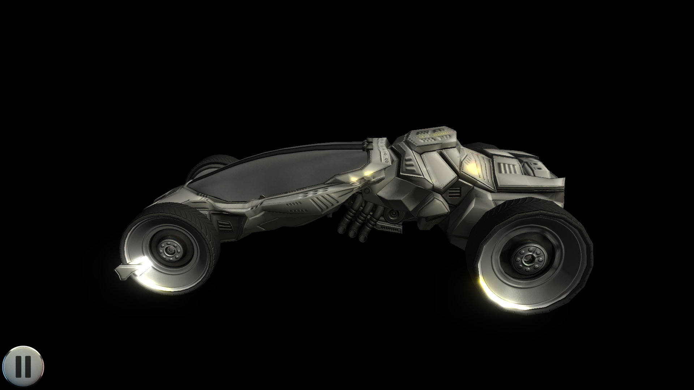
</a>

A example of how to create a bloom effect. The idea is not to create the most accurate bloom,
but something that is fairly fast to render.

Instead of increasing the kernal size to get a good blur we do a fairly fast approximation by
downscaling the original image to multiple smaller render-targets and then blurring these
using a relative small kernel and then finally rescaling the result to the original size.


### [Blur](DemoApps/GLES2/Blur)
<a href="DemoApps/GLES2/Blur">
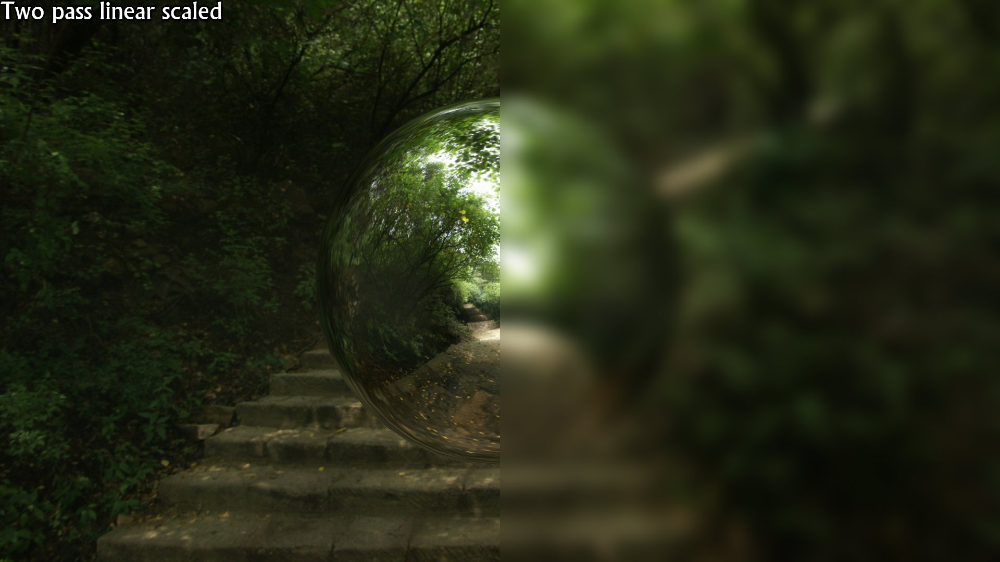
</a>

Showcases multiple ways to implement a gaussian blur.
- One pass blur
- Two pass blur
  The 2D Gaussian filter kernel is separable. This allows us two produce the same output as a one pass algorithm by first applying a X-blur and then a Y-blur.
- Two pass linear blur
  Uses the two pass technique and further reduces the bandwidth requirement by taking advantage of the GPU's linear texture filtering
  which allows us to reduce the needed kernel length to roughly half its length while producing the same output as the full kernel length.
- Two pass linear scaled blur
  Uses the two pass linear technique and further reduces the bandwidth requirement by downscaling the 'source image' to 1/4 its size (1/2w x 1/2h) before applying the blur and
  and then upscaling the blurred image to provide the final image. This works well for large kernel sizes and relatively high sigma's but the downscaling produces visible artifacts with low sigma's


### [DeBayer](DemoApps/GLES2/DeBayer)
This sample shows how to use OpenGL ES shaders to Debayer an input video.
Please check the Shader.frag file within the Content folder to actually see how the data is converted.
The video data is obtained using gstreamer and using the DirectVIVMap extension mapped to a GPU buffer to be used as a texture for the fragment shader to DeBayer.


### [DFGraphicsBasic2D](DemoApps/GLES2/DFGraphicsBasic2D)
<a href="DemoApps/GLES2/DFGraphicsBasic2D">

</a>

Shows how to use the Demo Frameworks 'basic' 2d rendering capabilities that work across all backends.
The basic2D interface allows you to render ASCII strings using a system provided font and draw colored points in batches.

The functionality in Basic2D is used internally in the framework to render the profiling overlays like the frame rate counter and graphs.


### [DFNativeBatch2D](DemoApps/GLES2/DFNativeBatch2D)
<a href="DemoApps/GLES2/DFNativeBatch2D">
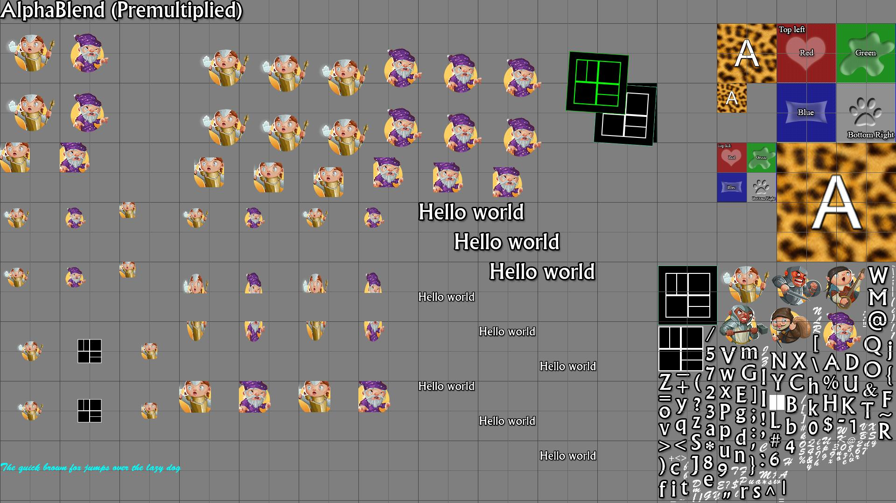
</a>

Shows how to use the Demo Frameworks NativeBatch implementatin to render various graphics elements.
The native batch functionality works across various 3D backends and also allows you to use the API native textures for rendering.

The native batch is very useful for quickly getting something on the screen which can be useful for prototyping and debugging.
It is however not a optimized way of rendering things.


### [DFSimpleUI100](DemoApps/GLES2/DFSimpleUI100)
<a href="DemoApps/GLES2/DFSimpleUI100">

</a>

A very basic example of how to utilize the DemoFramework's UI library.
The sample displays four buttons and reacts to clicks.

The UI framework that makes it easy to get a basic UI up and running. The main UI code is API independent. It is not a show case of how to render a UI fast but only intended to allow you to quickly get a UI ready that is good enough for a demo.


### [DFSimpleUI101](DemoApps/GLES2/DFSimpleUI101)
<a href="DemoApps/GLES2/DFSimpleUI101">

</a>

A more complex example of how to utilize the DemoFramework's UI library.
It displays various UI controls and ways to utilize them.

The UI framework that makes it easy to get a basic UI up and running. The main UI code is API independent. It is not a show case of how to render a UI fast but only intended to allow you to quickly get a UI ready that is good enough for a demo.


### [DirectMultiSamplingVideoYUV](DemoApps/GLES2/DirectMultiSamplingVideoYUV)
This sample shows how to use Gstreamer and OpenGL ES to display a YUV video on a texture by doing the YUV to RGB conversion on a shader and also use the DirectVIV extensions to avoid copying data from the Video Buffer to the GL Texture.


### [EightLayerBlend](DemoApps/GLES2/EightLayerBlend)
<a href="DemoApps/GLES2/EightLayerBlend">
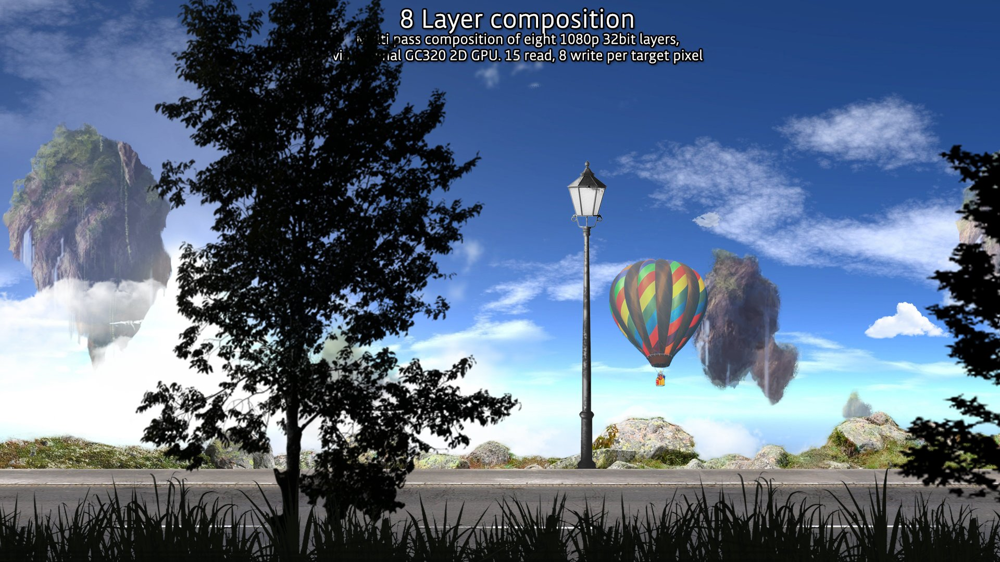
</a>

Creates a simple parallax scrolling effect by blending eight 32 bit per pixel 1080p layers
on top of each other. This is not the most optimal way to do it as it uses eight passes.
But it does provide a good example of the worst case bandwidth use for the operation.

The demo was created to compare GLES to the G2D eight blend blit functionality.


### [FractalShader](DemoApps/GLES2/FractalShader)
<a href="DemoApps/GLES2/FractalShader">
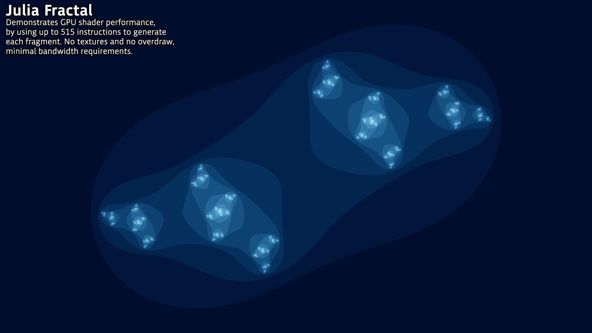
</a>

Can render both the julia and mandelbrot set using a fragment shader.
This demo was used to demonstrates GPU shader performance by using up roughly 515 instructions
to render each fragment while generating the julia set.

It uses no textures, has no overdraw and has a minimal bandwidth requirement.

Use the commandline arguments to select the scene and quality.


### [InputEvents](DemoApps/GLES2/InputEvents)
<a href="DemoApps/GLES2/InputEvents">
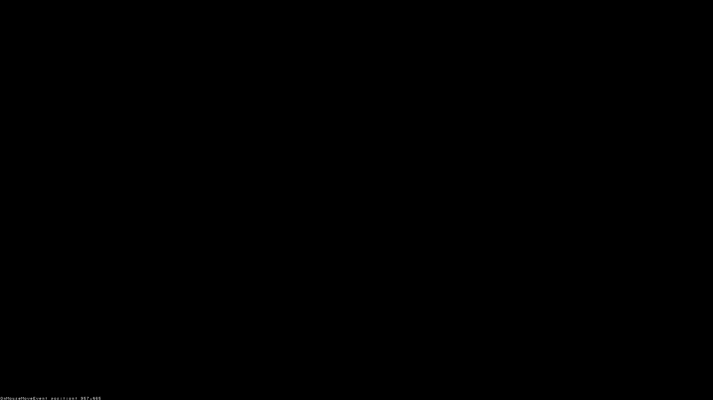
</a>

Demonstrates how to receive various input events and logs information about them onscreen and to to the log.

This can also be used to do some basic real time tests of the input system when porting the framework to a new platform.


### [ModelLoaderBasics](DemoApps/GLES2/ModelLoaderBasics)
<a href="DemoApps/GLES2/ModelLoaderBasics">
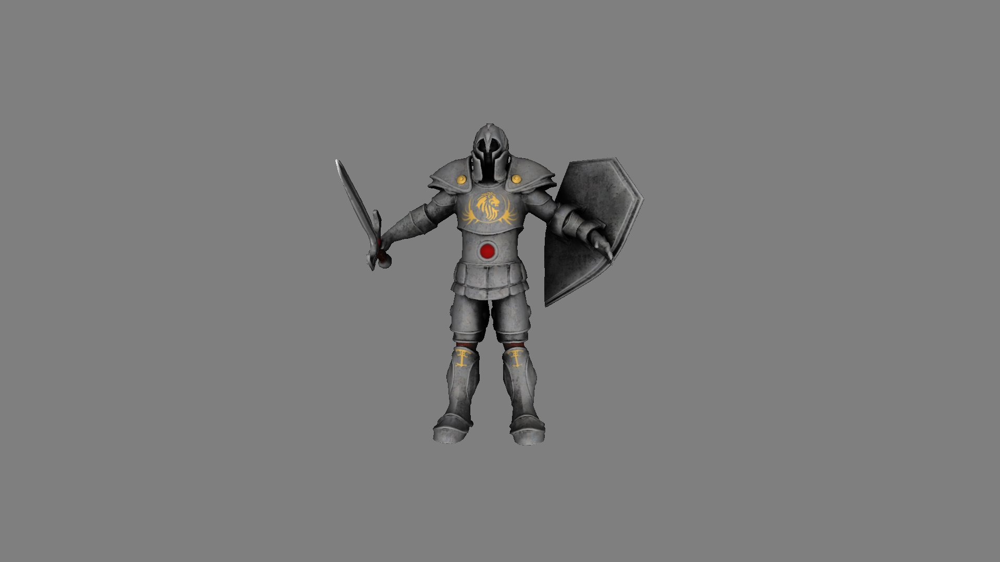
</a>

Demonstrates how to use the FslSceneImporter and Assimp to load a scene and render it using OpenGLES2.

The model is rendered using a simple per pixel directional light shader.

For a more complex example take a look at the ModelViewer example.


### [ModelViewer](DemoApps/GLES2/ModelViewer)
<a href="DemoApps/GLES2/ModelViewer">
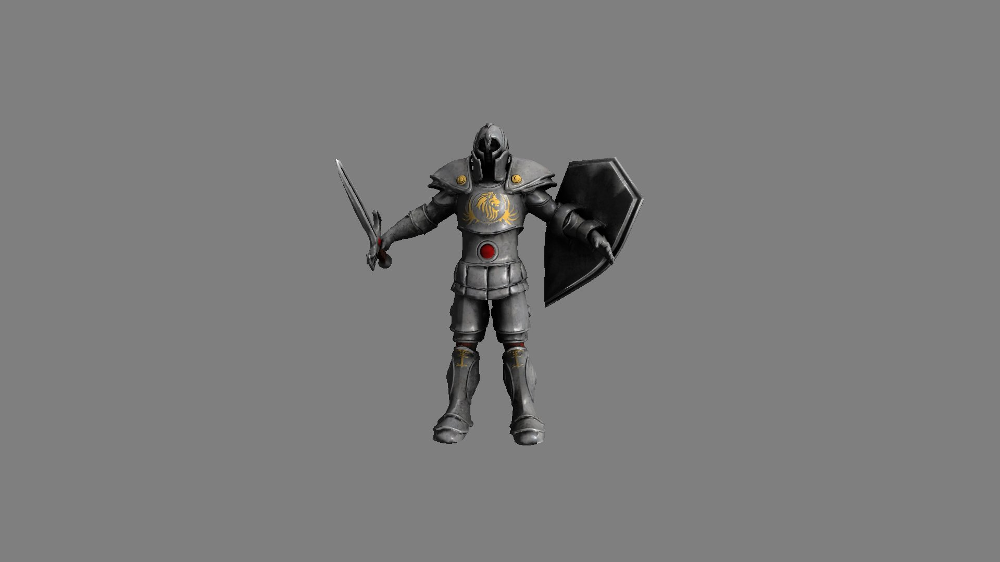
</a>

Expands the ModelLoaderBasics example with:

- A arcball camera
- Multiple different scenes (Knight, Dragon, Car, etc)
- More advanced shaders for directional per pixel specular light with support for gloss and normal maps.


### [OpenCV101](DemoApps/GLES2/OpenCV101)
<a href="DemoApps/GLES2/OpenCV101">

</a>

Demonstrates how to use OpenCV from inside a OpenGL ES 2 project.

This is a very basic example that mainly shows how to setup the correct dependency in the Fsl.gen file and
then it does some very basic OpenCV operations. It could be used as a good starting point for a more complex example.


### [S01_SimpleTriangle](DemoApps/GLES2/S01_SimpleTriangle)
<a href="DemoApps/GLES2/S01_SimpleTriangle">
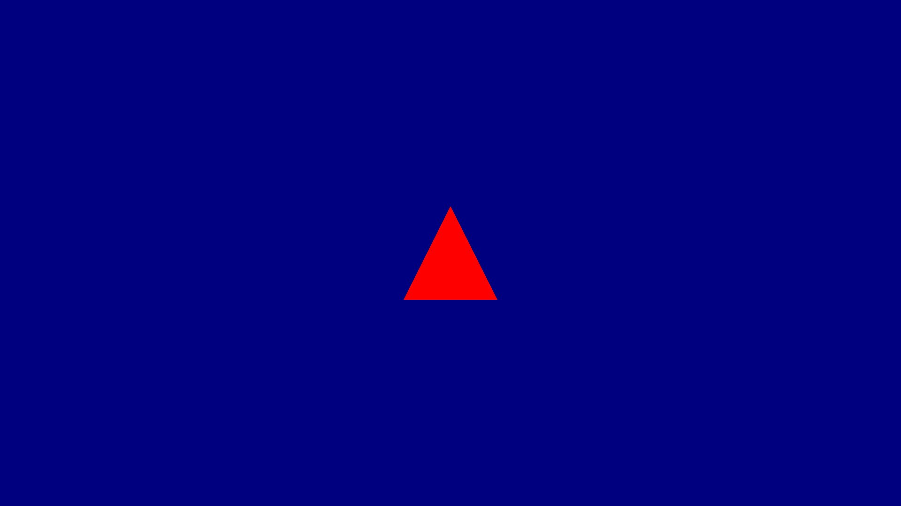
</a>

Shows how to render a single colored Triangle using OpenGL ES, this sample serves as a good introduction to
the OpenGL ES 2 Pipeline and the abstraction classes that the DemoFramework provides.

It's basically the typical 'Hello World' program for graphics.


### [S02_ColoredTriangle](DemoApps/GLES2/S02_ColoredTriangle)
<a href="DemoApps/GLES2/S02_ColoredTriangle">
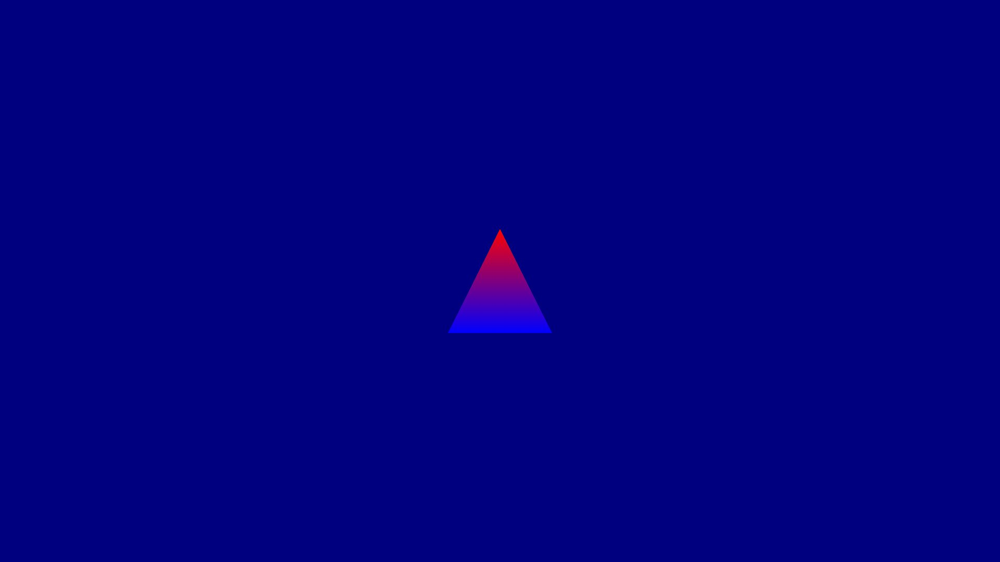
</a>

Shows how to render a vertex colored Triangle using OpenGL ES, this demonstrates how to add more than vertex
positions to the vertex attributes.

This is basically the same as the S01 example it just adds vertex colors to the shader.


### [S03_Transform](DemoApps/GLES2/S03_Transform)
<a href="DemoApps/GLES2/S03_Transform">
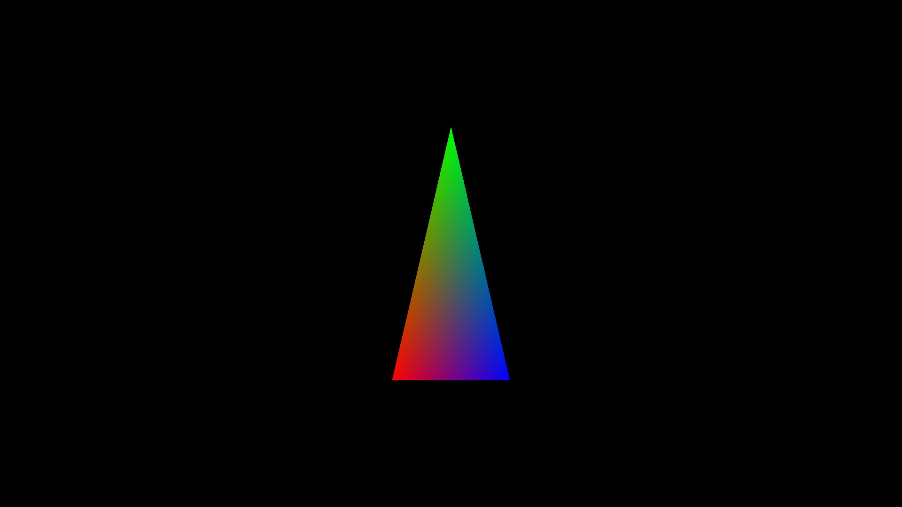
</a>

Renders a animated vertex colored triangle.

This shows how to modify the model matrix to rotate a triangle and
how to utilize demoTime.DeltaTime to do frame rate independent animation.


### [S04_Projection](DemoApps/GLES2/S04_Projection)
<a href="DemoApps/GLES2/S04_Projection">
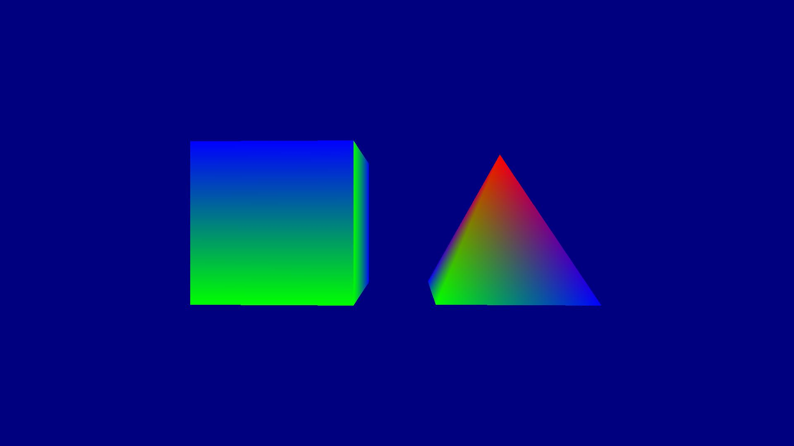
</a>

This example shows how to:

- Build a perspective projection matrix
- Render two simple 3d models using frame rate independent animation.


### [S05_PrecompiledShader](DemoApps/GLES2/S05_PrecompiledShader)
Demonstrates how to use a pre-compiled shader using the offline compiler tool 'vCompiler' from Verisilicon.

This currently only works on the Yocto platform.


### [S06_Texturing](DemoApps/GLES2/S06_Texturing)
<a href="DemoApps/GLES2/S06_Texturing">
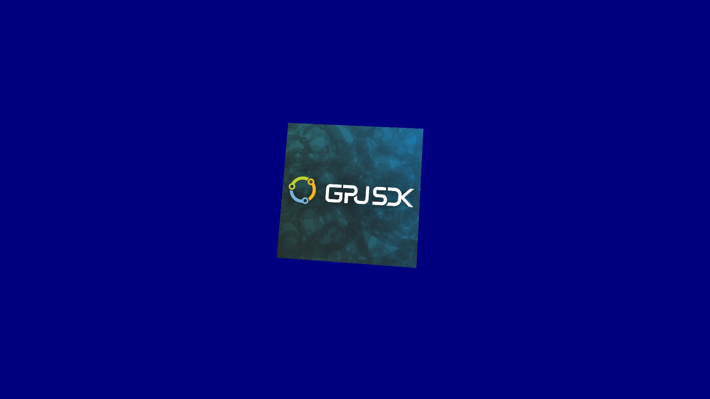
</a>

This example shows how to use the Texture class to use a texture in a cube.

It also shows you how to use the ContentManager service to load a 'png' file from the Content directory
into a bitmap utility class which is then used to used to create a OpenGL ES texture.


### [S07_EnvironmentMapping](DemoApps/GLES2/S07_EnvironmentMapping)
<a href="DemoApps/GLES2/S07_EnvironmentMapping">
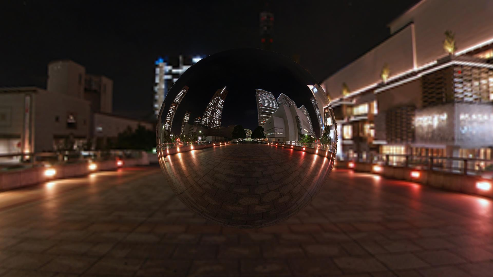
</a>

This sample shows how to use a cubemap texture to simulate a reflective material.

It also shows you how to use the ContentManager service to load a 'dds' file from the Content directory
into a Texture utility class which is then used to used to create a OpenGL ES cubemap texture.


### [S08_EnvironmentMappingRefraction](DemoApps/GLES2/S08_EnvironmentMappingRefraction)
<a href="DemoApps/GLES2/S08_EnvironmentMappingRefraction">

</a>

This sample is a variation from the previous sample, again, a cubemap texture is used,
but this time instead of simulating a reflective material a refractive material is simulated.

It also shows you how to use the ContentManager service to load a 'dds' file from the Content directory
into a Texture utility class which is then used to used to create a OpenGL ES cubemap texture.


### [S09_VIV_direct_texture](DemoApps/GLES2/S09_VIV_direct_texture)
This sample shows how to use the Verisilicon extensions to create a texture without having the need to copy the image data to GL.


### [T3DStressTest](DemoApps/GLES2/T3DStressTest)
<a href="DemoApps/GLES2/T3DStressTest">
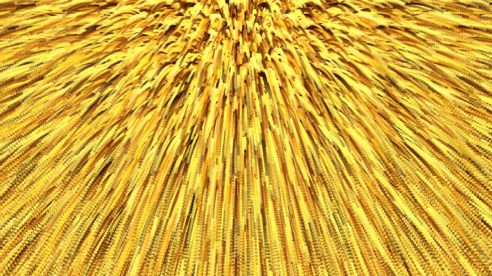
</a>

Executes a highly configurable stress test for the OpenGL ES API.

It will procedurally generate a mesh and fur texture that is then rendered to cover the entire screen.

This will often showcase the worst case power consumption of the GPU.


### [VIVDirectTextureMultiSampling](DemoApps/GLES2/VIVDirectTextureMultiSampling)
This example shows how to use the DirectVIV extension to use an existing buffer as a texture source without having to copy the data to GL.


## GLES3

### [Bloom](DemoApps/GLES3/Bloom)
<a href="DemoApps/GLES3/Bloom">
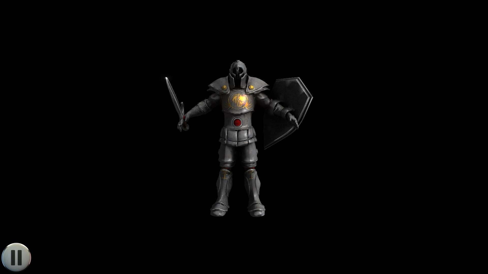
</a>

A example of how to create a bloom effect. The idea is not to create the most accurate bloom,
but something that is fairly fast to render.

Instead of increasing the kernal size to get a good blur we do a fairly fast approximation by
downscaling the original image to multiple smaller render-targets and then blurring these
using a relative small kernel and then finally rescaling the result to the original size.


### [ColorspaceInfo](DemoApps/GLES3/ColorspaceInfo)
Checks for the presence of known EGL color space extensions and outputs information about them to the console.


### [D1_1_VBOs](DemoApps/GLES3/D1_1_VBOs)
<a href="DemoApps/GLES3/D1_1_VBOs">

</a>

This sample introduces you to the use of Vertex Buffer Objects.
Look for the OSTEP tags in the code, they will list in an ordered way the steps needed to set a VBO,
The CHALLENGE tags will list additional steps you can follow to create an additional VBO.

This sample is basically a exact copy of E1_1_VBOs but it uses the DemoFramework utility classes to
make the code simpler.


### [D1_2_VAOs](DemoApps/GLES3/D1_2_VAOs)
<a href="DemoApps/GLES3/D1_2_VAOs">

</a>

This sample introduces you to the use of Vertex Array Objects.
They will allow you to record your Vertex States only once and then restore them by calling the glBindVertexArray function.
As with the E* samples, look for the OSTEP tags to see how they are created and used.

This sample is basically a exact copy of E1_2_VAOs but it uses the DemoFramework utility classes to
make the code simpler.


### [DFGraphicsBasic2D](DemoApps/GLES3/DFGraphicsBasic2D)
<a href="DemoApps/GLES3/DFGraphicsBasic2D">
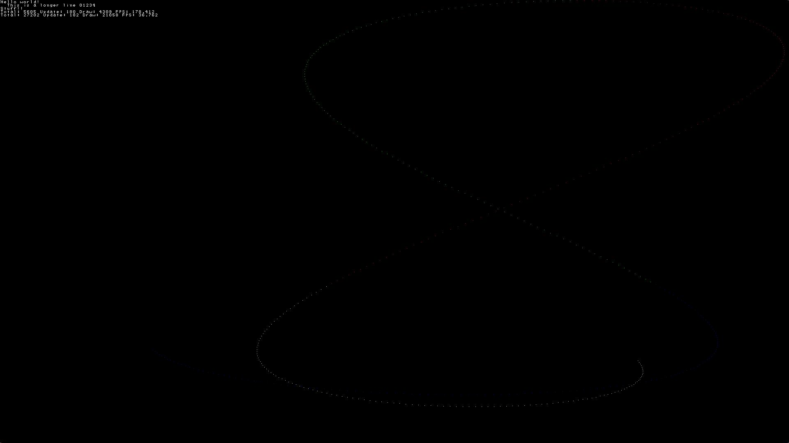
</a>

Shows how to use the Demo Frameworks 'basic' 2d rendering capabilities that work across all backends.
The basic2D interface allows you to render ASCII strings using a system provided font and draw colored points.

The functionality in Basic2D is used internally in the framework to render the profiling overlays like the frame rate counter and graph.


### [DFNativeBatch2D](DemoApps/GLES3/DFNativeBatch2D)
<a href="DemoApps/GLES3/DFNativeBatch2D">
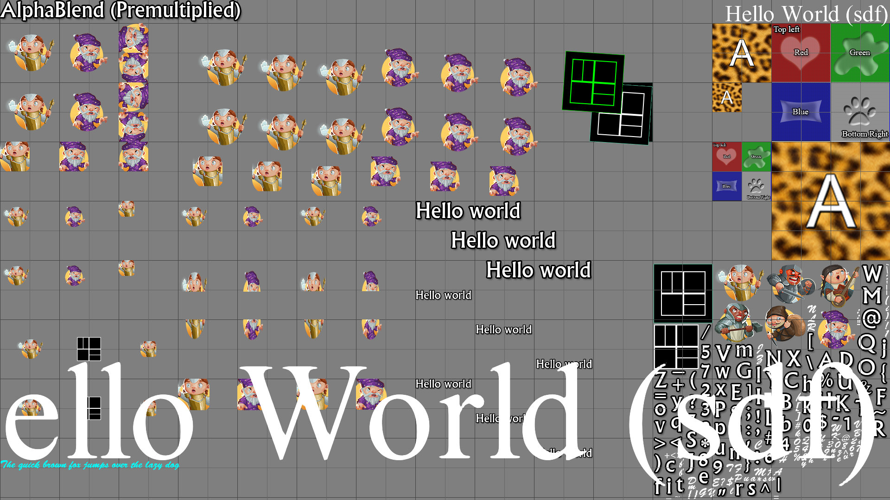
</a>

Shows how to use the Demo Frameworks NativeBatch implementatin to render various graphics elements.
The native batch functionality works across various 3D backends and also allows you to use the API native textures for rendering.

The native batch is very useful for quickly getting something on the screen which can be useful for prototyping and debugging.
It is however not a optimized way of rendering things.


### [DFSimpleUI100](DemoApps/GLES3/DFSimpleUI100)
<a href="DemoApps/GLES3/DFSimpleUI100">
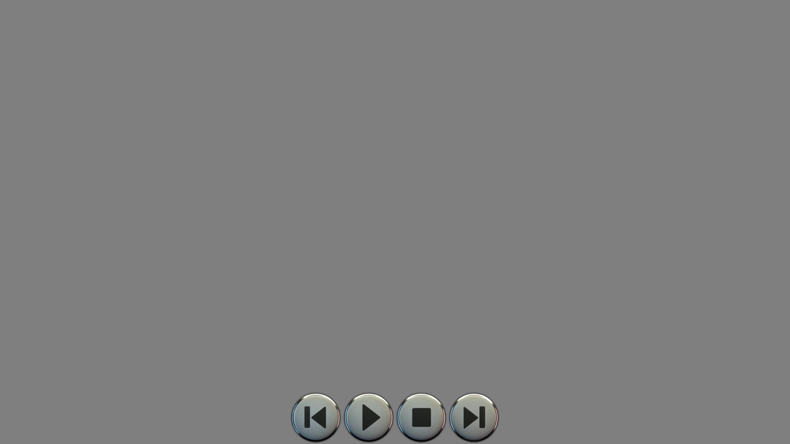
</a>

A very basic example of how to utilize the DemoFramework's UI library.
The sample displays four buttons and reacts to clicks.

The UI framework that makes it easy to get a basic UI up and running. The main UI code is API independent. It is not a show case of how to render a UI fast but only intended to allow you to quickly get a UI ready that is good enough for a demo.


### [DFSimpleUI101](DemoApps/GLES3/DFSimpleUI101)
<a href="DemoApps/GLES3/DFSimpleUI101">
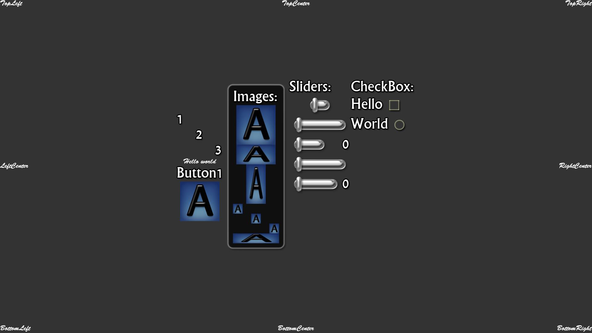
</a>

A more complex example of how to utilize the DemoFramework's UI library.
It displays various UI controls and ways to utilize them.

The UI framework that makes it easy to get a basic UI up and running. The main UI code is API independent. It is not a show case of how to render a UI fast but only intended to allow you to quickly get a UI ready that is good enough for a demo.


### [DirectMultiSamplingVideoYUV](DemoApps/GLES3/DirectMultiSamplingVideoYUV)
This sample shows how to use Gstreamer and OpenGL ES to display a YUV video on a texture by doing the YUV to RGB conversion on a shader and also use the DirectVIV extensions to avoid copying data from the Video Buffer to the GL Texture.


### [E1_1_VBOs](DemoApps/GLES3/E1_1_VBOs)
<a href="DemoApps/GLES3/E1_1_VBOs">
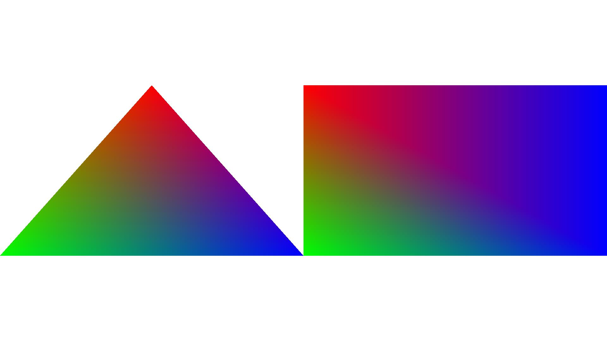
</a>

This sample introduces you to the use of Vertex Buffer Objects.
Look for the OSTEP tags in the code, they will list in an ordered way the steps needed to set a VBO,
The CHALLENGE tags will list additional steps you can follow to create an additional VBO.

To see a simpler version of this code that utilize utility classes from the DemoFramework take a look at D1_1_VBOs example.


### [E1_2_VAOs](DemoApps/GLES3/E1_2_VAOs)
<a href="DemoApps/GLES3/E1_2_VAOs">

</a>

This sample introduces you to the use of Vertex Array Objects.
They will allow you to record your Vertex States only once and then restore them by calling the glBindVertexArray function.
As with the E* samples, look for the OSTEP tags to see how they are created and used.

To see a simpler version of this code that utilize utility classes from the DemoFramework take a look at the D1_2_VAOs example.


### [E2_1_CopyBuffer](DemoApps/GLES3/E2_1_CopyBuffer)
<a href="DemoApps/GLES3/E2_1_CopyBuffer">
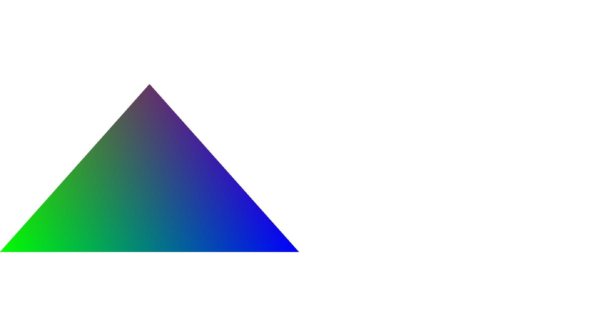
</a>

This sample teaches you how to use the glCopyBufferSubData to copy data between 2 Vertex Buffer Objects.
In this sample we copy a Buffer for Positions and a Buffer for Indices.

.


### [E3_0_InstancingSimple](DemoApps/GLES3/E3_0_InstancingSimple)
<a href="DemoApps/GLES3/E3_0_InstancingSimple">
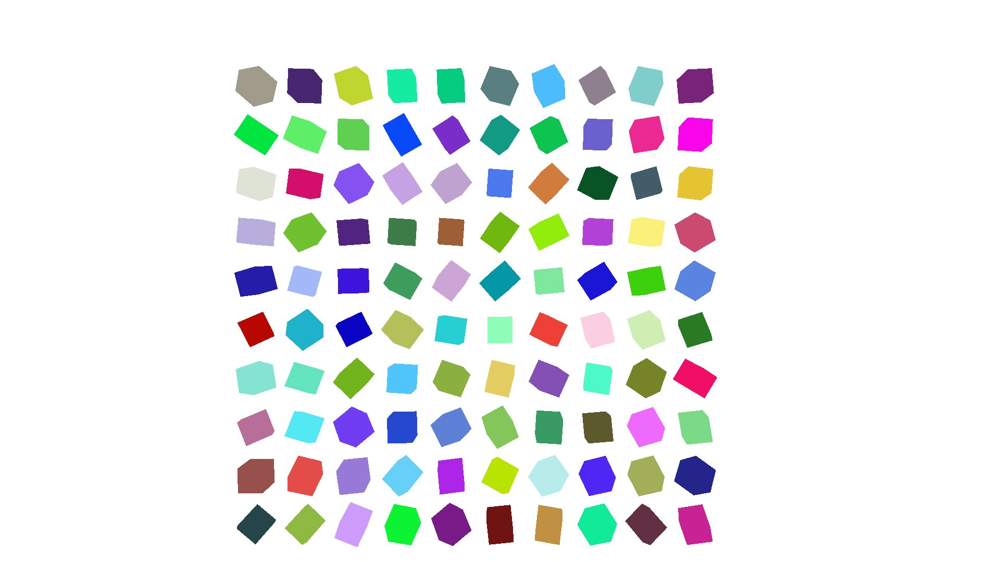
</a>

This sample introduces the concept of instancing, this concept is useful to render several meshes that share geometry.
In this sample all cubes will share the same vertex positions, however the colors and MVP Matrices will be independent.

.


### [E4_0_PRestart](DemoApps/GLES3/E4_0_PRestart)
<a href="DemoApps/GLES3/E4_0_PRestart">
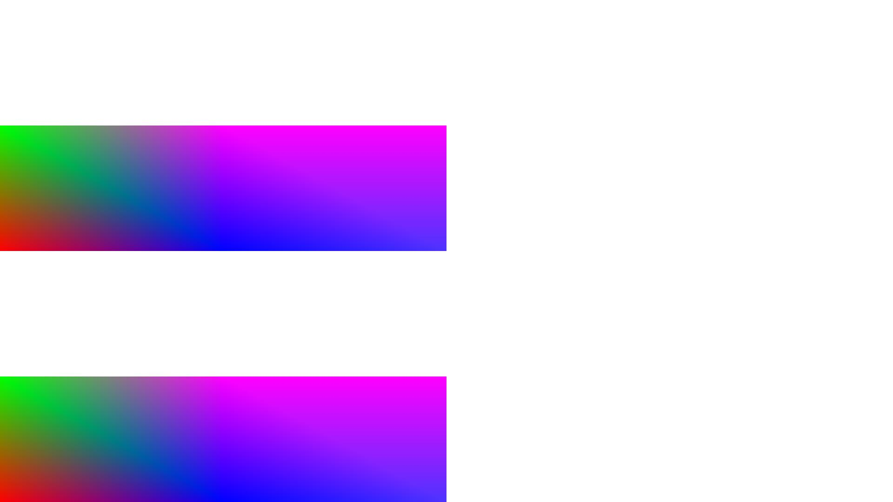
</a>

This sample shows you a new feature of OpenGL ES 3.0 called primitive restart.
This allows you to segment the geometry without the need of adding a degenerate triangle to the triangle index list.

.

.


### [E6_0_MultipleRenderTargets](DemoApps/GLES3/E6_0_MultipleRenderTargets)
<a href="DemoApps/GLES3/E6_0_MultipleRenderTargets">

</a>

This sample introduces multiple render targets (MRT). This feature allows you to define multiple outputs from your fragment shader.
Please check the fragment shader under the Content folder, you will notice how 4 outputs are being defined.

.


### [E7_0_ParticleSystem](DemoApps/GLES3/E7_0_ParticleSystem)
<a href="DemoApps/GLES3/E7_0_ParticleSystem">

</a>

This sample creates a particle system using GL_POINTS.
It defines an initial point where the particles will be tightly packed and then, during the explosion lifetime each point will be animated from a starting position to an end position.

.


### [EquirectangularToCubemap](DemoApps/GLES3/EquirectangularToCubemap)
<a href="DemoApps/GLES3/EquirectangularToCubemap">
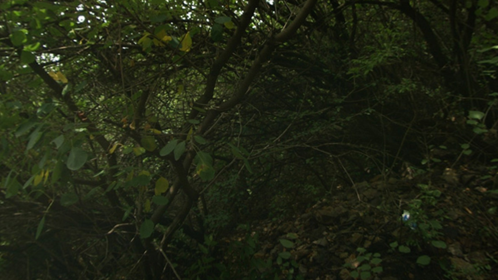
</a>

Convert a [equirectangular map](https://en.wikipedia.org/wiki/Equirectangular_projection) to a cubemap using OpenGL ES3.


### [FractalShader](DemoApps/GLES3/FractalShader)
<a href="DemoApps/GLES3/FractalShader">
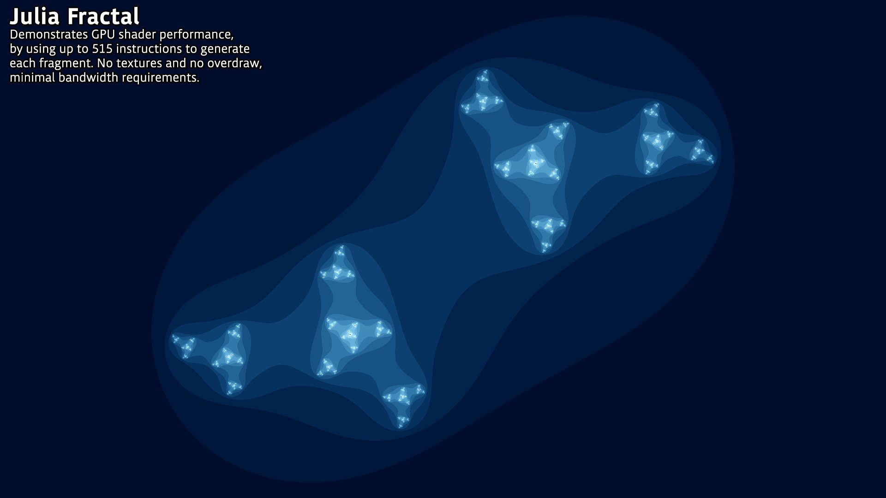
</a>

Can render both the julia and mandelbrot set.
Was used to demonstrates GPU shader performance by using up to 515 instructions each fragment while generating the julia set.

No texture and no overdraw, minimal bandwidth requirements.


### [FurShellRendering](DemoApps/GLES3/FurShellRendering)
<a href="DemoApps/GLES3/FurShellRendering">

</a>

Illustrates how to render fur over several primitives.

The fur is rendered on a layered approach using a seamless texture as a base and then creating a density bitmap.

.


### [GammaCorrection](DemoApps/GLES3/GammaCorrection)
<a href="DemoApps/GLES3/GammaCorrection">
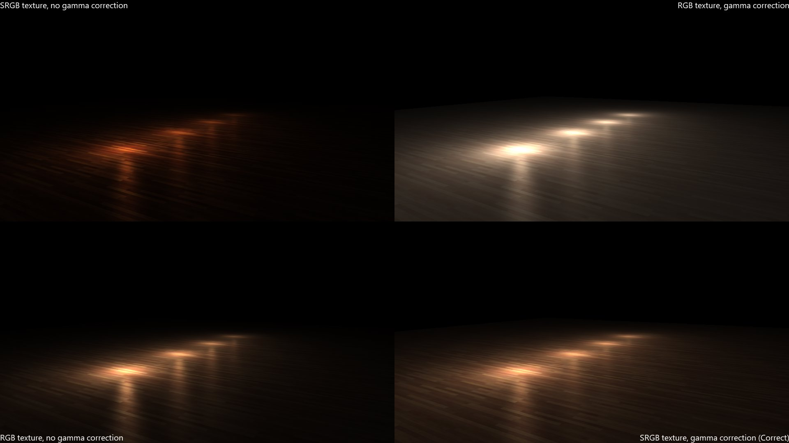
</a>

A simple example of how to do gamma correction it shows the difference that SRGB textures and gamma correction makes to the output by comparing
it to the uncorrected rendering methods.


### [HDR01_BasicToneMapping](DemoApps/GLES3/HDR01_BasicToneMapping)
<a href="DemoApps/GLES3/HDR01_BasicToneMapping">
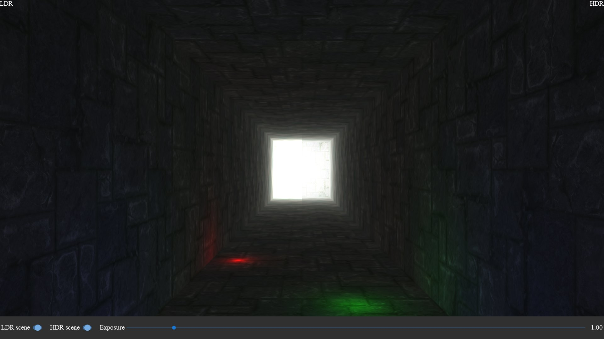
</a>

As normal framebuffer values are clamped between 0.0 and 1.0 it means that any light value above 1.0 gets clamped.
Because of this its not really possible to differentiate really bright lights from normal lights.
To take advantage of the light information that normally gets discarded we use a tone mapping algorithm to try and
preserve it. This demo applies the tonemapping right away in the lighting shader so no temporary floating point framebuffer is needed.


### [HDR02_FBBasicToneMapping](DemoApps/GLES3/HDR02_FBBasicToneMapping)
<a href="DemoApps/GLES3/HDR02_FBBasicToneMapping">
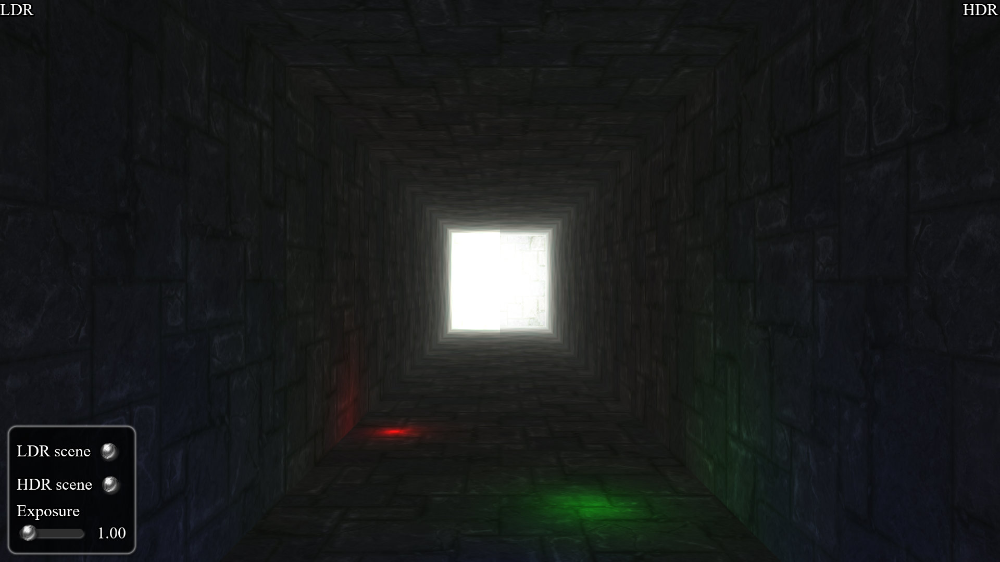
</a>

As normal framebuffer values are clamped between 0.0 and 1.0 it means that any light value above 1.0 gets clamped.
Because of this its not really possible to differentiate really bright lights from normal lights.
To take advantage of the light information that normally gets discarded we use a tone mapping algorithm to try and
preserve it. This demo applies the tonemapping as a postprocessing step on the fully lit scene,
so a temporary floating point framebuffer is needed.

This sample outputs to a LDR screen.


### [HDR03_SkyboxTonemapping](DemoApps/GLES3/HDR03_SkyboxTonemapping)
<a href="DemoApps/GLES3/HDR03_SkyboxTonemapping">
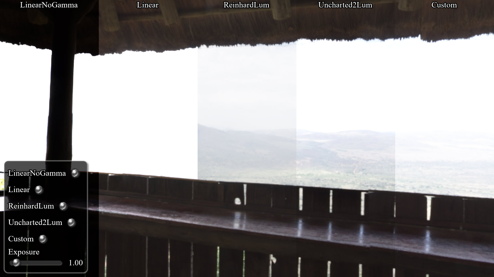
</a>

Render a HDR skybox and apply various tonemapping algorithms to it.

This sample outputs to a LDR screen.


### [HDR04_HDRFramebuffer](DemoApps/GLES3/HDR04_HDRFramebuffer)
<a href="DemoApps/GLES3/HDR04_HDRFramebuffer">
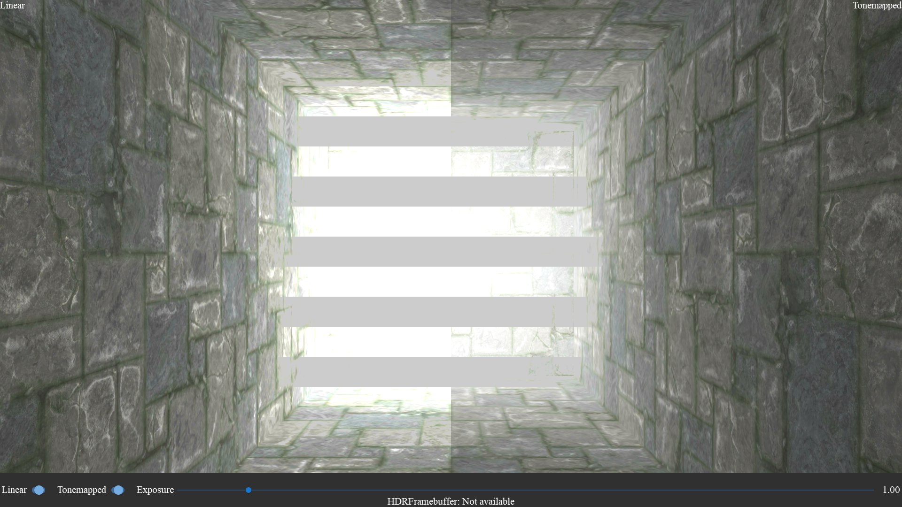
</a>

Demonstrates how to enable HDRFramebuffer mode if available.
The render a test scene using a pattern that makes it easy to detect if the display actually enabled HDR mode.

This sample outputs to a HDR screen if supported.


### [ModelLoaderBasics](DemoApps/GLES3/ModelLoaderBasics)
<a href="DemoApps/GLES3/ModelLoaderBasics">
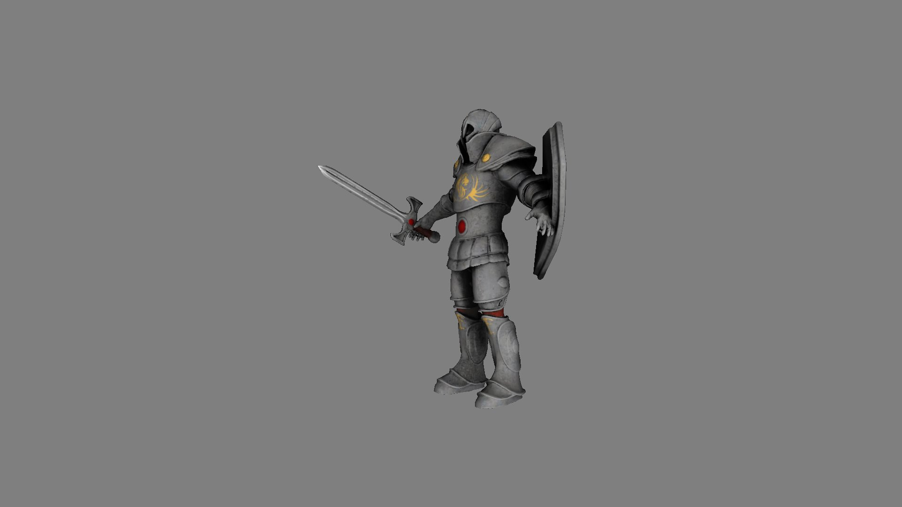
</a>

Demonstrates how to use the FslSceneImporter and Assimp to load a scene and render it using OpenGLES2.

The model is rendered using a simple per pixel directional light shader.

For a more complex example take a look at the ModelViewer example.


### [ModelViewer](DemoApps/GLES3/ModelViewer)
<a href="DemoApps/GLES3/ModelViewer">
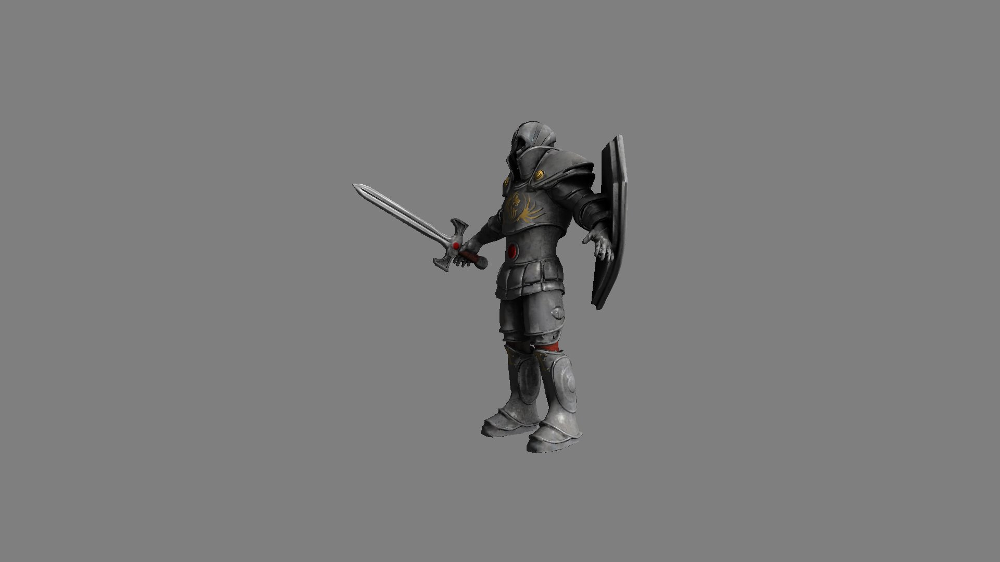
</a>

Expands the ModelLoaderBasics example with:

- A arcball camera
- Multiple different scenes (Knight, Dragon, Car, etc)
- More advanced shaders for directional per pixel specular light with support for gloss and normal maps.


### [MultipleViewportsFractalShader](DemoApps/GLES3/MultipleViewportsFractalShader)
<a href="DemoApps/GLES3/MultipleViewportsFractalShader">
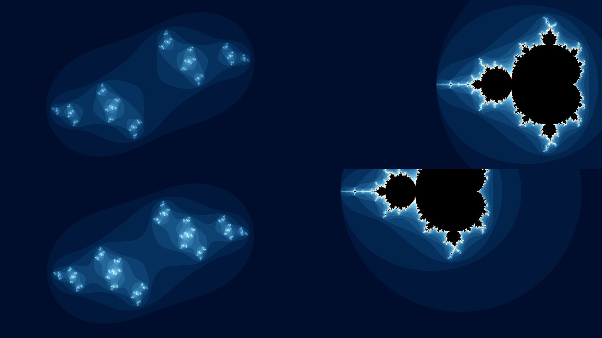
</a>

Demonstrates how to utilize multiple viewports.
It reuses the fractal shaders from the FractalShader demo to render the julia and mandelbrot sets.

No texture and no overdraw, minimal bandwidth requirements.


### [ObjectSelection](DemoApps/GLES3/ObjectSelection)
<a href="DemoApps/GLES3/ObjectSelection">
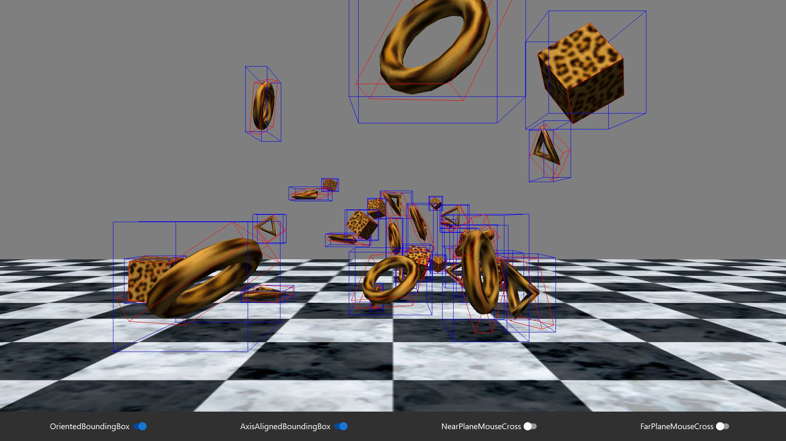
</a>

Shows how to select (pick) 3d objects using the mouse via Axis Aligned Bounding Boxes (AABB).

Beware that AABB's often represent quite a rough fit and therefore is best used as a quick way to determine
if there might be a collision and then utilize a more precise calculation to verify it.


### [OpenCL101](DemoApps/GLES3/OpenCL101)
<a href="DemoApps/GLES3/OpenCL101">

</a>

Simple application that allows you to get your system's OpenCL available platforms.

Demonstrates how to use OpenCL from inside a OpenGL ES 3 project.

This is a very basic example that mainly shows how to setup the correct dependency in the Fsl.gen file and
then it does some very basic OpenCL operations. It could be used as a good starting point for a more complex example.


### [OpenCLGaussianFilter](DemoApps/GLES3/OpenCLGaussianFilter)
<a href="DemoApps/GLES3/OpenCLGaussianFilter">
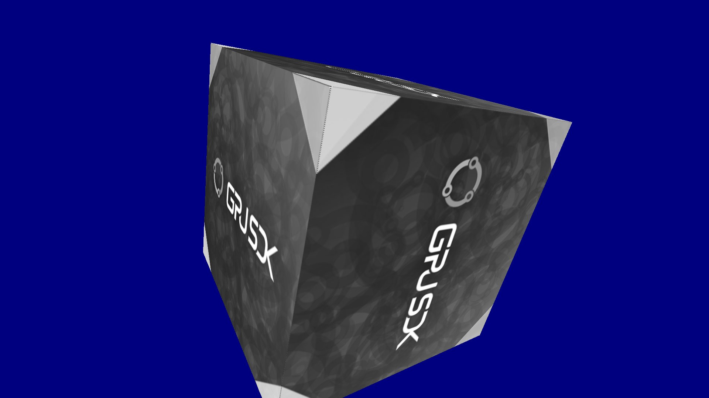
</a>

This sample uses OpenCL to execute a Gaussian Blur on an image.

The output will then be stored into a bmp image and also displayed as an OpenGL ES 3.0 texture mapped to a cube.


### [OpenCV101](DemoApps/GLES3/OpenCV101)
<a href="DemoApps/GLES3/OpenCV101">

</a>

Demonstrates how to use OpenCV from inside a OpenGL ES 2 project.

This is a very basic example that mainly shows how to setup the correct dependency in the Fsl.gen file and
then it does some very basic OpenCV operations. It could be used as a good starting point for a more complex example.


### [OpenCVMatToNativeBatch](DemoApps/GLES3/OpenCVMatToNativeBatch)
<a href="DemoApps/GLES3/OpenCVMatToNativeBatch">
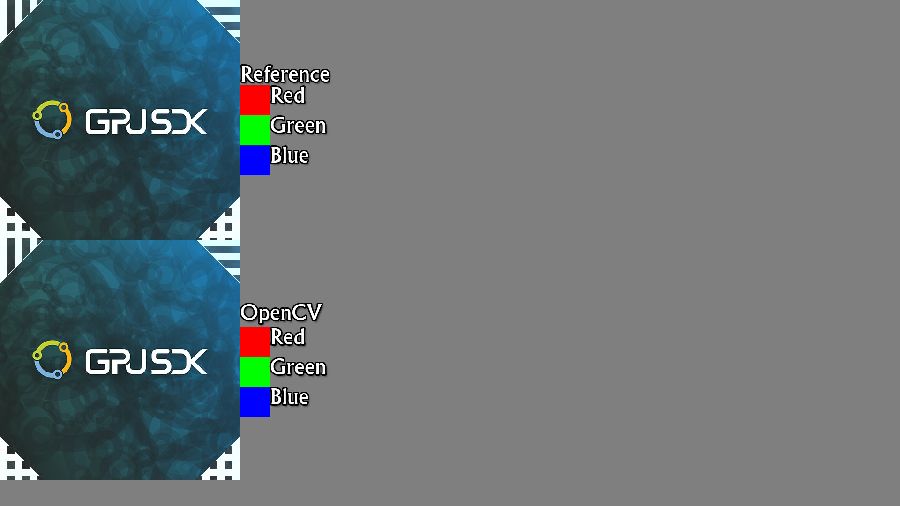
</a>

Demonstrates how to take a OpenCV mat and convert it to a Bitmap which is then converted to a Texture2D for use with
the NativeBatch. The texture is then shown on screen and can be compared to the same texture that was loaded using the
normal DemoFramework methods.

The cv::Mat -> Bitmap routines used here are a very basic proof of concept.


### [OpenCVMatToUI](DemoApps/GLES3/OpenCVMatToUI)
<a href="DemoApps/GLES3/OpenCVMatToUI">
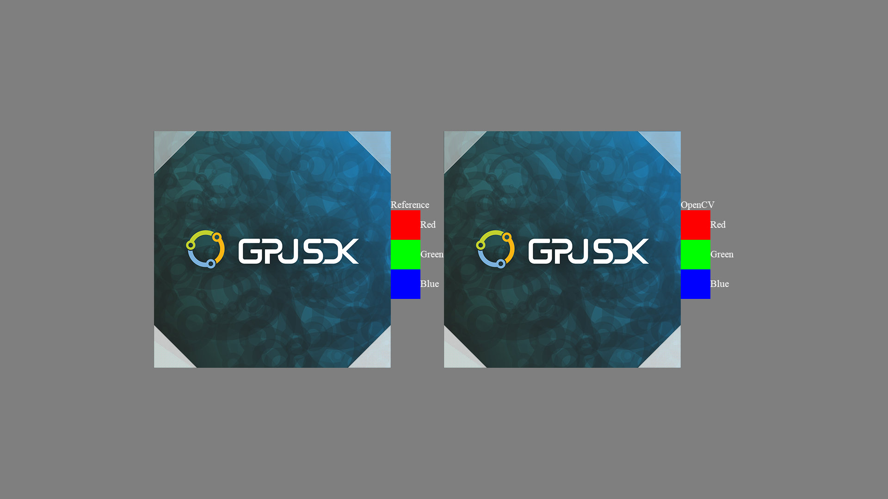
</a>

Demonstrates how to take a OpenCV mat and convert it to a Bitmap which is then converted to a Texture2D for use with
the UI frmaework. The texture is then shown on screen and can be compared to the same texture that was loaded using the
normal DemoFramework methods.

The cv::Mat -> Bitmap routines used here are a very basic proof of concept.


### [OpenVX101](DemoApps/GLES3/OpenVX101)
<a href="DemoApps/GLES3/OpenVX101">
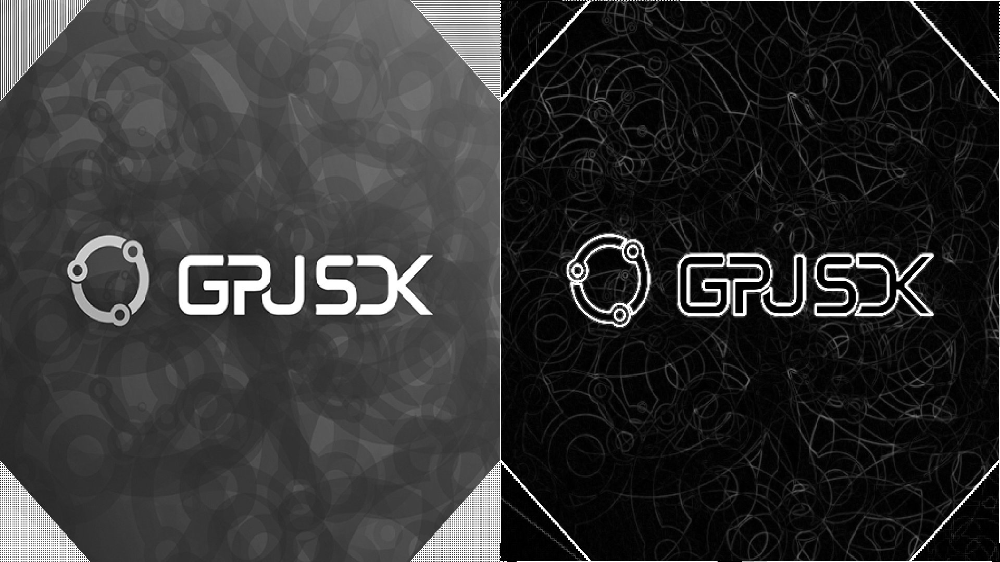
</a>


### [ParticleSystem](DemoApps/GLES3/ParticleSystem)
<a href="DemoApps/GLES3/ParticleSystem">
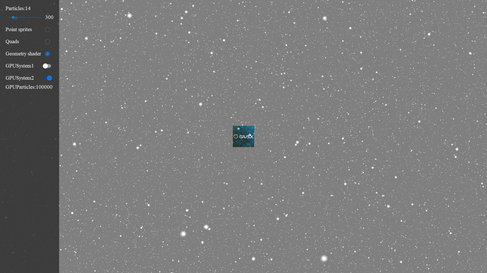
</a>

Creates a configurable particle system where you can select the type of primitive each particle will have and the amount of particles.

.

.


### [S01_SimpleTriangle](DemoApps/GLES3/S01_SimpleTriangle)
<a href="DemoApps/GLES3/S01_SimpleTriangle">

</a>

Shows how to render a single colored Triangle using OpenGL ES, this sample serves as a good introduction to
the OpenGL ES 3 Pipeline and the abstraction classes that the DemoFramework provides.

It's basically the typical 'Hello World' program for graphics.


### [S02_ColoredTriangle](DemoApps/GLES3/S02_ColoredTriangle)
<a href="DemoApps/GLES3/S02_ColoredTriangle">

</a>

Shows how to render a vertex colored Triangle using OpenGL ES, this demonstrates how to add more than vertex
positions to the vertex attributes.

This is basically the same as the S01 example it just adds vertex colors to the shader.


### [S03_Transform](DemoApps/GLES3/S03_Transform)
<a href="DemoApps/GLES3/S03_Transform">
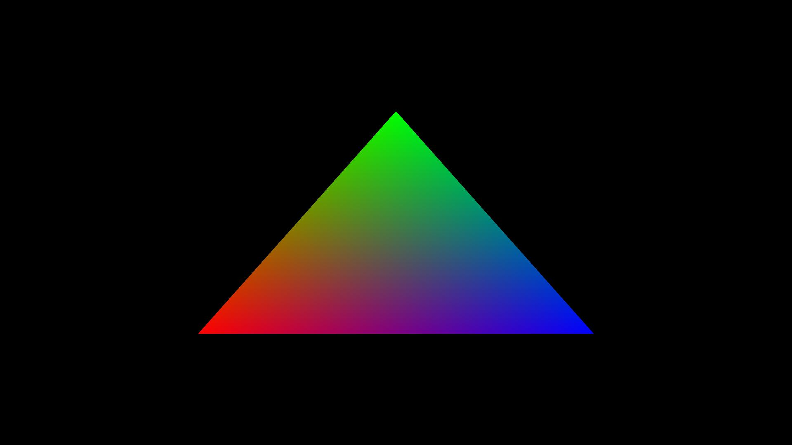
</a>

Renders a animated vertex colored triangle.

This shows how to modify the model matrix to rotate a triangle and
how to utilize demoTime.DeltaTime to do frame rate independent animation.


### [S04_Projection](DemoApps/GLES3/S04_Projection)
<a href="DemoApps/GLES3/S04_Projection">
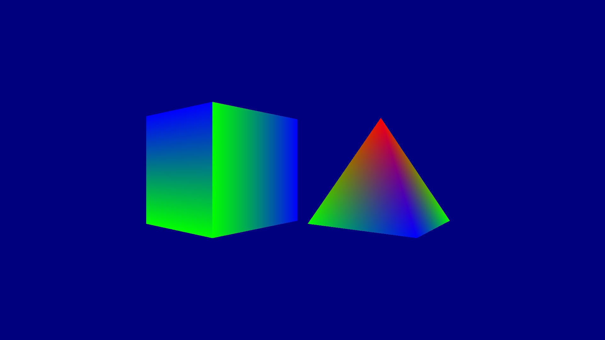
</a>

This example shows how to:

- Build a perspective projection matrix
- Render two simple 3d models using frame rate independent animation.


### [S05_PrecompiledShader](DemoApps/GLES3/S05_PrecompiledShader)
Demonstrates how to use a pre-compiled shader using the offline compiler tool 'vCompiler' from Verisilicon.

This currently only works on the Yocto platform.


### [S06_Texturing](DemoApps/GLES3/S06_Texturing)
<a href="DemoApps/GLES3/S06_Texturing">

</a>

This example shows how to use the Texture class to use a texture in a cube.

It also shows you how to use the ContentManager service to load a 'png' file from the Content directory
into a bitmap utility class which is then used to used to create a OpenGL ES texture.


### [S07_EnvironmentMapping](DemoApps/GLES3/S07_EnvironmentMapping)
<a href="DemoApps/GLES3/S07_EnvironmentMapping">

</a>

This sample shows how to use a cubemap texture to simulate a reflective material.

It also shows you how to use the ContentManager service to load a 'dds' file from the Content directory
into a Texture utility class which is then used to used to create a OpenGL ES cubemap texture.


### [S08_EnvironmentMappingRefraction](DemoApps/GLES3/S08_EnvironmentMappingRefraction)
<a href="DemoApps/GLES3/S08_EnvironmentMappingRefraction">

</a>

This sample is a variation from the previous sample, again, a cubemap texture is used,
but this time instead of simulating a reflective material a refractive material is simulated.

It also shows you how to use the ContentManager service to load a 'dds' file from the Content directory
into a Texture utility class which is then used to used to create a OpenGL ES cubemap texture.


### [S09_VIV_direct_texture](DemoApps/GLES3/S09_VIV_direct_texture)
This sample shows how to use the Verisilicon extensions to create a texture without having the need to copy the image data to GL.


### [Scissor101](DemoApps/GLES3/Scissor101)
<a href="DemoApps/GLES3/Scissor101">
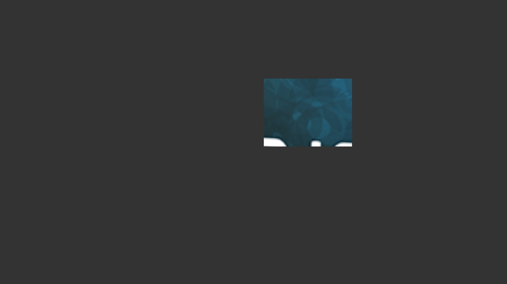
</a>

A simple example of how glScissor works.
This sample also allows you to force set a invalid scissor rect from the command line.


### [Skybox](DemoApps/GLES3/Skybox)
<a href="DemoApps/GLES3/Skybox">
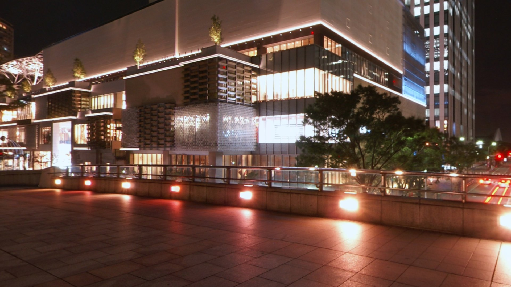
</a>

Render a simple skybox using a cubemap.


### [SpringBackground](DemoApps/GLES3/SpringBackground)
<a href="DemoApps/GLES3/SpringBackground">
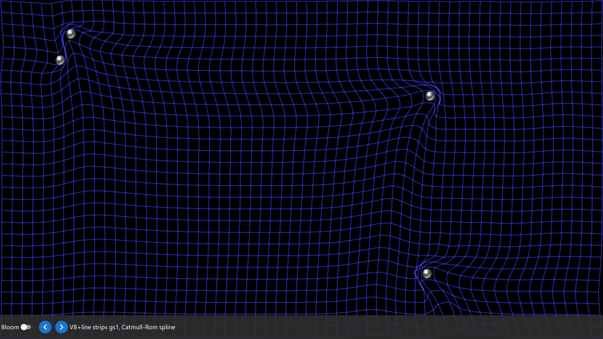
</a>

Background test to showcase SPline animations used for simulating a fluid background that can be stimulated by either the spheres or mouse/touch input.

It is then demonstrated how to render the grid using:
- The DemoFramework native batch (Basic or Catmull-Rom splines)
- Linestrips in a VertexBuffer (Catmull-Rom splines)
- Linestrips in a VertexBuffer but using the geometry shader to make quads (Catmull-Rom splines)


### [SRGBFramebuffer](DemoApps/GLES3/SRGBFramebuffer)
<a href="DemoApps/GLES3/SRGBFramebuffer">
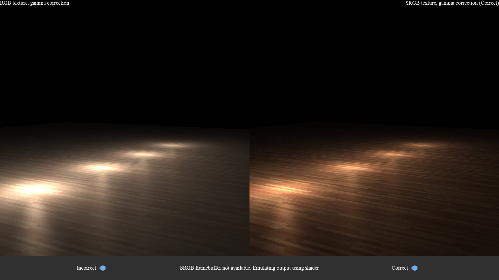
</a>

Enables a SRGB Framebuffer if the extension EGL_KHR_gl_colorspace is available.
If unavailable it does normal gamma correction in the shader.


### [T3DStressTest](DemoApps/GLES3/T3DStressTest)
<a href="DemoApps/GLES3/T3DStressTest">
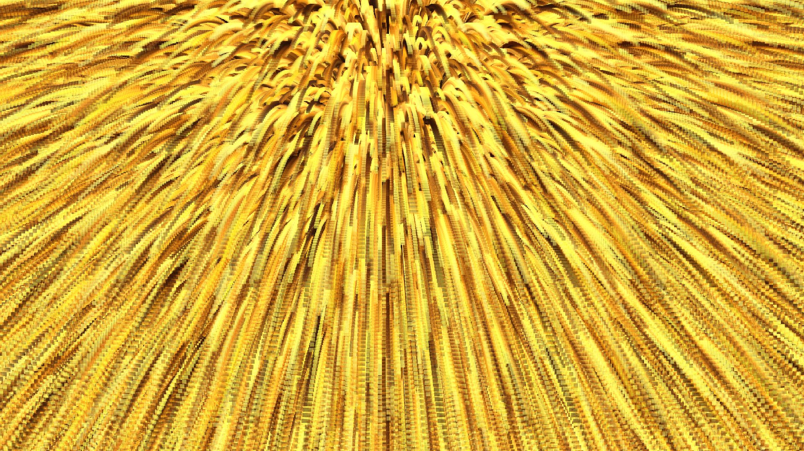
</a>

Executes a highly configurable stress test for the OpenGL ES API.

It will procedurally generate a mesh and fur texture that is then rendered to cover the entire screen.

This will often showcase the worst case power consumption of the GPU.


### [Tessellation101](DemoApps/GLES3/Tessellation101)
<a href="DemoApps/GLES3/Tessellation101">
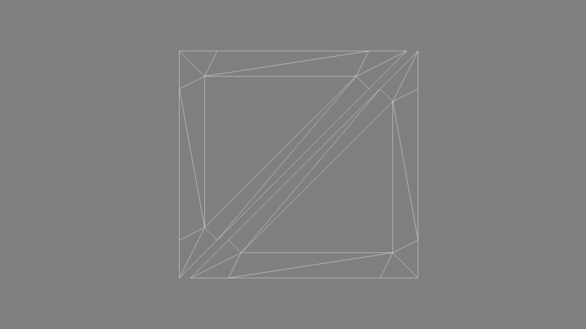
</a>

Simple tessellation sample that allows you to select the tessellation level to see how it modifies the level of detail on the selected geometry.

.


### [TessellationSample](DemoApps/GLES3/TessellationSample)
<a href="DemoApps/GLES3/TessellationSample">
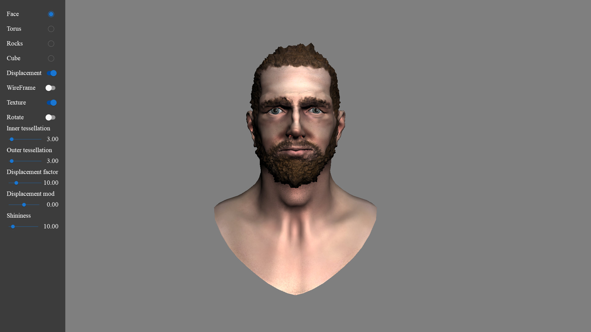
</a>

Shows how to load scenes via Assimp and then render them using
- a directional per pixel specular light with support for normal maps.
- tessellation using the geometry shader.


### [TextureCompression](DemoApps/GLES3/TextureCompression)
<a href="DemoApps/GLES3/TextureCompression">
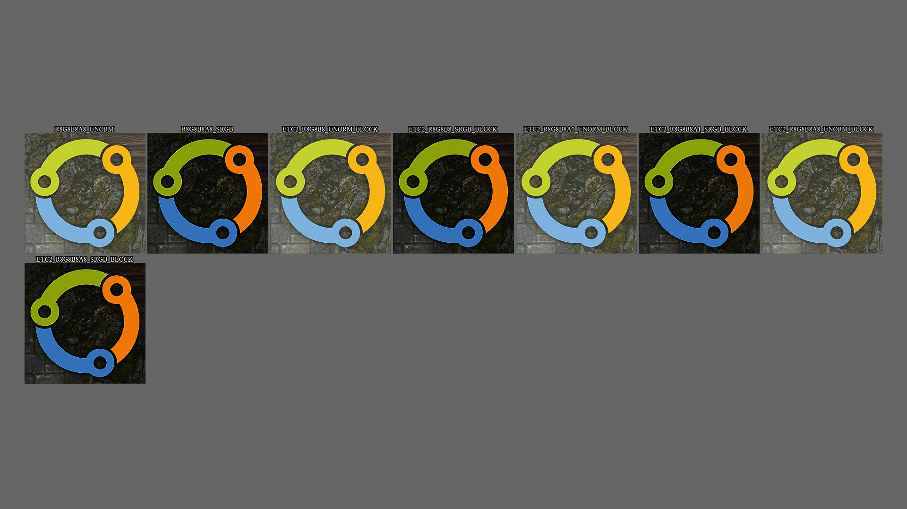
</a>

Load and render some ETC2 compressed textures.
It also outputs information about the found compression extensions.


### [VerletIntegration101](DemoApps/GLES3/VerletIntegration101)
<a href="DemoApps/GLES3/VerletIntegration101">
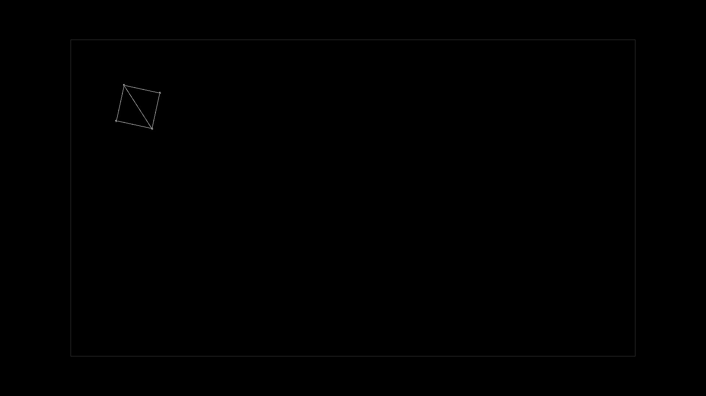
</a>

A very simple [verlet integration](https://en.wikipedia.org/wiki/Verlet_integration) example.

It's inspired by: [Coding Math: Episode 36 - Verlet Integration Part I+IV](https://www.youtube.com/watch?v=3HjO_RGIjCU&index=1&list=PL_-Pk4fSWzGv_EAW9hW2ioo9Xtr-9DuoZ)

.


## OpenCL

### [FastFourierTransform](DemoApps/OpenCL/FastFourierTransform)
OpenCL Kernel and code to execute a Fast Fourier Transform
--Options

"Length" FFT length.


### [Info](DemoApps/OpenCL/Info)
Simple OpenCL Application that allows you to obtain your system's complete OpenCL information:
Information related to CL kernel compilers, number of buffers supported, extensions available and more.


### [SoftISP](DemoApps/OpenCL/SoftISP)
<a href="DemoApps/OpenCL/SoftISP">

</a>

It is a software-based image signal processing(SoftISP) application optimized by GPU. SoftISP --Options
"Enable" Enable high quality noise reduction node


## OpenCV

### [OpenCV101](DemoApps/OpenCV/OpenCV101)
Simple and quick test for OpenCV 3.1.
This test tries to read a couple of bitmaps, process them and show the result on the window.


### [OpenCV102](DemoApps/OpenCV/OpenCV102)
Simple and quick test for OpenCV 3.1.
This test tries to read a couple of bitmaps, process them and show the result on the window.


## OpenVG

### [BitmapFont](DemoApps/OpenVG/BitmapFont)
<a href="DemoApps/OpenVG/BitmapFont">
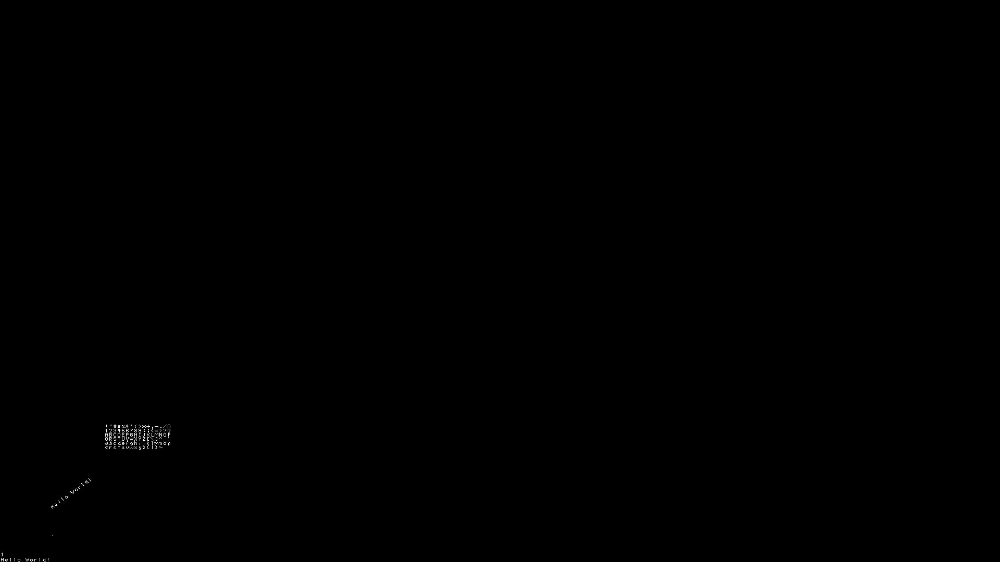
</a>

Shows how to render text using a bitmap font in OpenVG.

.

.


### [CoverFlow](DemoApps/OpenVG/CoverFlow)
<a href="DemoApps/OpenVG/CoverFlow">
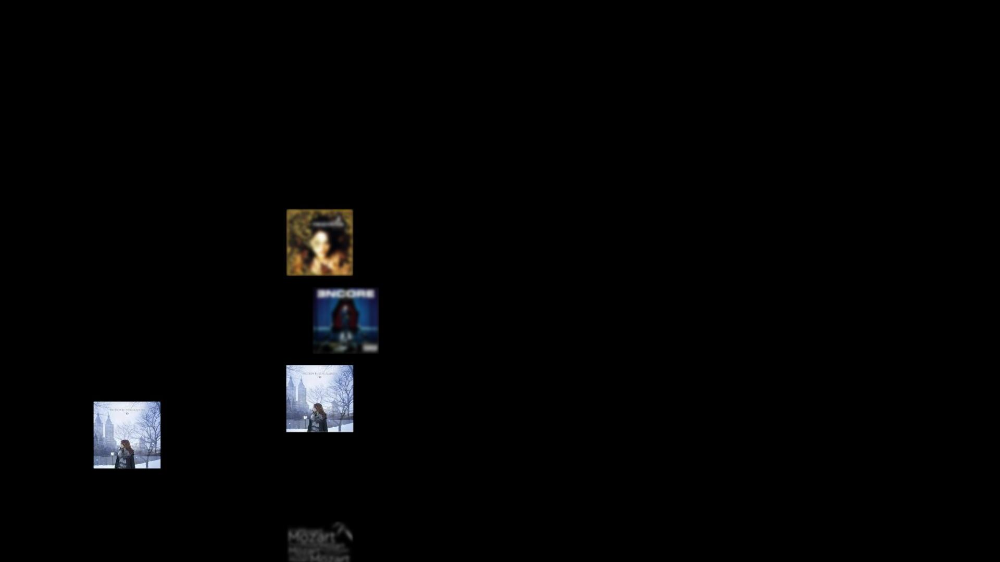
</a>

This sample shows how to use image data in OpenVG. You can think of it as an OpenGL Texture on a Quad. A vgImage is a rectangular shape populated with color information from an image.
This sample also shows that you can transform those images as the paths in previous samples and also can apply special filters like Gaussian Blurs.

.


### [DFGraphicsBasic2D](DemoApps/OpenVG/DFGraphicsBasic2D)
<a href="DemoApps/OpenVG/DFGraphicsBasic2D">

</a>

Shows how to use the Demo Frameworks 'basic' 2d rendering capabilities that work across all backends.
The basic2D interface allows you to render ASCII strings using a system provided font and draw colored points.

The functionality in Basic2D is used internally in the framework to render the profiling overlays like the frame rate counter and graph.


### [Example1](DemoApps/OpenVG/Example1)
<a href="DemoApps/OpenVG/Example1">
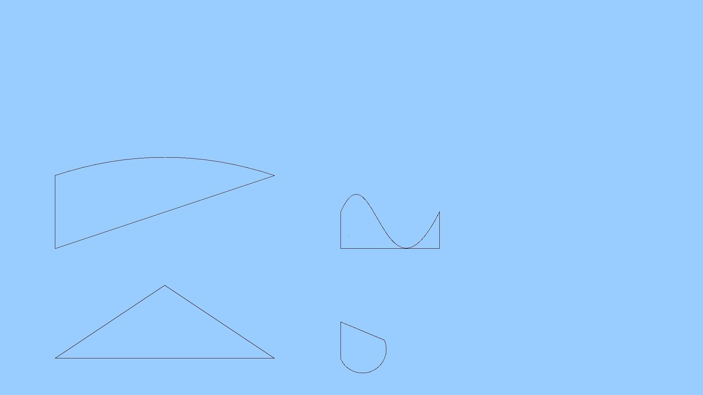
</a>

Shows how to draw lines using OpenVG, this sample introduces the concept of Points and segments and
how to integrate them into paths that describe the final shapes that are rendered on screen.

.


### [Example2](DemoApps/OpenVG/Example2)
<a href="DemoApps/OpenVG/Example2">
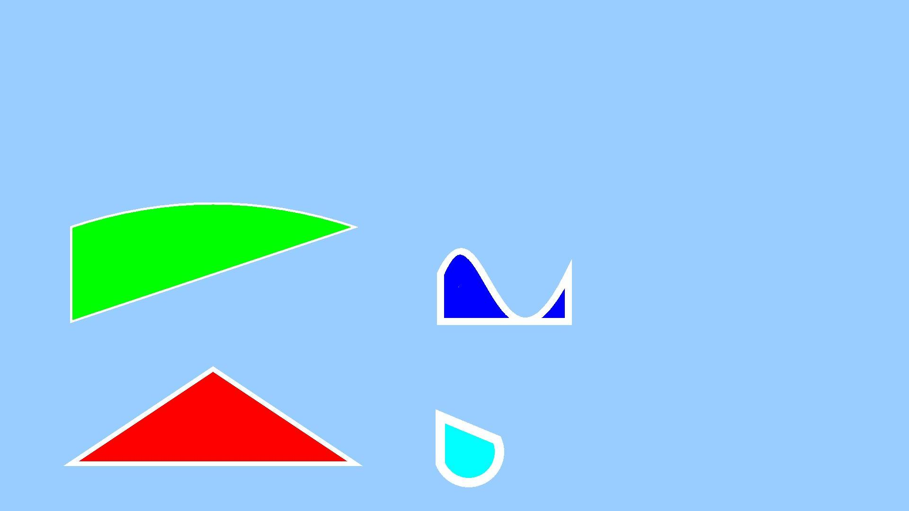
</a>

This sample builds on top of Example1 and shows how to add color to the path strokes and
the path fill area by introducing the concept of "paints" in OpenVG.

.

.


### [Example3](DemoApps/OpenVG/Example3)
<a href="DemoApps/OpenVG/Example3">
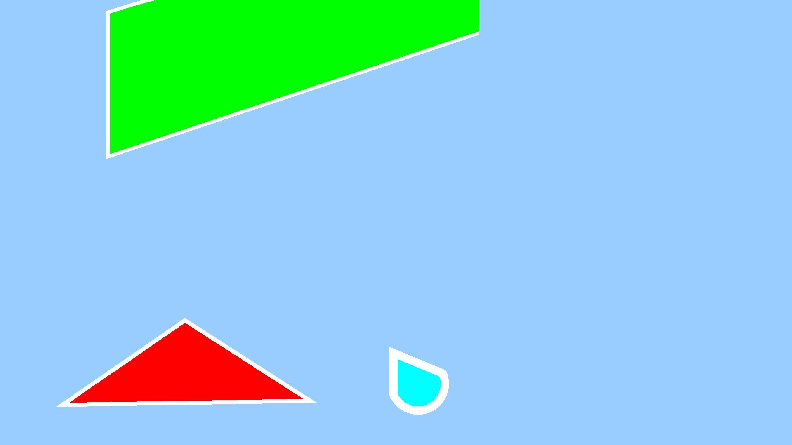
</a>

This sample will introduce the transformation functions on OpenVG as well as the scissoring function.
Each object will be animated using either vgTranslate, vgScale, vgShear or vgRotate.
The scissoring rectangle will be set at the beginning of the Draw method.

.


### [SimpleBench](DemoApps/OpenVG/SimpleBench)
<a href="DemoApps/OpenVG/SimpleBench">

</a>

Small benchmarking application for benchmarking various ways to render points in OpenVG.

.

.

.


### [VGStressTest](DemoApps/OpenVG/VGStressTest)
<a href="DemoApps/OpenVG/VGStressTest">
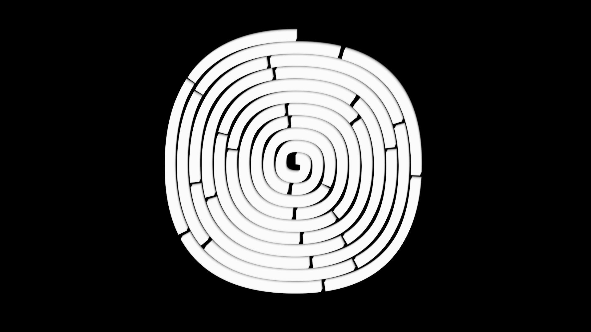
</a>

Executes a configurable stress test for the OpenVG API.

This will often showcase the worst case power consumption.

.


## OpenVX

### [SoftISP](DemoApps/OpenVX/SoftISP)
<a href="DemoApps/OpenVX/SoftISP">
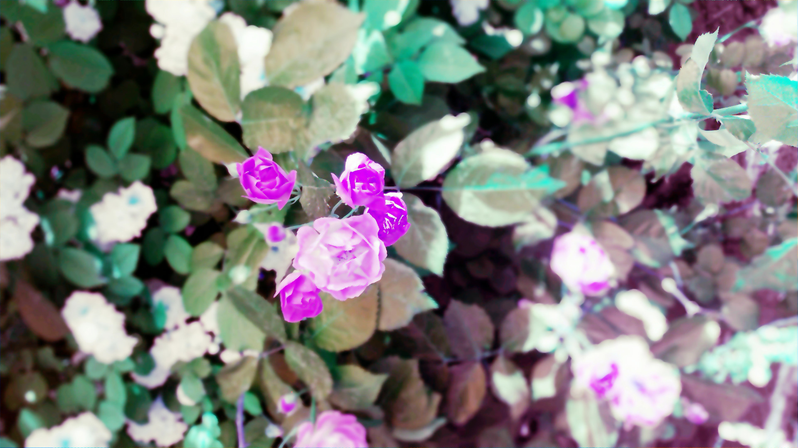
</a>

It is a software-based image signal processing(SoftISP) application optimized by GPU. SoftISP --Options
"Enable" Enable high quality noise reduction node


### [VxTutorial1](DemoApps/OpenVX/VxTutorial1)
<a href="DemoApps/OpenVX/VxTutorial1">
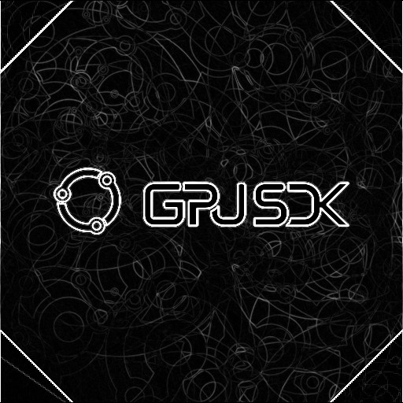
</a>


## Vulkan

### [ComputeParticles](DemoApps/Vulkan/ComputeParticles)
<a href="DemoApps/Vulkan/ComputeParticles">

</a>

Attraction based particle system. A shader storage buffer is used to store particle on which the compute shader does some physics calculations.
The buffer is then used by the graphics pipeline for rendering with a gradient texture for.
Demonstrates the use of memory barriers for synchronizing vertex buffer access between a compute and graphics pipeline

Based on a example called [ComputeParticles](https://github.com/SaschaWillems/Vulkan) by Sascha Willems.
Recreated as a DemoFramework freestyle window sample in 2016.


### [DevBatch](DemoApps/Vulkan/DevBatch)
Early development prototype of a basic quad batch implementation that can be used to implement the native batch for Vulkan.
This will allow the UI library to work with Vulkan.

.


### [DisplacementMapping](DemoApps/Vulkan/DisplacementMapping)
<a href="DemoApps/Vulkan/DisplacementMapping">

</a>

Uses tessellation shaders to generate additional details and displace geometry based on a heightmap.

Based on a example called [Displacement mapping](https://github.com/SaschaWillems/Vulkan) by Sascha Willems.
Recreated as a DemoFramework freestyle window sample in 2016.


### [DynamicTerrainTessellation](DemoApps/Vulkan/DynamicTerrainTessellation)
<a href="DemoApps/Vulkan/DynamicTerrainTessellation">

</a>

Renders a terrain with dynamic tessellation based on screen space triangle size,
resulting in closer parts of the terrain getting more details than distant parts.
The terrain geometry is also generated by the tessellation shader using a 16 bit height map for displacement.
To improve performance the example also does frustum culling in the tessellation shader.

Based on a example called [Dynamic terrain tessellation](https://github.com/SaschaWillems/Vulkan) by Sascha Willems.
Recreated as a DemoFramework freestyle window sample in 2016.


### [Gears](DemoApps/Vulkan/Gears)
<a href="DemoApps/Vulkan/Gears">
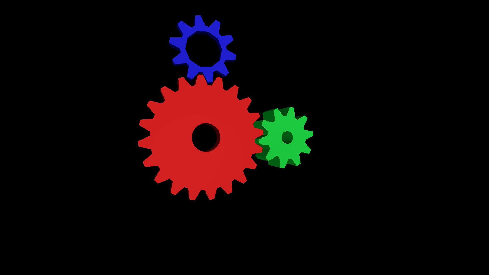
</a>

Vulkan interpretation of glxgears.
Procedurally generates separate meshes for each gear, with every mesh having it's own uniform buffer object for animation.
Also demonstrates how to use different descriptor sets.

Based on a example called [Vulkan Gears](https://github.com/SaschaWillems/Vulkan) by Sascha Willems.
Recreated as a DemoFramework freestyle window sample in 2016.


### [MeshInstancing](DemoApps/Vulkan/MeshInstancing)
<a href="DemoApps/Vulkan/MeshInstancing">

</a>

Shows the use of instancing for rendering many copies of the same mesh using different attributes and textures.
A secondary vertex buffer containing instanced data, stored in device local memory,
is used to pass instance data to the shader via vertex attributes with a per-instance step rate.
The instance data also contains a texture layer index for having different textures for the instanced meshes.

Based on a example called [Mesh instancing](https://github.com/SaschaWillems/Vulkan) by Sascha Willems.
Recreated as a DemoFramework freestyle window sample in 2016.


### [TessellationPNTriangles](DemoApps/Vulkan/TessellationPNTriangles)
<a href="DemoApps/Vulkan/TessellationPNTriangles">

</a>

Generating curved PN-Triangles on the GPU using tessellation shaders to add details to low-polygon meshes,
based on [this paper](http://alex.vlachos.com/graphics/CurvedPNTriangles.pdf), with shaders from
[this tutorial](http://onrendering.blogspot.de/2011/12/tessellation-on-gpu-curved-pn-triangles.html).

Based on a example called [PN-Triangles](https://github.com/SaschaWillems/Vulkan) by Sascha Willems.
Recreated as a DemoFramework freestyle window sample in 2016.


### [Texturing](DemoApps/Vulkan/Texturing)
<a href="DemoApps/Vulkan/Texturing">

</a>

Shows how to upload a 2D texture into video memory for sampling in a shader.
Loads a compressed texture into a host visible staging buffer and copies all mip levels to a device local optimal tiled image for best performance.

Also demonstrates the use of combined image samplers. Samplers are detached from the actual texture image and
only contain information on how an image is sampled in the shader.

Based on a example called [Texture mapping](https://github.com/SaschaWillems/Vulkan) by Sascha Willems.
Recreated as a DemoFramework freestyle window sample in 2016.


### [TexturingArrays](DemoApps/Vulkan/TexturingArrays)
<a href="DemoApps/Vulkan/TexturingArrays">
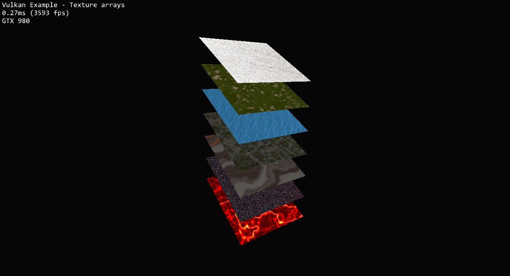
</a>

Texture arrays allow storing of multiple images in different layers without any interpolation between the layers.
This example demonstrates the use of a 2D texture array with instanced rendering. Each instance samples from a different layer of the texture array.

Based on a example called [Texture arrays](https://github.com/SaschaWillems/Vulkan) by Sascha Willems.
Recreated as a DemoFramework freestyle window sample in 2016.


### [TexturingCubeMap](DemoApps/Vulkan/TexturingCubeMap)
<a href="DemoApps/Vulkan/TexturingCubeMap">

</a>

Building on the basic texture loading example, a cubemap texture is loaded into a staging buffer and
is copied over to a device local optimal image using buffer to image copies for all of it's faces and mip maps.

The demo then uses two different pipelines (and shader sets) to display the cubemap as a skybox (background) and as a source for reflections.

Based on a example called [Cube maps](https://github.com/SaschaWillems/Vulkan) by Sascha Willems.
Recreated as a DemoFramework freestyle window sample in 2016.


### [Triangle](DemoApps/Vulkan/Triangle)
<a href="DemoApps/Vulkan/Triangle">
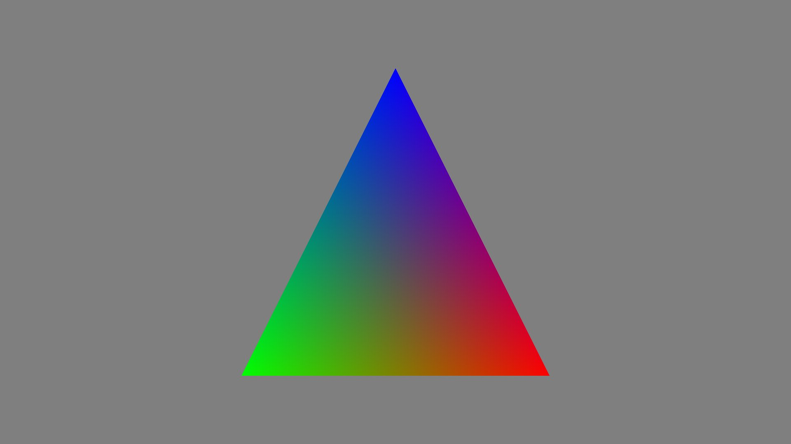
</a>

Most basic example. Renders a colored triangle using an indexed vertex buffer.
Vertex and index data are uploaded to device local memory using so-called "staging buffers".
Uses a single pipeline with basic shaders loaded from SPIR-V and and single uniform block for passing matrices that is updated on changing the view.

This example is far more explicit than the other examples and is meant to be a starting point for learning Vulkan from the ground up.
Much of the code is boilerplate that you'd usually encapsulate in helper functions and classes (which is what the other examples do).

Based on a example called [Triangle](https://github.com/SaschaWillems/Vulkan) by Sascha Willems.
Recreated as a DemoFramework freestyle window sample in 2016.


### [Vulkan101](DemoApps/Vulkan/Vulkan101)
This is a work in progress example using the 'in development' Vulkan demo host.
Please ignore it for now.


### [VulkanComputeMandelbrot](DemoApps/Vulkan/VulkanComputeMandelbrot)
<a href="DemoApps/Vulkan/VulkanComputeMandelbrot">
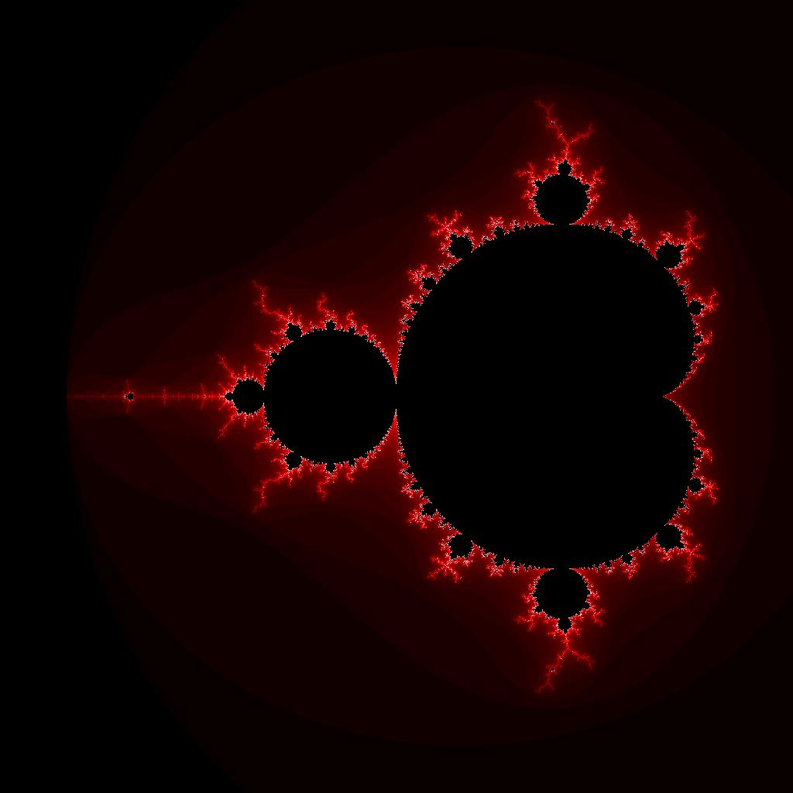
</a>

Calculating and drawing of the Mandelbrot set using the core Vulkan API

Based on a sample by Norbert Nopper from VKTS Examples [VKTS_Sample08](https://github.com/McNopper/Vulkan/blob/master/VKTS_Example08)
Recreated as a DemoFramework freestyle console sample in 2016.

.


### [VulkanInfo](DemoApps/Vulkan/VulkanInfo)
Commandline tool to dump vulkan system information to the console.

This is a easy way to quickly query the hardware capabilities as reported by vulkan.


## Window

### [InputEvents](DemoApps/Window/InputEvents)
Demonstrates how to receive various input events and logs information about them to the log.

This can also be used to do some basic real time tests of the input system when porting the framework to a new platform.


### [VulkanTriangle](DemoApps/Window/VulkanTriangle)
<a href="DemoApps/Window/VulkanTriangle">
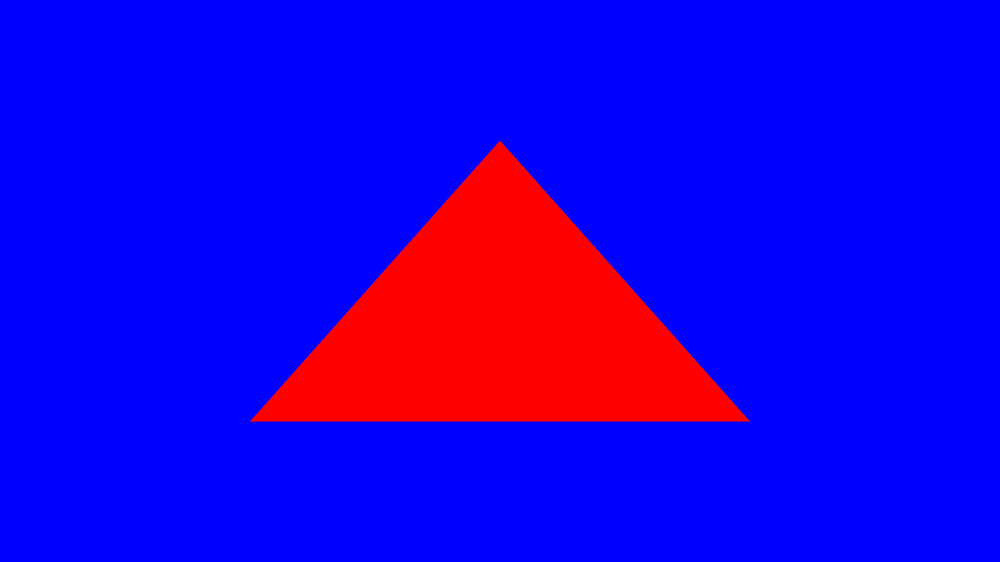
</a>

Demonstrates how to use the Freestyle window project type to create a window for use with Vulkan.

Then renders a simple triangle to it.

The triangle rendering code is based on a sample by Norbert Nopper from VKTS Examples [VKTS_Sample02](https://github.com/McNopper/Vulkan/blob/master/VKTS_Example02)
Recreated as a DemoFramework freestyle window sample in 2016.


### [Window101](DemoApps/Window/Window101)
Just shows how to create a native window using the FslNativeWindow library.

This can be used to develop support for a new platform.


<!-- #AG_DEMOAPPS_END# -->
