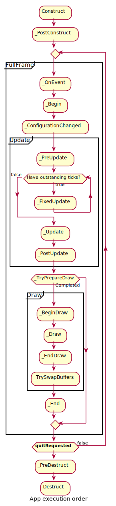

<!-- #AG_PROJECT_CAPTION_BEGIN# -->
# DemoFramework 6.5.1
<!-- #AG_PROJECT_CAPTION_END# -->

A multi-platform framework for fast and easy demo development.

The framework abstracts away all the boilerplate & OS specific code of allocating windows, creating the context,
texture loading, shader compilation, render loop, animation ticks, benchmarking graph overlays etc.
Thereby allowing the demo/benchmark developer to focus on writing the actual 'demo' code.

Therefore demos can be developed on PC or Android where the tool chain and debug facilities often allows for faster turnaround time and
then compiled and deployed without code changes for other supported platforms.

The framework also allows for ‘real’ comparative benchmarks between the different OS and windowing systems,
since the exact same demo/benchmark code run on all of them.

## Supported app templates

* Console. A freestyle project that runs in a console like environment.
* G2D (early access)
* OpenCL (early access)
* OpenCV (early access)
* OpenGL ES 2, 3, 3.1
* OpenVG
* OpenVX (early access)
* Vulkan (early access)
* Window. A freestyle project that runs in a window based environment.

    

## Supported operating systems

* Android NDK
* Linux with various windowing systems (Yocto).
* Ubuntu 22.04
* Windows 10+

## Table of contents

<!-- #AG_TOC_BEGIN# -->
* [Introduction](#introduction)
  * [Technical overview](#technical-overview)
* [Building](#building)
  * [Reasoning](#reasoning)
  * [Build system per platform](#build-system-per-platform)
  * [Scripts](#scripts)
* [Demo application details](#demo-application-details)
  * [Method overview](#method-overview)
  * [Execution order of methods during a frame](#execution-order-of-methods-during-a-frame)
  * [Content loading](#content-loading)
  * [Demo registration](#demo-registration)
  * [Dealing with screen resolution changes](#dealing-with-screen-resolution-changes)
  * [Exit](#exit)
* [Demo playback](#demo-playback)
  * [Command line arguments](#command-line-arguments)
  * [Default keyboard mappings.](#default-keyboard-mappings)
  * [Demo single stepping / pause](#demo-single-stepping-/-pause)
* [Demo applications](#demo-applications)
  * [Console](#console)
  * [Console.System](#consolesystem)
  * [FslResearch](#fslresearch)
  * [G2D](#g2d)
  * [GLES2](#gles2)
  * [GLES2.System](#gles2system)
  * [GLES2.UI](#gles2ui)
  * [GLES3](#gles3)
  * [GLES3.System](#gles3system)
  * [GLES3.UI](#gles3ui)
  * [OpenCL](#opencl)
  * [OpenCV](#opencv)
  * [OpenVG](#openvg)
  * [OpenVG.System](#openvgsystem)
  * [OpenVX](#openvx)
  * [Vulkan](#vulkan)
  * [Vulkan.System](#vulkansystem)
  * [Vulkan.UI](#vulkanui)
  * [Window](#window)
  * [Window.System](#windowsystem)
<!-- #AG_TOC_END# -->

# Introduction

## Technical overview

* Written in a limited subset of [C++ 20](https://en.wikipedia.org/wiki/C%2B%2B20) and
uses [RAII](http://en.wikipedia.org/wiki/Resource_Acquisition_Is_Initialization) to manage resources.
* Uses a limited subset of [STL](https://en.wikipedia.org/wiki/Standard_Template_Library) to make it easier to port.
* No copyleft restrictions from GPL / L-GPL licenses.
* Allows for direct access to the expected API’s (EGL, OpenGL ES 2, OpenGL ES 3, OpenVG, OpenCV, etc)
* Package based architecture that ensures your app only has dependencies to the libs it uses.
* Content pipeline:
  * Automatically compile Vulkan shaders during build.
* Services
  * Keyboard, mouse and GamePad.
  * Persistent data manager
  * Assets management (models, textures)
* Defines a standard way for handling
  * Init, shutdown & window resize.
  * Program input arguments.
  * Input events like keyboard, mouse and touch.
  * Fixed time-step and variable time-step demo implementations.
  * Logging functionality.
* Provides optional helper classes for commonly used tasks:
  * Matrix, Vector3, GLShader, GLTexture, etc
* Easy access to optional libs like:
  [GLM](http://glm.g-truc.net/0.9.8/index.html),
  [GLI](http://gli.g-truc.net/0.8.2/index.html),
  [RapidJSON](http://rapidjson.org/) and
  [Assimp](http://assimp.sourceforge.net/)

# Building

See the setup guides for your platform:

* [Android](Doc/Setup_guide_android_sdk+ndk_on_windows.md)
* [Ubuntu 22.04](Doc/Setup_guide_ubuntu22.04.md)
* [Windows](Doc/Setup_guide_windows.md)
* [Yocto](Doc/Setup_guide_yocto.md)

For details about the build system see the [FslBuildGen document](./Doc/FslBuildGen.docx).

## Reasoning

While writing this we currently have forty-three OpenGL ES 2 samples, seventy-nine OpenGL ES 3.x samples,
seventy-two Vulkan samples, eight OpenVG samples, two G2D samples, sixteen OpenCL samples, two OpenCV samples,
three OpenVX sample and ten other samples. Which is *235 sample applications*.

The demo framework currently runs on at least four platforms so using a traditional approach we would have to
maintain 235 * 4 = *940 build files* for the samples alone.
Maintaining 940 or even just 235 build files would be an extremely time consuming and error prone process.
So ideally, we wanted to use a build tool that supported

1. Minimalistic build description files, that are used to ‘auto generate’ real build files.
2. Proper package dependency support.
3. A good developer experience
   * co-existence of debug, release and other variants.
   * re-use of already build libs for other samples.
   * full source access to all used packages inside IDE’s.
4. Support for Windows, Ubuntu, Yocto and Android NDK.
5. Ensure a similar source layout for all samples.

The common go-to solution for C++ projects these days would be to use CMake, but when we started this project it was not nearly as
widely used, the build files were not as minimalistic as we would like, the package dependencies were not handled as easy as we would
have liked, it had no Android NDK support and the sample layout would have to be manually enforced.

As no existing system really fit, we made the controversial choice of creating our own minimalistic system.
It uses a minimalistic build-meta-data file with no scripting capabilities (as we want everything to be build the same way).
From the meta data files + the content of the folders ‘include’ and ‘source’ we then generate the platform dependent build files
using various templates that can be changed in one location. This means that once the ‘build-meta-data’ file has been created it
would basically never have to change unless the source code gets new dependencies to other packages.

Over the years, we been using this approach we have not really touched any of the build-meta-data files (Fsl.gen) since they were
initially created. If we ever needed any build file changes we could instead update the template in one location and have it affect
all samples right away.

Here is an example ‘Fsl.gen’ build-meta-data file for the GLES2.Blur sample app:

```XML
<?xml version="1.0" encoding="UTF-8"?>
<FslBuildGen xmlns:xsi="http://www.w3.org/2001/XMLSchema-instance" xsi:noNamespaceSchemaLocation="../../../FslBuildGen.xsd">
  <Executable Name="GLES2.Blur" NoInclude="true">
    <ImportTemplate Name="DemoAppGLES2"/>
    <Dependency Name="EnvironmentMappingShared"/>
  </Executable>
</FslBuildGen>
```

It basically specifies that this directory contains an executable package with no include directory,
that it uses the ‘DemoAppGLES2’ template and has a dependency on a package called ‘EnvironmentMappingShared’.

Another example is the ‘Fsl.gen’ file for the FslGraphics package which has had lots of files added over the years,
but its build file has been untouched.

```XML
<?xml version="1.0" encoding="UTF-8"?>
<FslBuildGen xmlns:xsi="http://www.w3.org/2001/XMLSchema-instance" xsi:noNamespaceSchemaLocation="../../FslBuildGen.xsd">
  <Library Name="FslGraphics">
    <Dependency Name="FslBase"/>
  </Library>
</FslBuildGen>
```

It specifies a ‘library’ (static library), with a dependency to ‘FslBase’ and a windows visual studio project id.

While CMake has improved a lot since we initially looked, it would requires more manual work to keep the
samples up to date than our current solution.

It's worth mentioning that its entirely possible generate 'CMakeLists.txt' with this system, in fact we do just that internally for the
android gradle+cmake build.

## Build system per platform

Operating System | Build system
-----------------|---------------------
Android          | gradle + cmake (Android Studio can be used with the generated projects)
Ubuntu           | cmake (ninja)
Windows          | cmake (Visual studio 2022 x64)
Yocto            | cmake (ninja)

## Scripts

### FslBuildGen.py

Is a cross-platform build-file generator. Which main purpose is to keep all build files consistent, in sync and up to date.
See the [FslBuildGen document](./Doc/FslBuildGen.docx) for details.

### FslBuild.py

Extends the technology behind FslBuildGen with additional knowledge about how to execute the build system for a given platform.
So basically, FslBuild works like this

1. Invoke the build-file generator that updates all build files if necessary.
2. Filter the builds request based on the provided feature and extension list.
3. Build all necessary build files in the correct order.

#### Useful arguments

FslBuild comes with a few useful arguments

Argument|Description
-------------------|---
--ListRequirements | List the requirement tree and exit.
--ListVariants     | List all variants.
--RequireFeatures  | The list of features that are required for a executable package to be build. For example [OpenGLES2] to build all executables that use OpenGLES2.
--UseFeatures      | Allows you to limit what’s build based on a provided feature list. For example [EGL,OpenGLES2]. This parameter defaults to all features.
--UseExtensions    | The list of available extensions to build for. For example [OpenGLES3.1:EXT_geometry_shader,OpenGLES3.1:EXT_tessellation_shader] to allow the OpenGLES3.1 extensions EXT_geometry_shader and EXT_tessellation_shader. You can also specify * for all extensions (default).
--Variants         | Define the variants you wish to build (if any). For yocto for example you select the window system and build type using --Variants [config=Debug,WindowSystem=FB]
--BuildTime        | Time the build and print the result and the end.
-t 'sdk'           | Build all demo framework projects
-v                 | Set verbosity level
--                 | arguments written after this is send directly to the native build system.

#### Important notes

* Don’t modify the auto-generated files.
The FslBuild scripts are responsible for creating all the build files for a platform and verifying dependencies.
Since all build files are auto generated you can never modify them directly as the next build will overwrite your changes.
Instead add your changes to the ‘Fsl.gen’ files as they control the build file generation!
* The ‘Fsl.gen’ file is the real build file.
* All include and source files in the respective folders are automatically added to the build files.

### FslBuildContent.py

This only runs the content builder part of the build process.

```bash
FslBuildContent.py
```

Build the current directories package content.

### FslBuildNew.py

Generate a new project of the specified type. This is basically a project wizard that will prepare a new project directory with a basic template
for the chosen project type.

```bash
FslBuildNew.py GLES2 FlyingPigsApp
```

Create the FlyingPigsApp sample app directory using the GLES2 template.

### FslBuildCheck.py

Package build environment checker. Based on what features the package uses this will try to detect setup errors.
It also has the capability to scan the source for common mistakes and it can check if the proper License.json file is provided for screenshots.

```bash
FslBuildCheck.py
```

Check the current build environment to see if the package can be build.

```bash
FslBuildCheck.py --scan
```

Scan the current package and see if there is any common mistakes with for example include guards, tabs, etc.

### FslBuildDoc.py

A new **work in progress* tool that helps keep the README.md files similar and that fills out various areas of the root README.md file.

```bash
FslBuildDoc.py
```

# Demo application details

The following description of the demo application details uses a GLES2 demo named ‘S01_SimpleTriangle’ as example.
It lists the default methods that a demo should implement, the way it can provide customized parameters to the windowing system and
how asset management is made platform agnostic.

## Method overview

This is a list of the methods that every Demo App is most likely to override .

```C++
// Init
S01_SimpleTriangle(const DemoAppConfig& config)
// Shutdown
~S01_SimpleTriangle()
// OPTIONAL: Custom resize logic (if the app requested it). The default logic is to
// restart the app.
void ConfigurationChanged(const DemoWindowMetrics& windowMetrics)
// OPTIONAL: Fixed time step update method that will be called the set number of times
// per second. The fixed time step update is often used for physics.
void FixedUpdate(const DemoTime& demoTime)
// OPTIONAL: Variable time step update method.
void Update(const DemoTime& demoTime)
// Put the rendering calls here
void Draw(const FrameInfo& frameInfo)
```

When the constructor is invoked, the Demo Host API will already be setup and ready for use,
the demo framework will use EGL to configure things as requested by your EGL config and API version.

It is recommended that you do all your setup in the constructor.

This also means that you should never try to shutdown EGL in the destructor since the framework will do it at the appropriate time.
The destructor should only worry about resources that your demo app actually allocated by itself.

### ConfigurationChanged

The ConfigurationChanged method will be called if the screen metrics changes.

### FixedUpdate

Is a fixed time-step update method that will be called the set number of times per second. The fixed time step update is often used for physics.

### Update

Will be called once before every draw call and you will normally update your animation using delta time.
For example if you need to move your object 10 units horizontally per second you would do something like

```C++
_positionX += 10 * demoTime.DeltaTime;
```

### Draw

Should be used to render graphics.

### Fixed or variable timestep update

Depending on what your demo is doing, you might use one or the other - or both.
It’s actually a very complex topic once you start to dig into it, but in general anything that need precision and
predictable/repeatable calculations, like for example physics, often benefits from using fixed time steps.
It really depends on your algorithm and it’s recommended to do a couple of google searches on fixed vs variable,
since there are lots of arguments for both. It’s also worth noting that game engines like Unity3D support both methods.

## Execution order of methods during a frame

The methods will be called in this order
* Events (if any occurred)
* ConfigurationChanged
* FixedUpdate (0-N calls. The first frame will always have a FixedUpdate call)
* Update
* Draw
After the draw call, a swap will occur.

<a href="Doc/ClassDiagrams/Images/AppExecutionOrder.svg">

</a>

## Content loading

The framework supports loading files from the Content folder on all platforms.

Given a content folder like this:
```
Content/Texture1.bmp
Content/Stuff/Readme.txt
```

You can load the files via the IContentManager service that can be accessed by calling

```C++
std::shared_ptr<IContentManager> contentManager = GetContentManager();
```

You can then load files like this:

```C++
// *** Text file ***

// Read it directly into a new string
const std::string content = contentManager->ReadAllText("Stuff/Readme.txt");

// *** Binary file ***

// Read the content directly into a new vector
const std::vector<uint8_t> content = contentManager->ReadBytes("MyData.bin");

// Read the content into a existing vector
std::vector<uint8_t> content;
contentManager->ReadAllBytes(content, "MyData.bin");

// *** Bitmap file ***

// Read the content directly into a new bitmap
const Bitmap bitmap = contentManager->ReadBitmap("Texture1.bmp", PixelFormat::R8G8B8_UINT);

// Read the content into a existing bitmap object.
// Beware the bitmap object will be resized and format changed as needed, but some memory could be reused.
Bitmap bitmap;
contentManager->Read(bitmap, "Texture1.bmp", PixelFormat::R8G8B8_UINT);

// *** Texture file ***

// Read the content directly into a new texture
const Texture texture = contentManager->ReadTexture("Texture1.bmp", PixelFormat::R8G8B8_UINT);

// Read the content directly into a existing texture object.
// Beware the texture object will be resized and format changed as needed, but some memory could be reused.
Texture texture;
contentManager->Read(texture, "Texture1.bmp", PixelFormat::R8G8B8_UINT);

```

If you prefer to control the loading yourself, you can retrieve the path to the files like this:

```C++
IO::Path contentPath = contentManager->GetContentPath();
IO::Path myData = IO::Path::Combine(contentPath, "MyData.bin");
IO::Path readmePath = IO::Path::Combine(contentPath, "Stuff/Readme.txt");
IO::Path texture1Path = IO::Path::Combine(contentPath, "Texture1.bmp");
```

You can then open the files with any method you prefer. Both methods work for all supported platforms.

## Demo registration

This is done in the S01_SimpleTriangle_Register.cpp file.

```C++
namespace Fsl
{
  namespace
  {
     // Custom EGL config (these will per default overwrite the custom settings. However an exact EGL config can be used)
     static const EGLint g_eglConfigAttribs[] =
     {
        EGL_SAMPLES, 0,
        EGL_RED_SIZE, 8,
        EGL_GREEN_SIZE, 8,
        EGL_BLUE_SIZE, 8,
        EGL_ALPHA_SIZE, 0, // buffers with the smallest alpha component size are preferred
        EGL_DEPTH_SIZE, 24,
        EGL_SURFACE_TYPE, EGL_WINDOW_BIT,
        EGL_NONE,
     };
  }

  // Configure the demo environment to run this demo app in a OpenGLES2 host environment
  void ConfigureDemoAppEnvironment(HostDemoAppSetup& rSetup)
  {
    DemoAppHostConfigEGL config(g_eglConfigAttribs);

    DemoAppRegister::GLES2::Register<S01_SimpleTriangle>(rSetup, "GLES2.S01_SimpleTriangle", config);
  }
}
```

Since the demo framework is controlling the main method, you need to register your application with the Demo Host specific registration call
 (in this case the OpenGL ES2 host), for the framework to register your demo class.

### OpenGL ES 3.X registration

To register a demo for OpenGLES 3.X you would use the GLES3 register method:

```C++
    DemoAppRegister::GLES3::Register<S01_SimpleTriangle>(rSetup, "GLES3.S01_SimpleTriangle", config);
```

## Dealing with screen resolution changes

Per default the app is destroyed and recreated when a resolution change occurs.
It is left up to the DemoApp to save and restore demo specific state.

## Exit

The demo app can request an exit to occur, or it can be terminated via an external request.
In both cases one of the following things occur.

1. If the app has been constructed and has received a FixedUpdate, then it will finish its FixedUpdate, Update, Draw, swap sequence before its shutdown.
2. If the app requests a shutdown during construction, the app will be destroyed before calling any other method on the object (and no swap will occur).

The app can request an exit to occur by calling:

```C++
    GetDemoAppControl()->RequestExit(1);
```

# Demo playback

## Command line arguments

All demos support various command line arguments.
Use –h on a demo for a complete list

Argument             | Description
-------------------- | ---
-h                   | Show the command line argument help.
--Stats              | Show a performance graph.
--LogStats           | Log various stats to the console.
--Window             | Run inside a window instead of using the fullscreen. Used like this `--Window [0,0,640,480]` the parameters specify (x,y,width,height).
--ScreenshotFrequency| Create a screenshot at the given frame frequency.
--ExitAfterFrame     | Exit after the given number of frames has been rendered
--ContentMonitor     | Monitor the Content directory for changes and restart the app on changes. WARNING: Might not work on all platforms and it might impact app performance (experimental)

## Default keyboard mappings.

All apps support these keys per default, but can override then if they chose to do so.
Beware that some platforms might not support the given 'key' type and therefore the functonality is unsupported.

Key     | Function
------- | ------------------------------------------------
Escape  | Exit the app.
F4      | Take a screenshot (If supported by the test service)
F5      | Restart the app.

## Demo single stepping / pause

All samples support time stepping which can be useful for debugging.
It might not be available on platforms that don't support the given keys.
Also beware that apps can override these keys if they chose to do so.

Key     | Function
------- | ---
Pause   | Pause the sample.
PageDown| Move forward one timestep.
Delete  | Toggle between normal and Slow 2x playback
End     | Toggle between normal and Slow 4x playback
Insert  | Toggle between normal and fast 2x playback.
Home    | Toggle between normal and fast 4x playback.

# Demo applications

<!-- #AG_DEMOAPPS_BEGIN# -->
## Console

See [Console](DemoApps/Console/README.md#console) applications

## Console.System

See [Console.System](DemoApps/Console/README.md#consolesystem) applications

## FslResearch

See [FslResearch](DemoFramework/FslResearch/README.md#fslresearch) applications

## G2D

See [G2D](DemoApps/G2D/README.md#g2d) applications

## GLES2

See [GLES2](DemoApps/GLES2/README.md#gles2) applications

## GLES2.System

See [GLES2.System](DemoApps/GLES2/README.md#gles2system) applications

## GLES2.UI

See [GLES2.UI](DemoApps/GLES2/README.md#gles2ui) applications

## GLES3

See [GLES3](DemoApps/GLES3/README.md#gles3) applications

## GLES3.System

See [GLES3.System](DemoApps/GLES3/README.md#gles3system) applications

## GLES3.UI

See [GLES3.UI](DemoApps/GLES3/README.md#gles3ui) applications

## OpenCL

See [OpenCL](DemoApps/OpenCL/README.md#opencl) applications

## OpenCV

See [OpenCV](DemoApps/OpenCV/README.md#opencv) applications

## OpenVG

See [OpenVG](DemoApps/OpenVG/README.md#openvg) applications

## OpenVG.System

See [OpenVG.System](DemoApps/OpenVG/README.md#openvgsystem) applications

## OpenVX

See [OpenVX](DemoApps/OpenVX/README.md#openvx) applications

## Vulkan

See [Vulkan](DemoApps/Vulkan/README.md#vulkan) applications

## Vulkan.System

See [Vulkan.System](DemoApps/Vulkan/README.md#vulkansystem) applications

## Vulkan.UI

See [Vulkan.UI](DemoApps/Vulkan/README.md#vulkanui) applications

## Window

See [Window](DemoApps/Window/README.md#window) applications

## Window.System

See [Window.System](DemoApps/Window/README.md#windowsystem) applications

<!-- #AG_DEMOAPPS_END# -->
